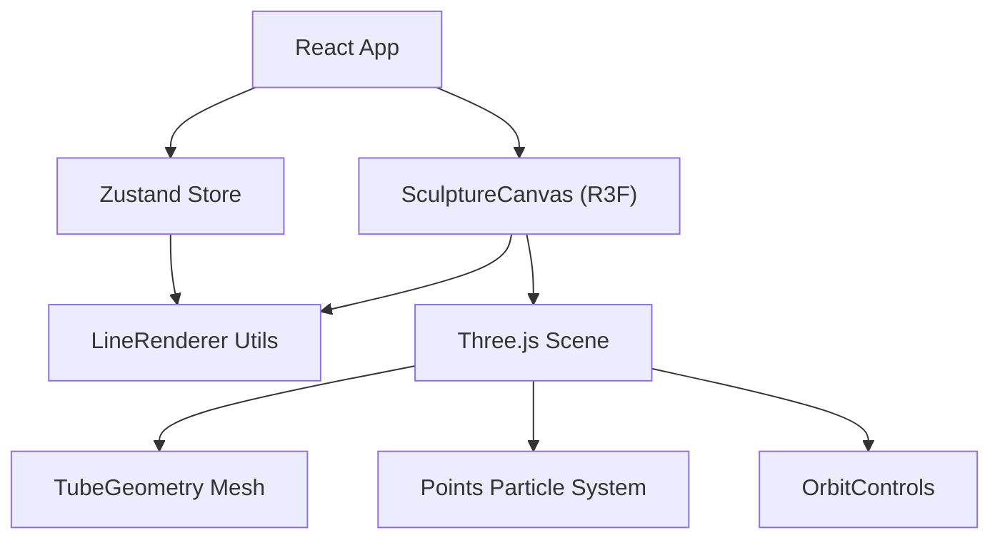

## 1. 架构设计


## 2. 技术描述
- **前端**：React@18 + TypeScript + Vite
- **3D渲染**：Three.js + @react-three/fiber + @react-three/drei
- **状态管理**：Zustand
- **初始化工具**：Vite (react-ts模板)
- **后端**：无（纯前端应用）
- **数据库**：无

## 3. 目录结构
```
d:\P\tasks\auto53/
├── package.json
├── vite.config.js
├── tsconfig.json
├── index.html
└── src/
    ├── main.tsx
    ├── App.tsx
    ├── store/
    │   └── useSculptureStore.ts
    ├── components/
    │   └── SculptureCanvas.tsx
    └── utils/
        └── LineRenderer.ts
```

## 4. 数据模型

### 4.1 数据类型定义
```typescript
// 三维点坐标
interface Point3D {
  x: number;
  y: number;
  z: number;
}

// 光线条数据
interface LightLine {
  id: string;
  points: Point3D[];
  color: string;
  createdAt: number;
}

// 颜色选项
type NeonColor = '#FF007F' | '#00F0FF' | '#39FF14' | '#BF00FF';

// Store状态
interface SculptureState {
  lines: LightLine[];
  currentColor: NeonColor;
  isDrawing: boolean;
  currentPoints: Point3D[];
  backgroundColor: string;
  isDissolving: boolean;
  
  // Actions
  startDrawing: () => void;
  addPoint: (point: Point3D) => void;
  finishDrawing: () => void;
  setColor: (color: NeonColor) => void;
  clearAll: () => void;
  setDissolving: (value: boolean) => void;
}
```

### 4.2 常量定义
```typescript
// 霓虹色盘
const NEON_COLORS: NeonColor[] = ['#FF007F', '#00F0FF', '#39FF14', '#BF00FF'];

// 颜色对应的深色背景
const COLOR_BACKGROUNDS: Record<NeonColor, string> = {
  '#FF007F': '#1A0033',
  '#00F0FF': '#001A2E',
  '#39FF14': '#0A1F00',
  '#BF00FF': '#1A0033',
};

// 性能限制
const MAX_LINES = 50;
const MAX_POINTS_PER_LINE = 50;
const MAX_PARTICLES = 5000;

// 采样频率
const SAMPLING_RATE = 30; // 每秒30个点

// 线条参数
const LINE_RADIUS = 0.08;
const EMISSIVE_INTENSITY = 0.8;

// 粒子参数
const PARTICLE_COUNT = 100;
const PARTICLE_SIZE = 0.03;
const PARTICLE_DELAY = 300; // 0.3秒后开始
const PARTICLE_PERIOD = 2000; // 2秒周期
```

## 5. 核心模块设计

### 5.1 Zustand Store (src/store/useSculptureStore.ts)
- 管理光线条列表、当前颜色、绘制状态
- 提供开始/结束绘制、添加点、切换颜色、清除等action
- 处理颜色切换时的背景色过渡

### 5.2 SculptureCanvas 组件 (src/components/SculptureCanvas.tsx)
- Three.js场景初始化：灯光、相机、控制器
- 渲染所有光线条Mesh和粒子系统
- 处理鼠标交互（拖拽绘制）
- 管理R键重置事件监听
- 实现线条消散动画

### 5.3 LineRenderer 工具类 (src/utils/LineRenderer.ts)
- createTubeLine(): 根据点数组生成带渐变半径的TubeGeometry
- createParticleSystem(): 为每条线创建流动粒子系统
- 处理粒子沿路径运动的更新逻辑
- 优化BufferGeometry和性能

### 5.4 App 主组件 (src/App.tsx)
- 管理全局状态和相机控制器
- 渲染颜色选择按钮组
- 渲染操作提示文字
- 处理背景色过渡动画

## 6. 关键实现点

### 6.1 鼠标拖拽绘制
- 使用Three.js Raycaster将屏幕坐标转换为三维空间坐标
- 采样频率控制：使用useRef + requestAnimationFrame实现30次/秒采样
- 限制每条线最多50个点，超过则自动截断

### 6.2 发光线条渲染
- 使用TubeGeometry，通过自定义参数实现两端半径渐变收窄
- MeshStandardMaterial设置emissive为颜色加倍，emissiveIntensity为0.8
- 使用CatmullRomCurve3平滑曲线

### 6.3 粒子流动效果
- 每条线创建100个粒子，使用Points + BufferGeometry
- 粒子位置通过曲线getPointAt(t)计算，t随时间从0到1循环
- 使用useFrame钩子每帧更新粒子位置

### 6.4 消散动画
- 按R键触发isDissolving状态
- 每条线从末端向起点逐段缩小：通过修改tube的radius和透明度
- 使用gsap或requestAnimationFrame实现0.8秒动画
- 动画完成后清空store中的lines数组

### 6.5 性能优化
- 使用BufferGeometry而非Geometry
- 粒子系统使用InstancedBufferGeometry或共享BufferAttribute
- 限制最大线条数50，总粒子数5000
- 及时清理不再使用的Geometry和Material释放内存
