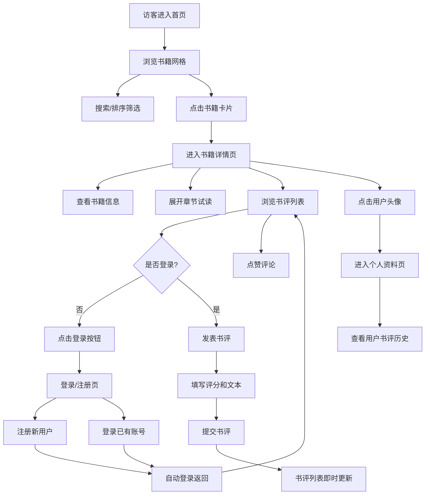

## 1. 产品概述

BookNook是一个面向小型独立书店的在线书籍试读与社区书评平台，为读者提供书籍浏览、章节试读、书评互动的一站式体验。
- 主要目的：连接独立书店与读者，通过在线试读和社区书评提升用户粘性和购书转化率
- 目标用户：喜欢阅读、愿意分享读书心得的书友们

## 2. 核心功能

### 2.1 用户角色

| 角色 | 注册方式 | 核心权限 |
|------|----------|----------|
| 访客 | 无需注册 | 浏览书籍列表、查看书籍详情和章节试读、浏览公开书评 |
| 注册用户 | 用户名+密码注册 | 发表书评、回复评论、点赞评论、查看和编辑个人资料 |

### 2.2 功能模块

1. **书籍浏览页**：书籍网格展示、实时搜索、评分排序
2. **书籍详情页**：书籍信息展示、章节试读、书评列表、发表评论
3. **登录注册页**：用户注册、用户登录
4. **用户个人资料页**：用户信息展示、书评历史、资料编辑

### 2.3 页面详情

| 页面名称 | 模块名称 | 功能描述 |
|----------|----------|----------|
| 书籍浏览页 | 导航栏 | Logo、导航链接、搜索框、用户菜单（登录后） |
| 书籍浏览页 | 搜索与排序 | 书名/作者实时搜索（200ms防抖）、评分高低排序切换 |
| 书籍浏览页 | 书籍网格 | 4列卡片网格展示，封面/标题/作者/评分，悬停上移动效 |
| 书籍浏览页 | 分页控制器 | 底部分页，当前页高亮橙色 |
| 书籍详情页 | 书籍信息区 | 封面大图（300x450）、标题、作者、简介、评分 |
| 书籍详情页 | 章节试读区 | 章节列表展开收起、章节前3页内容滚动预览、淡入动画 |
| 书籍详情页 | 书评列表 | 用户头像、用户名、相对时间、评分星标、评论文本 |
| 书籍详情页 | 发表评论区 | 1-5星评分、300字以内文本、自动扩展高度 |
| 登录注册页 | 表单区 | 登录/注册模式切换、用户名密码输入、表单验证 |
| 个人资料页 | 用户信息区 | 大头像、用户名、注册时间、编辑资料按钮（本人可见） |
| 个人资料页 | 书评概览区 | 按时间倒序展示用户书评，书籍缩略图+摘要+评分 |

## 3. 核心流程

访客进入首页浏览书籍 → 点击书籍卡片进入详情页 → 阅读章节试读 → 如需发表书评则点击登录 → 注册或登录后返回详情页 → 发表书评/点赞评论 → 查看个人资料

## 4. 用户界面设计

### 4.1 设计风格
- 主色调：#F5F0E8（米白背景）、#3E2723（深棕色文字）
- 强调色：#E67E22（橙色，按钮和链接悬停）
- 辅助色：#3498DB（排序按钮）、#2ECC71（编辑按钮）、#E74C3C（点赞高亮）、#2C3E50（用户头像背景）
- 按钮风格：圆角6px，实心背景，白色字体
- 字体：使用优雅的衬线字体搭配现代无衬线字体，标题字号14px深色，作者12px灰色
- 布局风格：顶部导航栏（64px高）+ 卡片式主体内容
- 动效：页面滑入（0.5s ease-out）、卡片悬停上移（0.3s ease）、内容淡入（0.6s ease）、点赞缩放（0.15s）

### 4.2 页面设计概览

| 页面名称 | 模块名称 | UI元素 |
|----------|----------|--------|
| 书籍浏览页 | 导航栏 | 深棕背景(#3E2723)，白色文字，当前页橙色下划线，右侧用户头像圆形 |
| 书籍浏览页 | 搜索栏 | 输入框聚焦橙色边框+1.02倍缩放（0.2s），200ms防抖 |
| 书籍浏览页 | 排序按钮 | #3498DB背景，白色字体，圆角6px |
| 书籍浏览页 | 书籍卡片 | 封面占70%高度，悬停上移4px+阴影增强，0.3s过渡 |
| 书籍详情页 | 封面大图 | 300x450px，圆角12px，阴影0 4px 12px rgba(0,0,0,0.1) |
| 书籍详情页 | 章节内容 | 固定高度可滚动区域，首次加载淡入0.6s |
| 书籍详情页 | 评论框 | 宽度100%，自动扩展高度，最大200px |
| 书籍详情页 | 点赞按钮 | 拇指图标，点击后#E74C3C高亮，缩放至0.85倍恢复 |
| 个人资料页 | 用户头像 | 直径120px圆形，#2C3E50背景 |
| 个人资料页 | 编辑按钮 | #2ECC71背景，白色字体，圆角6px |

### 4.3 响应式设计
- 桌面端（≥768px）：导航栏水平展开，书籍网格4列，最小卡片宽度200px
- 移动端（<768px）：汉堡菜单（点击展开全屏覆盖，半透明深棕#3E2723 at 95%），书籍网格2列
- 触控优化：所有交互元素最小44px触控区域

### 4.4 性能约束
- 搜索输入后列表更新延迟 ≤ 200ms
- 书籍详情页内容加载时间 ≤ 1.5秒
- 界面操作响应时间 ≤ 100ms
- 书评提交后列表即时更新（无需刷新）
