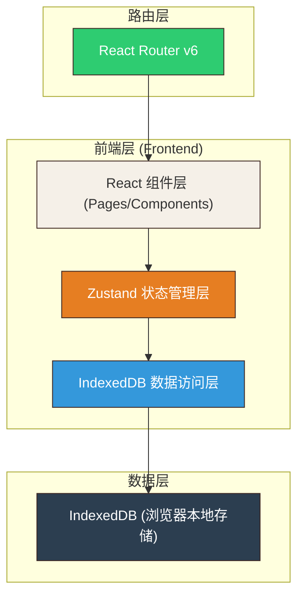
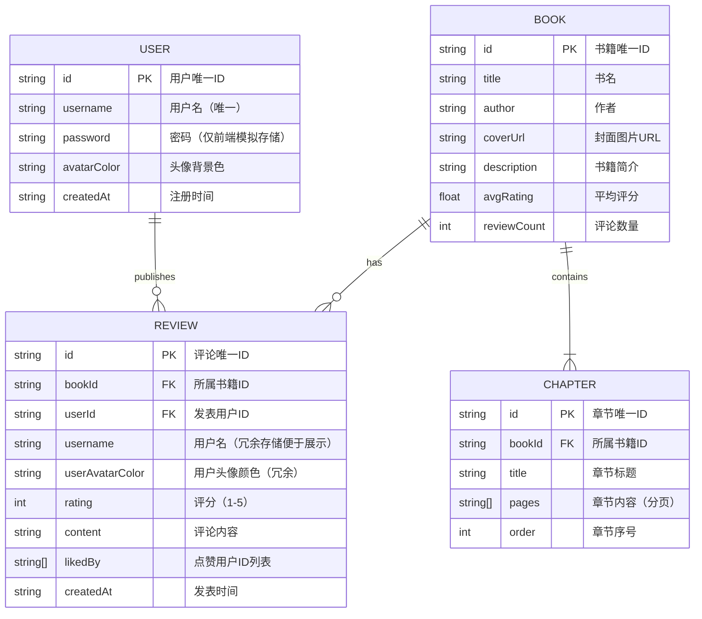

## 1. 架构设计



**数据流向说明：**
1. 用户操作 → React组件调用Zustand store方法
2. Zustand store → 调用IndexedDB数据访问层进行读写
3. IndexedDB操作完成 → Zustand更新全局状态
4. 状态变更 → React组件自动重新渲染

## 2. 技术描述

- **前端框架**：React@18 + TypeScript
- **构建工具**：Vite（含React插件）
- **状态管理**：Zustand
- **路由管理**：React Router DOM@6
- **数据存储**：IndexedDB（浏览器本地存储，模拟后端）
- **唯一ID生成**：uuid
- **CSS方案**：原生CSS + CSS变量（模块化样式）

## 3. 路由定义

| 路由 | 用途 | 组件 |
|------|------|------|
| / | 书籍浏览首页（重定向或作为主页） | BrowsePage |
| /browse | 书籍浏览页 | BrowsePage |
| /books/:id | 书籍详情页 | BookPage |
| /login | 登录/注册页 | LoginPage |
| /profile/:username | 用户个人资料页 | ProfilePage |

## 4. 数据模型

### 4.1 数据模型定义（ER图）



### 4.2 IndexedDB数据存储结构

| Object Store | Key Path | 索引 |
|--------------|----------|------|
| users | id | username (unique) |
| books | id | title, author |
| chapters | id | bookId, order |
| reviews | id | bookId, userId, createdAt |

## 5. 项目文件结构

```
d:\P\tasks\auto55\
├── package.json              # 项目依赖和脚本
├── vite.config.js            # Vite配置
├── tsconfig.json             # TypeScript配置
├── index.html                # 入口HTML
└── src/
    ├── main.tsx              # 应用入口
    ├── store.ts              # Zustand全局状态管理
    ├── db.ts                 # IndexedDB数据访问层
    ├── types.ts              # TypeScript类型定义
    ├── styles/
    │   └── global.css        # 全局样式和CSS变量
    ├── components/
    │   ├── Navbar.tsx        # 顶部导航栏
    │   ├── BookCard.tsx      # 书籍卡片组件
    │   ├── StarRating.tsx    # 星级评分组件
    │   ├── ReviewItem.tsx    # 评论项组件
    │   └── Pagination.tsx    # 分页组件
    └── pages/
        ├── BrowsePage.tsx    # 书籍浏览页
        ├── BookPage.tsx      # 书籍详情页
        ├── LoginPage.tsx     # 登录注册页
        └── ProfilePage.tsx   # 用户个人资料页
```

**文件调用关系与数据流向：**

```
main.tsx (入口)
  ├── 初始化 IndexedDB (db.ts)
  ├── 挂载 BrowserRouter (React Router)
  └── 渲染 App 根组件
      ├── Navbar (components/Navbar.tsx)
      │   └── 调用 store.ts: currentUser, logout()
      └── Routes
          ├── / → BrowsePage (pages/BrowsePage.tsx)
          │       ├── 调用 store.ts: books, searchBooks(), sortBooks()
          │       ├── BookCard (components/BookCard.tsx)
          │       └── Pagination (components/Pagination.tsx)
          ├── /books/:id → BookPage (pages/BookPage.tsx)
          │       ├── 调用 store.ts: getBookById(), chapters, reviews
          │       ├── StarRating (components/StarRating.tsx)
          │       └── ReviewItem (components/ReviewItem.tsx)
          │           └── 调用 store.ts: likeReview()
          ├── /login → LoginPage (pages/LoginPage.tsx)
          │       └── 调用 store.ts: login(), register()
          └── /profile/:username → ProfilePage (pages/ProfilePage.tsx)
                  └── 调用 store.ts: getUserByUsername(), getUserReviews(), updateProfile()
```

## 6. 核心数据类型定义

```typescript
// User - 用户
interface User {
  id: string;
  username: string;
  password: string;
  avatarColor: string;
  createdAt: string;
}

// Book - 书籍
interface Book {
  id: string;
  title: string;
  author: string;
  coverUrl: string;
  description: string;
  avgRating: number;
  reviewCount: number;
}

// Chapter - 章节
interface Chapter {
  id: string;
  bookId: string;
  title: string;
  pages: string[];
  order: number;
}

// Review - 书评
interface Review {
  id: string;
  bookId: string;
  userId: string;
  username: string;
  userAvatarColor: string;
  rating: number;
  content: string;
  likedBy: string[];
  createdAt: string;
}

// StoreState - Zustand状态
interface StoreState {
  // 用户状态
  currentUser: User | null;
  // 书籍状态
  books: Book[];
  currentBook: Book | null;
  chapters: Chapter[];
  reviews: Review[];
  // 筛选状态
  searchQuery: string;
  sortOrder: 'desc' | 'asc';
  currentPage: number;
}
```
