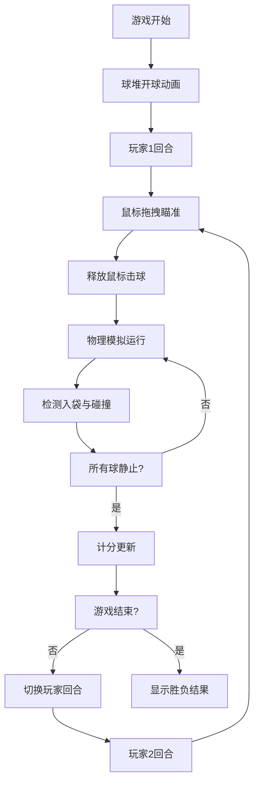

## 1. 产品概述

一款基于浏览器的2D台球对战模拟器，实现真实物理碰撞效果与完整计分规则，为用户提供沉浸式的双人轮流击球体验。

- 核心价值：在浏览器端呈现高品质台球游戏体验，包含真实物理引擎、精美视觉效果和完整游戏规则
- 目标用户：休闲游戏爱好者、台球爱好者

## 2. 核心功能

### 2.1 功能模块

1. **台球物理引擎**：弹性碰撞、摩擦减速、库边反弹、球袋检测
2. **轮流击球系统**：双人轮流控制，鼠标拖拽瞄准，力度控制
3. **计分系统**：按球编号计分，8号球特殊规则，胜负判定
4. **视觉特效**：碰撞火花粒子、入袋涟漪、母球拖尾、球杆蓄力动画
5. **游戏信息面板**：玩家分数、回合指示、剩余球数

### 2.2 页面详情

| 页面名称 | 模块名称 | 功能描述 |
|-----------|-------------|---------------------|
| 游戏主页面 | 顶部信息栏 | 赛博朋克风格霓虹字体，显示游戏模式、双方分数、剩余球数 |
| 游戏主页面 | 台球桌区域 | 绿色绒布球台、深棕边框、金色装饰角、6个球袋 |
| 游戏主页面 | 球与球杆 | 16颗彩球、三角形球杆、蓄力条、瞄准虚线 |
| 游戏主页面 | 粒子特效 | 碰撞金色火花、入袋涟漪、母球拖尾轨迹 |

## 3. 核心流程

玩家进入游戏后，球堆以三角形排列，开球动画自动散开。玩家1通过鼠标拖拽白色母球前方虚线瞄准，松开鼠标击球。击球后母球运动并与其他球碰撞，球入袋时触发计分。所有球静止后切换玩家回合。当8号球在所有其他球入袋后打入时获胜。

## 4. 用户界面设计

### 4.1 设计风格

- **主色调**：深棕木纹背景 (#3E2723)、绿色球台 (#228B22 系)、金色装饰 (#D4AF37)
- **点缀色**：霓虹青 (#00FFCC)、霓虹蓝发光阴影 (#00FFFF)、蓄力渐变 (红#FF0000到黄#FFFF00)
- **字体风格**：赛博朋克风格霓虹字体，带发光阴影效果
- **整体风格**：深色木纹+赛博朋克信息栏的混搭风格，桌球实体感与未来感信息展示结合

### 4.2 页面设计概述

| 页面名称 | 模块名称 | UI元素 |
|-----------|-------------|-------------|
| 游戏主页面 | 背景区域 | 深色木纹横纹纹理，Canvas绘制 |
| 游戏主页面 | 信息栏 | 高度60px，背景#1B1B2F透明度0.9，霓虹字体发光效果 |
| 游戏主页面 | 球台 | 900x450px，深棕边框30px，金色装饰角，6个球袋 |
| 游戏主页面 | 球体 | 16颗球，半径10px，各自颜色，光泽渐变 |
| 游戏主页面 | 球杆 | 三角形，#D4A76A色，蓄力时后移 |
| 游戏主页面 | 粒子效果 | 金色火花、圆形涟漪、拖尾轨迹 |

### 4.3 响应式

- 桌面端优先，球台居中自适应
- 最小支持宽度1024px
- Canvas元素保持固定比例缩放

### 4.4 动效设计

- **开球动画**：球堆三角形排列，0.3秒内向外扩散
- **击球动画**：球杆快速前冲，0.1秒复位
- **粒子效果**：碰撞产生15个金色粒子，0.3秒消散
- **涟漪效果**：入袋时半径10→40px扩散，0.4秒消失
- **拖尾效果**：母球最近20个位置，透明度递减
