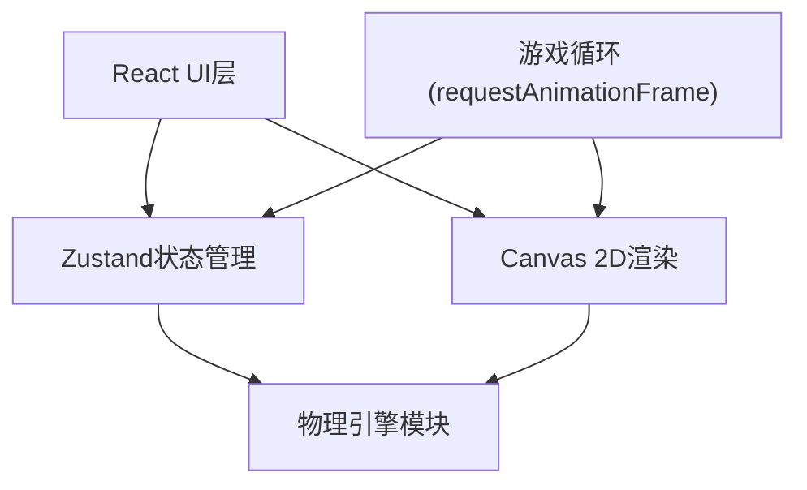

## 1. 架构设计



## 2. 技术栈说明

- **前端框架**：React@18 + TypeScript
- **构建工具**：Vite
- **状态管理**：Zustand
- **渲染方式**：Canvas 2D API
- **物理引擎**：自定义纯函数物理模块
- **唯一标识**：uuid

## 3. 目录结构

```
src/
├── main.tsx              # React入口
├── App.tsx               # 根组件
├── game/
│   ├── types.ts          # 类型定义
│   └── physics.ts        # 物理引擎纯函数
├── store/
│   └── gameStore.ts      # Zustand状态管理
└── ui/
    ├── GameBoard.tsx     # Canvas游戏画布组件
    └── ScorePanel.tsx    # 顶部记分面板组件
```

## 4. 核心数据模型

### 4.1 球 (Ball)

| 字段 | 类型 | 说明 |
|------|------|------|
| id | string | 唯一标识 |
| x | number | x坐标 |
| y | number | y坐标 |
| vx | number | x方向速度 |
| vy | number | y方向速度 |
| radius | number | 半径 |
| number | number | 球号 (0=母球, 1-15彩球) |
| color | string | 颜色 |
| pocketed | boolean | 是否已入袋 |
| trail | {x,y}[] | 拖尾轨迹点 |

### 4.2 玩家 (Player)

| 字段 | 类型 | 说明 |
|------|------|------|
| id | number | 玩家ID |
| name | string | 玩家名称 |
| score | number | 当前分数 |
| group | 'low' \| 'high' \| null | 已分配球组 |

### 4.3 游戏状态

| 字段 | 类型 | 说明 |
|------|------|------|
| balls | Ball[] | 所有球的状态 |
| players | Player[] | 两名玩家 |
| currentPlayer | number | 当前玩家索引 |
| gamePhase | 'aiming' \| 'shooting' \| 'moving' \| 'gameOver' | 游戏阶段 |
| aimData | AimData | 瞄准数据 |
| particles | Particle[] | 粒子效果 |
| ripples | Ripple[] | 涟漪效果 |

## 5. 物理引擎模块

### 5.1 核心函数

- `updateBalls(balls, dt)`: 更新所有球位置，应用摩擦力
- `checkBallCollisions(balls)`: 检测球与球碰撞，动量守恒计算
- `checkWallCollisions(balls, table)`: 检测球与库边碰撞，恢复系数0.85
- `checkPocketCollisions(balls, pockets)`: 检测球是否入袋
- `allBallsStopped(balls)`: 检查所有球是否静止

### 5.2 物理参数

- 球半径: 10px
- 球台尺寸: 900x450px (内沿)
- 边框宽度: 30px
- 球袋半径: 22px
- 摩擦减速度: 0.98 (每帧)
- 库边恢复系数: 0.85
- 最大击球速度: 800px/s
- 停止速度阈值: 0.1px/s

## 6. 渲染模块

Canvas 2D渲染，每帧执行：
1. 绘制背景木纹
2. 绘制球台边框与金色装饰角
3. 绘制球袋
4. 绘制所有球（带光泽渐变）
5. 绘制母球拖尾
6. 绘制瞄准虚线与球杆
7. 绘制蓄力条
8. 绘制粒子与涟漪效果

## 7. 状态管理 (Zustand)

- 管理球、玩家、回合、瞄准、粒子等全部游戏状态
- 提供击球、切换玩家、计分等action
- 物理更新在store中通过setInterval或rAF驱动
