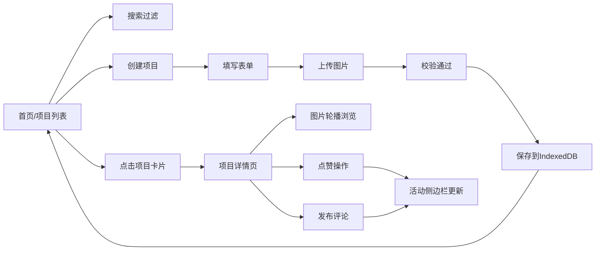

## 1. 产品概述

CommSpace是一个面向社区营造NGO团队的志愿者在线协作平台，用于记录和分享社区公共空间改造方案与活动反馈。志愿者可以创建改造项目、上传对比图片、浏览他人项目、进行互动点赞与评论，促进社区改造经验的交流与传播。

## 2. 核心功能

### 2.1 用户角色

| 角色 | 注册方式 | 核心权限 |
|------|----------|----------|
| 志愿者用户 | 内置模拟用户 | 创建/编辑/删除项目、上传图片、点赞、评论、标记已参与 |

### 2.2 功能模块

1. **项目列表页**：项目卡片展示、搜索过滤、创建新项目入口
2. **项目详情页**：图片轮播、项目描述、点赞、评论区、活动记录
3. **侧边栏活动动态**：最近5条点赞和评论活动

### 2.3 页面详情

| 页面名称 | 模块名称 | 功能描述 |
|----------|----------|----------|
| 项目列表页 | 搜索框 | 实时搜索项目名称，300ms去抖 |
| 项目列表页 | 项目卡片网格 | 240x320px卡片，悬停动画，点击跳转详情 |
| 项目列表页 | 创建项目表单 | 项目名称(50字)、描述(500字)、2-4张图片(jpg/png<2MB) |
| 项目详情页 | 图片轮播 | 左右箭头切换，淡入淡出0.3s过渡 |
| 项目详情页 | 点赞按钮 | 心形图标，灰/红切换，0.2s缩放动画 |
| 项目详情页 | 评论区 | 头像(首字母)、用户名、内容、相对时间、200字限制 |
| 侧边栏 | 活动动态 | 最近5条点赞/评论，时间倒序，图标区分类型 |

## 3. 核心流程

用户访问首页 → 浏览项目列表（可搜索）→ 点击卡片进入详情 → 查看图片和描述 → 点赞/评论 → 活动侧边栏实时更新 → 或点击创建新项目 → 填写表单上传图片 → 提交后列表更新

## 4. 用户界面设计

### 4.1 设计风格

- **主色调**：草绿色 #27AE60（积极、自然、社区感）
- **辅助色**：暖灰色 #ECF0F1、浅米色 #FAF9F6（背景）
- **强调色**：点赞红 #E74C3C、中性灰 #999
- **字体**：无衬线现代字体，标题18px粗体，正文14px
- **布局**：左右两栏（左flex:1最小600px，右320px固定），<768px侧边栏移至底部
- **卡片**：圆角12px，阴影0 4px 12px rgba(0,0,0,0.08)，悬停上移4px加深阴影
- **交互**：按钮hover颜色加深，过渡0.2s，明确反馈

### 4.2 页面设计概览

| 页面名称 | 模块名称 | UI元素 |
|----------|----------|--------|
| 项目列表页 | 顶部导航 | Logo "CommSpace" + 草绿主色 + 创建按钮 |
| 项目列表页 | 搜索框 | 圆角8px，占位文字灰色，实时过滤 |
| 项目列表页 | 卡片网格 | 响应式排列，间距16px，卡片缩略图100x100 |
| 项目详情页 | 轮播容器 | 圆角12px，左右半透明白色圆形箭头 |
| 项目详情页 | 信息区 | 标题18px粗体，描述14px，点赞数评论数 |
| 项目详情页 | 评论输入 | 底部固定，textarea + 发送按钮，Enter提交 |
| 侧边栏 | 活动卡片 | 背景#F5F6FA，内边距20px，条目带图标和时间 |

### 4.3 响应式

- **桌面端(>=768px)**：左右两栏布局，左侧内容区最小600px，右侧侧边栏320px固定
- **移动端(<768px)**：侧边栏折叠至页面底部，变为全宽卡片，主内容区自适应，轮播图高度按比例缩小
- **触摸优化**：按钮最小尺寸44x44px，点击区域放大

## 5. 性能约束

- 列表渲染帧率 >= 30fps
- 图片懒加载（Intersection Observer）
- 侧边栏活动新增渲染延迟 <= 50ms
- 表单校验延迟 <= 100ms
- 搜索去抖300ms
