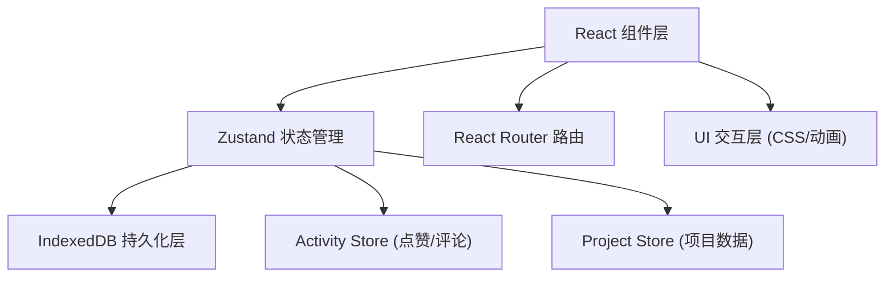
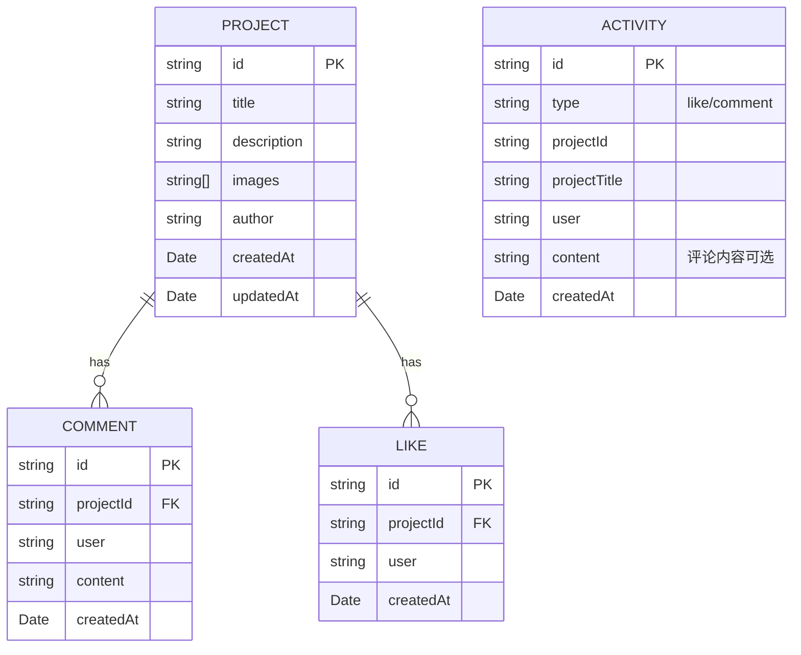

## 1. 架构设计



## 2. 技术栈说明

- **前端框架**：React@18 + TypeScript
- **构建工具**：Vite
- **路由**：react-router-dom@6
- **状态管理**：zustand
- **数据持久化**：IndexedDB (本地存储)
- **工具库**：uuid (ID生成)、date-fns (时间格式化)

## 3. 路由定义

| 路由 | 用途 |
|------|------|
| / | 项目列表页（首页） |
| /project/:id | 项目详情页 |

## 4. 文件结构与调用关系

```
src/
├── App.tsx                    # 主应用，定义路由和整体布局
├── main.tsx                   # 入口文件
├── index.css                  # 全局样式
├── modules/
│   ├── project/
│   │   ├── store.ts           # Zustand store: addProject/updateProject/deleteProject
│   │   ├── ProjectList.tsx    # 调用store.projects，渲染卡片列表
│   │   ├── ProjectDetail.tsx  # 调用store.getProjectById，activity store点赞评论
│   │   └── ProjectForm.tsx    # 调用store.addProject，表单校验与图片上传
│   └── activity/
│       ├── store.ts           # Zustand store: 记录点赞/评论活动
│       └── ActivityFeed.tsx   # 调用activity store.activities，渲染侧边栏
├── utils/
│   ├── db.ts                  # IndexedDB封装：项目/活动的CRUD
│   └── format.ts              # 工具函数：时间格式化等
└── types/
    └── index.ts               # 全局类型定义
```

**数据流向：**
1. 用户操作 → 组件触发 → store方法 → 更新state → 同步写入IndexedDB → 组件响应式重渲染
2. ProjectForm → projectStore.addProject → 生成uuid → 写入IndexedDB → ProjectList自动更新
3. ProjectDetail点赞/评论 → activityStore记录 → 更新project计数 → ActivityFeed实时显示新条目

## 5. 数据模型

### 5.1 数据模型定义



### 5.2 类型定义

```typescript
interface Project {
  id: string;
  title: string;
  description: string;
  images: string[];
  author: string;
  createdAt: Date;
  updatedAt: Date;
}

interface Comment {
  id: string;
  projectId: string;
  user: string;
  content: string;
  createdAt: Date;
}

interface Like {
  id: string;
  projectId: string;
  user: string;
  createdAt: Date;
}

interface Activity {
  id: string;
  type: 'like' | 'comment';
  projectId: string;
  projectTitle: string;
  user: string;
  content?: string;
  createdAt: Date;
}
```

## 6. 关键实现策略

- **IndexedDB封装**：使用Promise包装IDB操作，store初始化时异步加载数据
- **状态同步**：Zustand action中同时更新内存state和IndexedDB
- **图片存储**：将上传图片转为Base64字符串存入IndexedDB
- **性能优化**：React.memo包裹项目卡片，useMemo计算搜索结果，useCallback去抖
- **懒加载**：自定义useLazyLoad hook基于Intersection Observer
- **表单校验**：实时校验，100ms内显示错误，红色边框+提示文字
