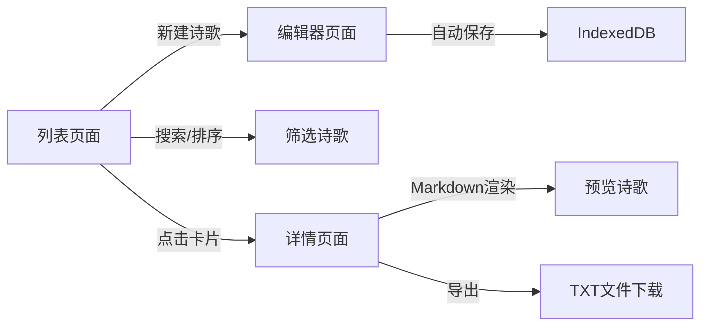

## 1. 产品概述

WindWhisper是一款沉浸式在线诗歌创作与编辑应用，为诗歌爱好者提供优雅、专注的写作环境。用户可以在深色主题的毛玻璃编辑器中创作诗歌，享受流畅的写作体验，并通过本地数据持久化安全保存作品。

- 主要目的：提供专注、优雅的诗歌创作环境，支持诗歌的创作、编辑、管理、预览和导出
- 目标用户：诗歌爱好者、文学创作者、日常写作人群
- 产品价值：沉浸式写作体验 + 本地数据安全存储 + 便捷的诗歌管理与导出功能

## 2. 核心功能

### 2.1 功能模块

1. **诗歌编辑器页面**：全屏毛玻璃编辑器、实时字数统计、自动保存、Markdown实时预览
2. **诗歌列表页面**：卡片网格展示、搜索过滤、排序功能、分页加载
3. **诗歌详情页面**：Markdown渲染预览、导出为TXT文件功能

### 2.2 页面详情

| 页面名称 | 模块名称 | 功能描述 |
|-----------|-------------|---------------------|
| 编辑器页面 | 毛玻璃编辑区 | 全屏半透明背景，模糊效果，高度自适应文本输入 |
| 编辑器页面 | 自动保存机制 | 输入停止500ms后自动保存至IndexedDB，显示"已保存"提示 |
| 编辑器页面 | 字数统计 | 实时统计诗歌字数 |
| 编辑器页面 | 实时预览 | 支持Markdown格式实时渲染预览 |
| 列表页面 | 卡片网格布局 | Masonry布局，卡片悬停上浮动效 |
| 列表页面 | 搜索框 | 按标题实时搜索过滤，延迟150ms |
| 列表页面 | 排序下拉 | 支持创建时间、编辑时间、标题字母排序 |
| 列表页面 | 无限滚动 | Intersection Observer实现底部自动加载更多 |
| 详情页面 | Markdown渲染 | 使用marked库渲染诗歌正文 |
| 详情页面 | 导出功能 | 导出为TXT文件，文件名为诗歌标题 |

## 3. 核心流程

用户打开应用进入诗歌列表页面 → 点击"新建诗歌"进入编辑器 → 在沉浸式环境中创作诗歌（自动保存）→ 返回列表查看所有诗歌 → 使用搜索/排序筛选诗歌 → 点击诗歌卡片进入详情页预览 → 导出诗歌为TXT文件

## 4. 用户界面设计

### 4.1 设计风格
- 主色调：深色背景 #0F0F1A，强调色紫色 #8B5CF6
- 辅助色：卡片背景 #2D2D3F，搜索框背景 #1E1E2E，成功提示绿色 #22C55E
- 文字颜色：主要文字 #E0E0E0，次要文字灰色
- 按钮/卡片：圆角设计（编辑器16px、卡片12px、搜索框20px）
- 字体：编辑器使用24px衬线体，标题16px粗体白色，摘要14px灰色
- 动效：卡片悬停上浮8px（0.3s过渡）、保存提示顶部滑入、光标闪烁动画（0.5s）
- 布局：桌面端Masonry网格，移动端单列自适应

### 4.2 页面设计概述

| 页面名称 | 模块名称 | UI元素 |
|-----------|-------------|-------------|
| 编辑器页面 | 毛玻璃编辑区 | 半透明背景#FFFFFF15、模糊10px、圆角16px、白色光标2px、衬线字体24px、行高2.0 |
| 编辑器页面 | 保存提示 | 绿色背景#22C55E、白色文字、圆角8px、顶部滑入、2秒后淡出 |
| 列表页面 | 诗歌卡片 | 宽320px高240px、背景#2D2D3F、圆角12px、阴影0 4px 15px rgba(0,0,0,0.3)、悬停上浮8px |
| 列表页面 | 搜索框 | 宽度60%、背景#1E1E2E、圆角20px、内边距12px |
| 列表页面 | 排序下拉 | 背景#2D2D3F、圆角8px |
| 详情页面 | 导出按钮 | 紫色强调色#8B5CF6、点击显示toast提示"导出成功"3秒 |

### 4.3 响应式适配

- 桌面端（≥768px）：编辑器全屏、诗歌列表多列Masonry网格（列间距20px、行间距24px）、每次加载12张卡片
- 移动端（<768px）：编辑器宽度90%视口、字体18px、诗歌列表单列布局、卡片宽度占满父容器

### 4.4 性能要求

- 输入到预览渲染响应时间：≤40ms（3000字符以下）
- 自动保存延迟：输入停止后500ms内完成保存操作
