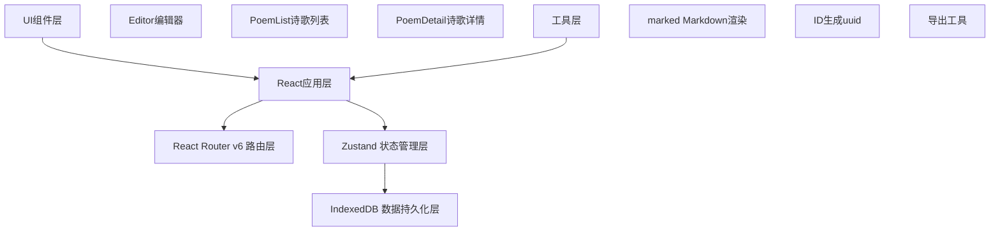
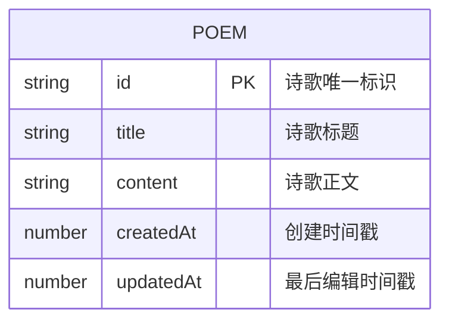

## 1. 架构设计



## 2. 技术说明

- 前端框架：React@18 + TypeScript
- 构建工具：Vite
- 状态管理：Zustand
- 前端路由：React Router v6
- 数据持久化：IndexedDB（浏览器本地存储
- Markdown渲染：marked
- ID生成：uuid

## 3. 路由定义

| 路由路径 | 页面组件 | 用途说明 |
|-----------|-------------|
| / | PoemList | 诗歌列表首页，展示所有已保存诗歌 |
| /editor/:id? | Editor | 诗歌编辑器，支持新建和编辑已有诗歌 |
| /poem/:id | PoemDetail | 诗歌详情页，Markdown渲染预览和导出 |

## 4. 数据模型

### 4.1 数据模型定义



### 4.2 TypeScript 类型定义

```typescript
interface Poem {
  id: string;
  title: string;
  content: string;
  createdAt: number;
  updatedAt: number;
}
```

## 5. 文件结构

```
auto60/
├── package.json
├── vite.config.js
├── tsconfig.json
├── index.html
├── src/
│   ├── main.tsx              # 应用入口
│   ├── App.tsx               # 根组件
│   ├── index.css             # 全局样式
│   ├── components/
│   │   ├── Editor.tsx      # 诗歌编辑器组件
│   │   ├── PoemList.tsx  # 诗歌列表组件
│   │   ├── PoemDetail.tsx # 诗歌详情组件
│   │   └── Toast.tsx      # Toast提示组件
│   ├── stores/
│   │   └── poemStore.ts   # Zustand状态管理
│   ├── utils/
│   │   ├── db.ts          # IndexedDB封装
│   │   └── export.ts      # 导出工具函数
│   └── types/
│       └── index.ts       # TypeScript类型定义
```

## 6. 核心实现要点

### 6.1 IndexedDB封装
- 使用Promise封装IndexedDB API
- 数据库名称：windwhisper-db
- 存储对象：poems
- 索引：id（主键），createdAt，updatedAt，title

### 6.2 Zustand状态管理
- poems：诗歌列表数据
- currentPoem：当前编辑诗歌
- 异步actions：fetchPoems, createPoem, updatePoem, deletePoem, getPoemById
- 与IndexedDB数据同步

### 6.3 性能优化
- 自动保存防抖（500ms）
- 搜索防抖（150ms）
- 列表虚拟滚动/分页加载（每次12条）
- Intersection Observer实现无限滚动
