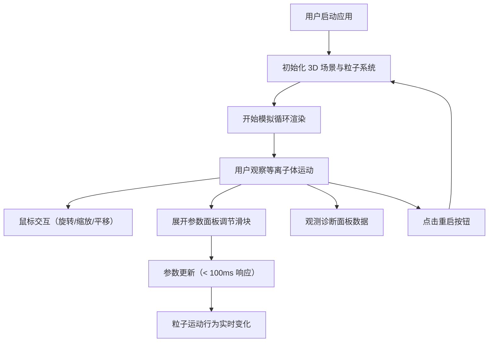

## 1. 产品概述

核聚变过程 3D 教育可视化应用，通过沉浸式 3D 交互帮助学生和物理爱好者直观理解托卡马克装置中等离子体运动与核聚变反应原理，解决抽象物理过程难以具象化、缺乏交互式探索工具的问题。

- **核心目标**：将复杂的等离子体物理过程转化为可交互的 3D 可视化，支持实时参数调节与数据观测
- **目标用户**：物理专业学生、科学教育工作者、核聚变爱好者
- **产品价值**：降低核聚变物理的理解门槛，提供沉浸式的科学探索体验

## 2. 核心功能

### 2.2 功能模块
1. **主场景模拟**：托卡马克环形腔 3D 渲染、等离子体粒子系统、磁场力场模拟、聚变碰撞效果
2. **参数调控面板**：温度控制、磁场强度调节、粒子数量控制、反应概率调节
3. **诊断数据面板**：聚变反应速率、等离子体温度曲线、累计聚变次数统计
4. **视角操控系统**：鼠标拖拽旋转、滚轮缩放、右键平移

### 2.3 页面详情
| 页面名称 | 模块名称 | 功能描述 |
|-----------|-------------|---------------------|
| 主模拟界面 | 3D 粒子模拟 | 实时渲染 200-500 个发光粒子在托卡马克环内的螺旋运动，支持碰撞检测与聚变效果可视化 |
| 主模拟界面 | 参数调控面板 | 可折叠的右侧面板，提供温度、磁场、粒子数、反应概率四个滑块控件，支持平滑过渡 |
| 主模拟界面 | 诊断图表窗 | 左下角悬浮窗，实时显示反应速率进度条、温度迷你折线图、累计聚变次数 |
| 主模拟界面 | 导航栏 | 顶部导航栏，包含应用 Logo、重启按钮、全屏切换按钮 |

## 3. 核心流程

用户进入应用后，自动启动核聚变模拟。可通过鼠标拖拽旋转视角观察托卡马克环内的粒子运动，滚动滚轮缩放场景，右键平移调整位置。展开右侧面板调节物理参数，观测参数变化对粒子运动和聚变反应的影响。左下角诊断面板实时显示当前模拟数据。点击重启按钮重置整个模拟状态。

## 4. 用户界面设计

### 4.1 设计风格
- **主色调**：深空蓝 `#0A0A1A` 背景，青色 `#00E5FF` 作为科技感点缀，红色 `#FF3366` 作为警示/强调色，金色 `#FFD700` 标记聚变热点
- **按钮风格**：圆角矩形按钮，悬停时颜色变亮，过渡动画 0.2s
- **字体**：Inter 无衬线字体，数字使用 Consolas 等宽字体
- **布局风格**：全屏沉浸式布局，UI 控件悬浮于 3D 场景之上，采用半透明毛玻璃效果
- **视觉元素**：星空点阵背景、发光扫描线、粒子发光效果、边缘光效

### 4.2 页面设计概述
| 页面名称 | 模块名称 | UI 元素 |
|-----------|-------------|-------------|
| 主模拟界面 | 3D 场景 | 半透明托卡马克环（#2A4A7F，透明度 0.3）、发光粒子系统、聚变闪光效果、高亮碰撞标记 |
| 主模拟界面 | 右侧参数面板 | 可折叠面板（#1A1A2E，0.9 半透明，圆角 12px），蓝红渐变温度滑块，磁场/粒子数/概率滑块 |
| 主模拟界面 | 诊断数据窗 | 半透明面板（#0D1117，2px #00E5FF 边框），水平进度条（青到红渐变），迷你折线图，等宽数字 |
| 主模拟界面 | 导航栏 | 半透明顶栏（#0A0A1A，0.85 透明度），FusionSim 3D 文字 Logo，红色重启按钮，全屏图标按钮 |

### 4.3 响应式
- 桌面端优先设计，支持 1920x1080 及以上分辨率
- Canvas 自动适配窗口大小，UI 面板保持固定位置
- 窗口 resize 时自动重新计算相机投影矩阵与渲染器尺寸

### 4.4 3D 场景指导
- **环境**：深空星空背景（Canvas 生成随机点阵），无外部 HDRI
- **光照**：场景环境光 + 粒子自发光 + 碰撞闪光点光源
- **相机**：PerspectiveCamera，初始距离 15 单位，视角 60°，目标点为场景中心
- **动画**：环形扫描线周期 4s，碰撞闪光 0.3s 衰减，高亮标记 1.5s 消失，粒子螺旋运动 0.5 弧度/秒
- **后期处理**：轻微 bloom 发光效果增强科技感
- **性能优化**：BufferGeometry、frustum culling、实例化渲染，目标帧率 45fps+
