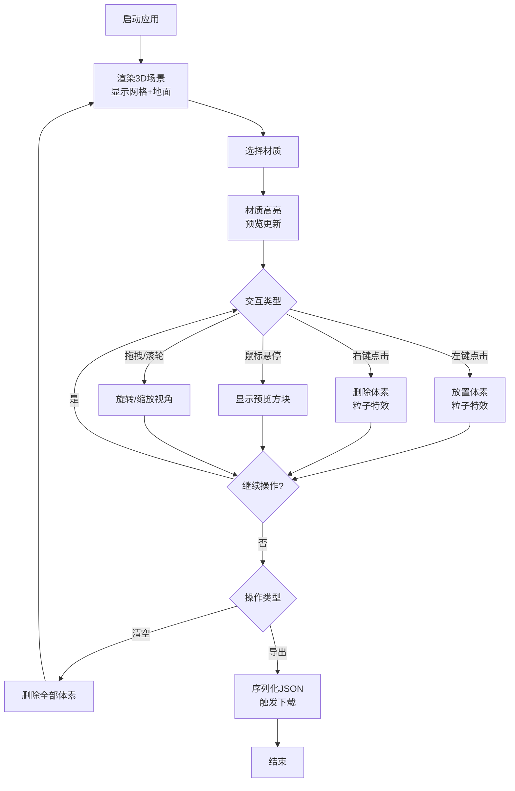

## 1. 产品概述

VoxelForge是一款基于Web的交互式3D体素世界构建工具，用户可以通过简单的点击和拖拽操作在三维网格中堆叠、删除和替换不同材质的体素方块，自由建造立体场景，并支持将作品导出为JSON格式的模型文件。

- **核心用途**：为创意工作者、游戏开发者和3D爱好者提供一个轻量级的浏览器内体素建模工具
- **目标用户**：3D建模初学者、像素美术师、独立游戏开发者、教育场景中的师生
- **产品价值**：无需安装专业软件，在浏览器中即可快速构建体素模型，降低3D创作门槛

## 2. 核心功能

### 2.1 用户角色
本工具无需登录，所有用户以访客身份使用全部功能。

### 2.2 功能模块
1. **主场景页面**：
   - 3D体素渲染场景
   - 网格辅助线显示
   - 轨道相机控制
   - 体素预览与放置
   - 粒子爆散特效

2. **工具栏模块**：
   - 清空世界按钮
   - 导出JSON按钮
   - 网格辅助开关
   - 当前材质预览

3. **材质面板模块**：
   - 预设材质卡片网格
   - 材质选中状态
   - 面板可折叠/关闭

### 2.3 页面详情
| 页面名称 | 模块名称 | 功能描述 |
|---------|---------|---------|
| 主场景 | 3D体素网格 | 15x15x15透明线框网格，支持射线投射命中检测 |
| 主场景 | 体素交互 | 左键放置体素，右键删除体素，悬停显示预览 |
| 主场景 | 相机控制 | 轨道旋转（带阻尼）、滚轮缩放（范围5-50） |
| 主场景 | 视觉效果 | 渐变天空盒、地面辅助网格、粒子爆散动画 |
| 工具栏 | 清空操作 | 一键删除所有体素，恢复空场景 |
| 工具栏 | 导出功能 | 将体素数据序列化为JSON并触发下载 |
| 工具栏 | 网格开关 | Toggle开关控制辅助网格显隐 |
| 工具栏 | 材质预览 | 50x50px方块展示当前选中材质 |
| 材质面板 | 材质选择 | 6种预设材质卡片，4列网格排列，点击切换 |
| 材质面板 | 面板控制 | 右上角X按钮关闭面板 |

## 3. 核心流程

**主要用户流程：**
1. 用户打开应用 → 3D场景自动渲染，显示体素网格和地面辅助平面
2. 用户从右侧材质面板选择一种材质 → 选中材质高亮，工具栏预览块同步更新
3. 用户左键点击网格位置 → 在对应坐标放置该材质的体素，触发粒子爆散特效
4. 用户右键点击已有体素 → 删除该体素，触发粒子爆散特效
5. 用户悬停在可放置位置 → 显示半透明预览方块
6. 用户可通过拖拽旋转场景视角、滚轮缩放查看细节
7. 用户可切换网格辅助线开关、清空整个场景
8. 用户点击导出按钮 → 下载JSON格式的模型文件

## 4. 用户界面设计

### 4.1 设计风格
- **主色调**：暗色主题，背景渐变 `#0A0A1A` → `#1A1A3A`
- **点缀色**：霓虹青蓝 `#00E5FF`，用于选中边框和hover发光效果
- **面板背景**：深灰蓝 `#1E1E2E`，圆角12px，带轻微透明度
- **按钮配色**：
  - 危险操作（清空）：红色 `#E74C3C`，hover变亮10%
  - 主要操作（导出）：蓝色 `#3498DB`，hover变亮10%
  - Toggle滑块：绿色 `#2ECC71`
- **字体**：现代无衬线字体，清晰易读
- **整体风格**：赛博朋克暗色科技风，配合霓虹高光，营造未来感创作环境

### 4.2 页面设计概述
| 页面名称 | 模块名称 | UI元素 |
|---------|---------|--------|
| 主场景 | 3D画布 | 全屏渲染，渐变天空，半透明网格平面 |
| 主场景 | 体素网格 | 15x15x15线框，颜色#444466，线宽1px |
| 主场景 | 预览方块 | 半透明（alpha 0.4），无碰撞，跟随鼠标 |
| 主场景 | 粒子效果 | 12个同色粒子，向外扩散，0.2秒淡出 |
| 左侧工具栏 | 固定面板 | 宽度220px，背景#1E1E2E，圆角12px |
| 左侧工具栏 | 按钮组 | 清空（红）、导出（蓝），带hover发光边框 |
| 左侧工具栏 | Toggle开关 | 网格辅助开关，滑块#2ECC71 |
| 左侧工具栏 | 材质预览 | 50x50px方块，带选中脉冲动画（缩放1.05，0.5s周期） |
| 右侧材质面板 | 悬浮面板 | 宽度300px，背景#1E1E2E，圆角12px，透明度0.9 |
| 右侧材质面板 | 关闭按钮 | 右上角X，hover高亮 |
| 右侧材质面板 | 材质卡片 | 60x60px，圆角8px，4列网格，hover放大1.1倍+阴影 |
| 右侧材质面板 | 选中状态 | 2px白色发光边框，标签文字 |

### 4.3 响应式设计
- **桌面端（≥768px）**：左侧固定工具栏（220px宽），右侧悬浮材质面板（300px宽），中间为3D场景
- **移动端（<768px）**：工具栏和材质面板合并为底部固定栏（高度80px），水平排列核心控件，材质选择改为横向滚动列表，3D场景自动适配剩余空间

### 4.4 3D场景设计
- **环境光**：柔和的半球光 + 方向光组合，确保体素表面有足够明暗层次
- **天空盒**：自定义渐变色（#0A0A1A → #1A1A3A），营造深空氛围
- **地面**：40x40单位半透明网格平面（网格线#333355，透明度0.2）
- **相机**：透视相机，初始位置约(12, 12, 12)，看向原点，轨道控制阻尼0.1
- **后处理**：轻微抗锯齿，保证边缘平滑
- **性能预算**：200个体素时≥45fps，粒子每帧≤100个
