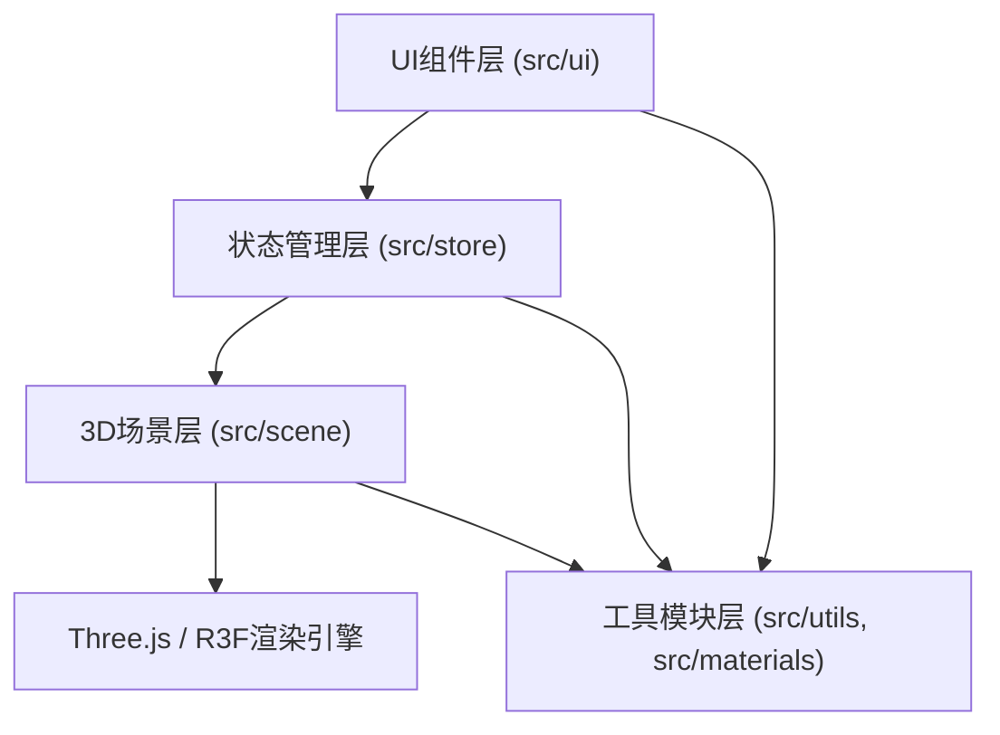

## 1. 架构设计

本项目为纯前端单页应用（SPA），采用分层架构设计，将3D渲染层、状态管理层、UI层和工具层清晰分离。



**层级说明：**
- **UI组件层**：负责Toolbar和MaterialPanel的渲染与用户交互
- **状态管理层**：Zustand管理体素数据、当前材质、工具模式等全局状态
- **3D场景层**：@react-three/fiber构建的3D场景，包含体素渲染、相机控制、射线检测
- **工具模块层**：材质配置、模型导出、体素构建逻辑等独立工具函数

## 2. 技术选型说明

| 技术栈 | 版本 | 用途 |
|-------|------|------|
| React | 18.x | UI框架，组件化开发 |
| React DOM | 18.x | 虚拟DOM渲染 |
| TypeScript | 5.x | 静态类型检查 |
| Vite | 5.x | 构建工具，开发服务器 |
| Three.js | 0.160.x | 底层3D渲染引擎 |
| @react-three/fiber | 8.x | React式Three.js封装 |
| @react-three/drei | 9.x | R3F常用组件库（OrbitControls等） |
| Zustand | 4.x | 轻量级状态管理 |
| uuid | 9.x | 生成体素唯一ID |

**项目初始化方式**：使用Vite官方 `react-ts` 模板创建基础项目结构，手动添加Three.js相关依赖。

## 3. 目录结构设计

```
auto64/
├── index.html                    # 入口HTML，全屏配置
├── package.json                  # 依赖与脚本配置
├── vite.config.js                # Vite构建配置（含React插件）
├── tsconfig.json                 # TS配置（严格模式，ES2020）
└── src/
    ├── main.tsx                  # React应用入口
    ├── App.tsx                   # 根组件，布局拼装
    ├── store/
    │   └── editorStore.ts        # Zustand状态仓库
    ├── scene/
    │   ├── VoxelWorld.tsx        # 3D场景主组件
    │   └── VoxelBuilder.ts       # 体素构建逻辑类
    ├── materials/
    │   └── materialStore.ts      # 材质数据模块
    ├── ui/
    │   ├── Toolbar.tsx           # 工具栏组件
    │   └── MaterialPanel.tsx     # 材质面板组件
    └── utils/
        └── modelExporter.ts      # JSON导出工具
```

## 4. 核心数据模型定义

### 4.1 体素数据（Voxel）
```typescript
interface Voxel {
  id: string;          // uuid生成的唯一标识
  x: number;           // 网格X坐标（整数，-7 ~ 7）
  y: number;           // 网格Y坐标（整数，0 ~ 14）
  z: number;           // 网格Z坐标（整数，-7 ~ 7）
  material: string;    // 材质类型ID（如"stone"、"grass"）
}
```

### 4.2 材质配置（MaterialConfig）
```typescript
interface MaterialConfig {
  id: string;          // 材质唯一ID
  name: string;        // 显示名称（中文）
  color: string;       // 基础颜色（十六进制）
  roughness: number;   // 粗糙度 0-1
  metalness: number;   // 金属度 0-1
  transparent?: boolean;  // 是否透明
  opacity?: number;       // 透明度 0-1
  emissive?: string;      // 自发光颜色
  emissiveIntensity?: number; // 自发光强度
}
```

### 4.3 编辑器状态（EditorState）
```typescript
interface EditorState {
  voxels: Voxel[];                 // 所有体素数据
  currentMaterial: string;         // 当前选中材质ID
  showGrid: boolean;               // 是否显示网格辅助线
  toolMode: 'add' | 'remove';      // 工具模式
  // Actions
  addVoxel: (x: number, y: number, z: number) => void;
  removeVoxel: (id: string) => void;
  setMaterial: (materialId: string) => void;
  toggleGrid: () => void;
  clearWorld: () => void;
}
```

### 4.4 导出JSON格式
```typescript
interface ExportedModel {
  version: "1.0";
  voxels: Array<{
    x: number;
    y: number;
    z: number;
    material: string;
  }>;
}
```

## 5. 核心组件与数据流

### 5.1 组件交互流程
```
用户操作（UI）
    ↓
MaterialPanel → setMaterial → editorStore 更新
    ↓
Toolbar → clearWorld / toggleGrid / export → editorStore / modelExporter
    ↓
VoxelWorld（订阅 editorStore）
    ↓
VoxelBuilder（监听点击事件）
    ↓
射线检测 → 计算网格坐标 → addVoxel/removeVoxel → editorStore
    ↓
VoxelWorld 重新渲染体素 + 触发粒子效果
```

### 5.2 关键实现要点

1. **网格坐标计算**：
   - 体素网格范围：X/Z ∈ [-7, 7]，Y ∈ [0, 14]，对应15x15x15
   - 射线命中后，根据命中面法线方向确定放置/删除的坐标
   - 放置坐标 = 命中方块坐标 + 法线方向（新方块贴在被点击面的外侧）
   - 删除坐标 = 命中方块本身的坐标

2. **体素渲染优化**：
   - 使用 `useMemo` 缓存已渲染体素，避免不必要的重建
   - 相同材质的体素可考虑InstancedMesh（按需优化）
   - 200个体素目标使用普通Mesh即可满足性能

3. **粒子系统**：
   - 使用@react-three/drei的Points或自定义粒子组
   - 每次操作12个粒子，生命周期0.2秒，超量自动回收
   - 粒子位置随机分布在半径1.5单位球体内

4. **预览方块**：
   - 射线检测到有效位置时，根据鼠标实时更新位置
   - 材质与当前选择一致，opacity=0.4，transparent=true
   - 不参与射线检测（raycast={() => null}）

## 6. 性能保障策略

| 性能指标 | 目标值 | 保障措施 |
|---------|--------|---------|
| 操作响应延迟 | ≤50ms | Zustand轻量更新，避免全量重渲染 |
| 200体素帧率 | ≥45fps | 合理使用useMemo/useRef，减少R3F reconciler开销 |
| 粒子数量控制 | ≤100/帧 | 固定对象池，过期粒子复用 |
| 内存占用 | 稳定 | 体素删除时清理Three.js资源 |
