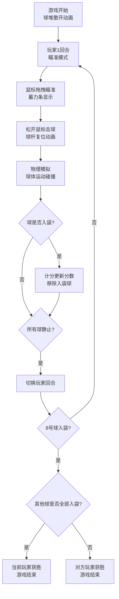

## 1. 产品概述

2D台球对战模拟器是一款基于浏览器的双人对战游戏，实现真实桌球物理碰撞与计分规则的休闲竞技游戏。
- 主要用途：为台球爱好者提供线上对战娱乐体验，在浏览器中即可体验真实的台球物理效果和完整的计分规则
- 目标用户：台球爱好者、休闲游戏玩家
- 核心价值：真实物理模拟 + 完整规则 + 精美视觉效果

## 2. 核心功能

### 2.1 用户角色

| 角色 | 注册方式 | 核心权限 |
|------|----------|----------|
| 玩家1 | 本地对战 | 控制白色母球、击球、得分 |
| 玩家2 | 本地对战 | 控制白色母球、击球、得分 |

### 2.2 功能模块

1. **游戏主界面**：球台渲染、球体物理模拟、瞄准系统
2. **计分系统**：玩家分数、回合切换、胜负判定
3. **视觉特效**：碰撞火花、球袋涟漪、母球拖尾、蓄力条
4. **控制系统**：鼠标瞄准、力度控制、球杆动画

### 2.3 页面详情

| 页面名称 | 模块名称 | 功能描述 |
|----------|----------|----------|
| 游戏主页面 | 顶部信息栏 | 显示两名玩家分数、当前回合、剩余球数，赛博朋克霓虹风格 |
| 游戏主页面 | 球台区域 | 绿色绒布球台、6个球袋、金色装饰角、深棕色边框 |
| 游戏主页面 | 球体系统 | 16颗球（1颗白球+15颗彩球）、物理碰撞、摩擦减速 |
| 游戏主页面 | 瞄准系统 | 虚线瞄准线、球杆对焦、蓄力条、力度控制 |
| 游戏主页面 | 特效系统 | 碰撞火花粒子、球袋涟漪、母球拖尾轨迹 |

## 3. 核心流程

玩家通过鼠标拖拽白色母球前方的虚线进行瞄准，松开鼠标击球。
击球后母球运动并与其他球发生碰撞。
球入袋后根据球的编号计分，8号球需最后打入才算获胜。
击球后切换到另一位玩家的回合。

## 4. 用户界面设计

### 4.1 设计风格
- **主色调**：深棕色木纹背景（#3E2723）、绿色球台（绿色绒布质感）、深棕色边框（#8B4513）
- **强调色**：金色装饰角（#D4AF37）、霓虹青（#00FFCC）、蓄力条红到黄渐变（#FF0000→#FFFF00）
- **字体**：赛博朋克风格霓虹字体，带发光阴影
- **布局**：居中自适应布局，顶部信息栏 + 中央球台

### 4.2 页面设计概览

| 页面名称 | 模块名称 | UI元素 |
|----------|----------|--------|
| 游戏主页面 | 顶部信息栏 | 高度60px，背景#1B1B2F透明度0.9，霓虹字体24px，发光阴影 |
| 游戏主页面 | 球台 | 900x450px，绿色绒布，深棕色边框30px宽，金色装饰角 |
| 游戏主页面 | 球袋 | 6个圆形球袋，半径22px，颜色#2C1810 |
| 游戏主页面 | 球 | 半径10px，白色母球+15颗彩色球 |
| 游戏主页面 | 瞄准线 | 虚线200px，间距8px，白色透明度0.6 |
| 游戏主页面 | 球杆 | 三角形，长200px，尾部宽8px，尖端宽2px，颜色#D4A76A |
| 游戏主页面 | 蓄力条 | 宽80px高10px，红到黄渐变 |

### 4.3 响应式
- 桌面端优先设计
- 整体居中自适应
- 球台固定尺寸900x450px

### 4.4 动画效果
- 开球时球堆自动散开动画（0.3s内向外扩散）
- 碰撞火花粒子效果（15个金色粒子，0.3秒）
- 球袋涟漪效果（半径10→40px，0.4秒）
- 母球拖尾轨迹（最近20个位置，透明度递减）
- 球杆击球动画（蓄力后拉+快速向前，0.1s复位）
