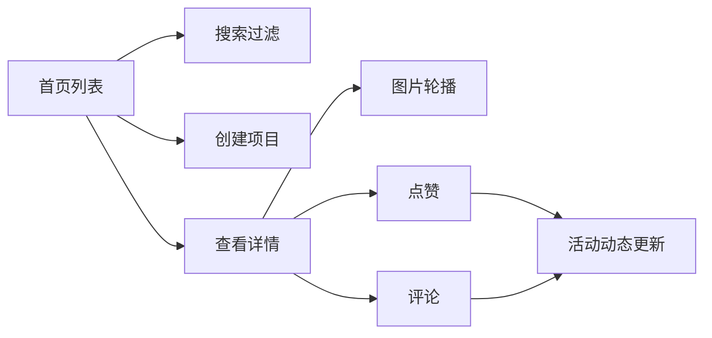

## 1. 产品概述

CommSpace 是一款面向社区营造NGO团队的在线协作平台，用于记录和分享社区公共空间改造方案与活动反馈，促进志愿者之间的协作与交流。

- 目标用户：社区NGO志愿者、社区工作者、普通居民
- 核心价值：沉淀社区改造经验，增强志愿者参与感，促进社区共建共享

## 2. 核心功能

### 2.1 用户角色
| 角色 | 注册方式 | 核心权限 |
|------|----------|----------|
| 志愿者用户 | 匿名使用（本地存储） | 创建项目、点赞、评论、标记参与 |

### 2.2 功能模块
1. **项目列表页**：项目卡片展示、搜索过滤、新建项目入口
2. **项目详情页**：图片轮播、项目描述、点赞、评论区
3. **活动动态侧边栏**：最近点赞和评论活动展示

### 2.3 页面详情
| 页面名称 | 模块名称 | 功能描述 |
|----------|----------|----------|
| 项目列表页 | 搜索框 | 按项目名称实时过滤（去抖300ms） |
| 项目列表页 | 项目卡片网格 | 展示标题、封面、点赞数、评论数，点击跳转详情 |
| 项目列表页 | 新建项目按钮 | 打开创建项目表单 |
| 项目详情页 | 图片轮播 | 淡入淡出切换，左右箭头导航 |
| 项目详情页 | 点赞按钮 | 心形图标，缩放动画，状态切换 |
| 项目详情页 | 评论区 | 评论列表、评论输入框 |
| 活动侧边栏 | 活动动态列表 | 最近5条点赞/评论活动，时间倒序 |

## 3. 核心流程

用户打开应用 → 浏览项目列表（可搜索） → 点击项目卡片进入详情 → 查看图片和描述 → 点赞/评论 → 活动动态实时更新

## 4. 用户界面设计

### 4.1 设计风格
- 主色调：草绿 #27AE60
- 辅助色：暖灰 #ECF0F1、浅米色 #FAF9F6、点赞红 #E74C3C
- 按钮：圆角，hover时草绿加深为 #219150
- 字体：清晰易读的无衬线字体
- 布局：左右两栏，左侧主内容区，右侧活动侧边栏
- 图标风格：Lucide 线性图标

### 4.2 页面设计概述
| 页面名称 | 模块名称 | UI元素 |
|----------|----------|--------|
| 项目列表页 | 搜索框 | 顶部居中，placeholder "搜索项目名称..." |
| 项目列表页 | 项目卡片 | 240x320px，圆角12px，阴影，hover上移4px |
| 项目详情页 | 图片轮播 | 淡入淡出0.3s，圆形半透明箭头 |
| 项目详情页 | 评论列表 | 圆形头像（灰底白字首字母），相对时间显示 |
| 活动侧边栏 | 活动条目 | 320px宽，#F5F6FA背景，带图标 |

### 4.3 响应式
- 桌面端（≥768px）：左右两栏布局，侧边栏固定320px
- 移动端（<768px）：侧边栏折叠至底部，全宽卡片，轮播图按比例缩小
