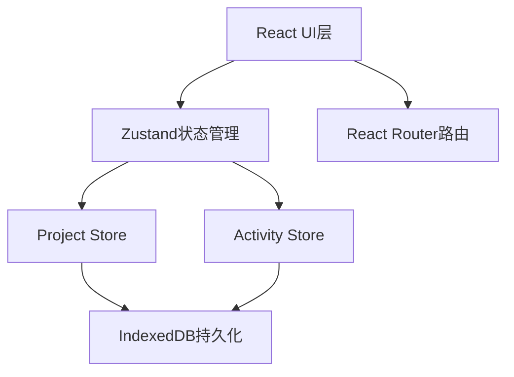
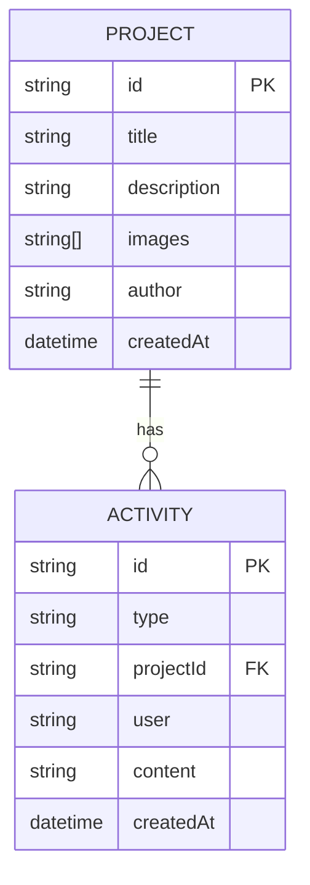

## 1. 架构设计



## 2. 技术说明

- 前端框架：React@18 + TypeScript
- 构建工具：Vite
- 状态管理：Zustand
- 路由：react-router-dom@6
- 数据持久化：IndexedDB
- 工具库：uuid、date-fns
- 图标：lucide-react

## 3. 路由定义
| 路由 | 用途 |
|------|------|
| / | 项目列表页 |
| /project/:id | 项目详情页 |

## 4. 数据模型

### 4.1 数据模型定义


### 4.2 类型定义
```typescript
interface Project {
  id: string;
  title: string;
  description: string;
  images: string[];
  author: string;
  createdAt: number;
}

interface Activity {
  id: string;
  type: 'like' | 'comment';
  projectId: string;
  projectTitle: string;
  user: string;
  content?: string;
  createdAt: number;
}

interface Like {
  projectId: string;
  userId: string;
}

interface Comment {
  id: string;
  projectId: string;
  user: string;
  content: string;
  createdAt: number;
}
```

## 5. 文件结构
```
src/
├── App.tsx              # 主应用，路由与布局
├── main.tsx             # 入口文件
├── index.css            # 全局样式
├── modules/
│   ├── project/
│   │   ├── store.ts          # 项目状态管理
│   │   ├── ProjectList.tsx   # 项目列表组件
│   │   ├── ProjectDetail.tsx # 项目详情组件
│   │   └── ProjectForm.tsx   # 创建/编辑项目表单
│   └── activity/
│       ├── store.ts          # 活动状态管理
│       └── ActivityFeed.tsx  # 活动动态侧边栏
├── shared/
│   └── types.ts          # 共享类型定义
└── utils/
    ├── db.ts             # IndexedDB封装
    └── hooks.ts          # 自定义hooks
```

## 6. 数据流向
1. 用户操作 → 组件触发store方法 → 更新Zustand状态 → 同步写入IndexedDB
2. 组件订阅store → 状态变化 → UI自动更新
3. ActivityStore通过projectId关联Project数据
