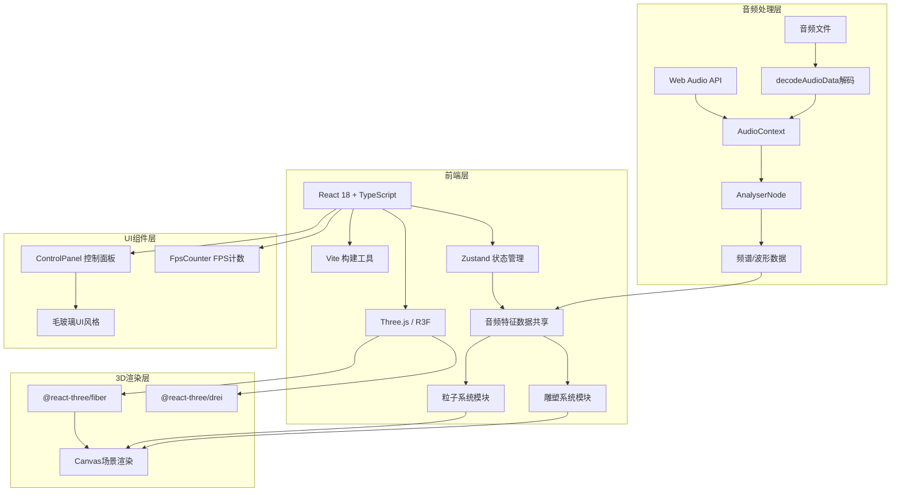

## 1. 架构设计



## 2. 技术描述
- **前端框架**：React@18 + TypeScript
- **构建工具**：Vite（配置@别名指向src）
- **3D渲染**：Three.js + @react-three/fiber + @react-three/drei
- **状态管理**：Zustand
- **音频处理**：Web Audio API（原生）
- **样式方案**：原生CSS（毛玻璃backdrop-filter）

## 3. 目录结构
```
src/
├── main.tsx              # React入口
├── App.tsx              # 主组件，Canvas场景组装
├── store/
│   └── audioStore.ts   # Zustand音频状态Store
├── audio/
│   └── audioProcessor.ts  # 音频处理模块
├── visualizer/
│   ├── particleSystem.ts  # 粒子系统Hook
│   └── sculptureSystem.ts  # 雕塑系统Hook
└── components/
    ├── ControlPanel.tsx   # 毛玻璃控制面板
    └── FpsCounter.tsx  # FPS计数器
```

## 4. 核心数据模型（Zustand Store）

```typescript
interface AudioState {
  frequencyData: Uint8Array;    // 频域频谱数组 (长度128)
  timeDomainData: Uint8Array; // 时域波形数组 (长度128)
  beat: number;            // 当前节拍强度 (0-1)
  volume: number;          // 当前音量级别 (0-1)
  update(freq: Uint8Array, time: Uint8Array, beat: number, volume: number): void;
}
```

## 5. 模块接口定义

### 5.1 audioProcessor.ts
- `loadAudio(file: File): Promise<void>` - 加载并解码音频文件
- `startPlayback(): void` - 开始播放
- `stopPlayback(): void` - 停止播放
- `setVolume(volume: number): void` - 设置音量

### 5.2 particleSystem.ts (useParticleAnimation)
- 输入：store中的frequencyData, timeDomainData, beat, volume
- 输出：每帧更新600粒子的位置、颜色、大小
- 使用PointsGeometry + PointsMaterial + 自定义着色器

### 5.3 sculptureSystem.ts (useSculptureAnimation)
- 输入：store中的beat数据
- 输出：三层ExtrudeGeometry雕塑
- 功能：Y轴旋转、节拍缩放、粒子爆散

### 5.4 ControlPanel.tsx
- 文件上传按钮、播放/暂停按钮、音量滑块
- 显示文件名和时长

### 5.5 FpsCounter.tsx
- requestAnimationFrame计算帧率
- 200ms更新一次显示

## 6. 性能优化策略
1. **粒子性能**：
   - 使用单个Points对象批量渲染600粒子
   - 自定义shader在GPU端计算位置颜色
   - 避免每帧创建新对象，复用TypedArray
   
2. **雕塑性能**：
   - 预生成ExtrudeGeometry，仅更新transform
   - 缩放动画使用requestAnimationFrame插值
   - 爆散粒子使用对象池复用

3. **音频性能**：
   - AnalyserNode fftSize设为256（平衡精度与性能）
   - 每帧仅读取一次数据写入store
   - 避免GC，复用TypedArray

4. **UI性能**：
   - Zustand浅比较避免不必要重渲染
   - useMemo/useCallback优化
   - CSS transform/GPU加速过渡动画

## 7. 技术约束
- TypeScript strict模式
- target ES2020
- moduleResolution bundler
- 所有模块通过Zustand共享音频数据
- 粒子数量固定600个
- 雕塑3层ExtrudeGeometry环状结构
- FPS稳定55fps以上
