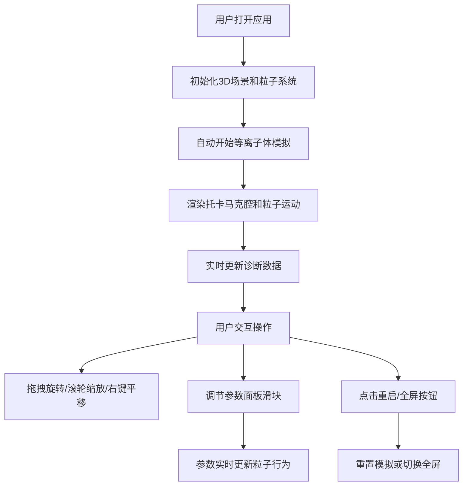

## 1. 产品概述
核聚变等离子体3D教育可视化应用，通过交互式3D场景模拟托卡马克装置中的核聚变反应过程，解决抽象物理过程难以直观理解的问题。
- 主要用途：物理学教育、核聚变原理演示、交互式科学探索工具
- 目标用户：物理学生、科学爱好者、教育工作者
- 产品价值：将复杂的等离子体物理过程转化为直观可交互的3D可视化体验

## 2. 核心功能

### 2.1 用户角色
| 角色 | 注册方式 | 核心权限 |
|------|----------|----------|
| 普通用户 | 无需注册，直接访问 | 浏览3D场景、调节参数、查看诊断数据、重启模拟 |

### 2.2 功能模块
1. **3D粒子模拟场景**：托卡马克环形反应腔、等离子体粒子系统、磁场力场螺旋运动、聚变碰撞闪光效果
2. **交互式参数调控面板**：温度、磁场强度、粒子数量、聚变概率滑块控制
3. **实时诊断图表**：聚变反应速率进度条、等离子体平均温度迷你折线图、累计聚变次数统计
4. **场景漫游控制**：鼠标拖拽旋转视角、滚轮缩放、右键平移场景
5. **顶部导航栏**：应用Logo、重启模拟按钮、全屏切换按钮

### 2.3 页面详情
| 页面名称 | 模块名称 | 功能描述 |
|----------|----------|----------|
| 主页面 | 3D模拟场景 | 托卡马克环形腔（主半径150px，截面半径40px，#2A4A7F半透明材质，4秒边缘发光扫描动画），200个发光粒子做螺旋运动，碰撞触发闪光（0.3秒衰减）和高亮标记（1.5秒） |
| 主页面 | 参数调控面板 | 可折叠右侧面板（320px宽，#1A1A2E半透明0.9背景，0.3s水平滑动动画），温度(1e6-1.5e8K)、磁场(1-10T)、粒子数(50-500)、聚变概率(1%-100%)滑块 |
| 主页面 | 诊断悬浮窗 | 左下角320x200px半透明窗口（#0D1117背景，#00E5FF边框），实时显示反应速率、温度折线图、累计次数 |
| 主页面 | 导航栏 | 顶部60px高导航栏（#0A0A1A，透明度0.85，#00E5FF发光分割线），FusionSim Logo，重启按钮，全屏按钮 |

## 3. 核心流程
用户打开应用后进入主页面，3D场景自动开始模拟等离子体运动。用户可通过鼠标拖拽旋转、滚轮缩放、右键平移来探索场景。通过右侧面板调节温度、磁场、粒子数、聚变概率参数，观察对模拟的影响。左下角诊断窗口实时显示聚变反应速率、温度和累计次数。点击顶部重启按钮可重置模拟，点击全屏按钮切换全屏模式。

## 4. 用户界面设计

### 4.1 设计风格
- 主色调：暗色科幻风格，深黑蓝背景（#0A0A1A, #0D1117, #1A1A2E）
- 强调色：青色#00E5FF（边框、分割线）、粉红色#FF3366（按钮、进度条）、金色#FFD700（高亮标记）、绿色#00FF88（温度折线）
- 按钮风格：圆角6px矩形按钮，悬停变色过渡0.2s
- 字体：Inter或系统无衬线字体，文本白色/浅灰色#B0B0B0
- 布局：全屏3D画布为主体，右侧参数面板可折叠，左下角诊断悬浮窗，顶部导航栏
- 动画：面板展开0.3s ease-out水平滑动，参数响应延迟<100ms，帧率≥45fps

### 4.2 页面设计概述
| 页面名称 | 模块名称 | UI元素 |
|----------|----------|----------|
| 主页面 | 星空背景 | Canvas生成随机白色点阵，1-2px大小，透明度0.2-0.6 |
| 主页面 | 3D场景 | Three.js渲染，BufferGeometry优化，frustum culling启用 |
| 主页面 | 参数面板 | 折叠按钮、滑块控件（温度蓝红渐变、磁场/粒子数/概率）、参数数值显示 |
| 主页面 | 诊断窗口 | 进度条、迷你折线图、数字计数器（Consolas粗体20px） |
| 主页面 | 导航栏 | TextGeometry生成Logo、矩形重启按钮、全屏图标按钮 |

### 4.3 响应式
桌面端优先设计，支持窗口resize事件响应3D画布适配，UI面板固定位置布局。

### 4.4 3D场景指导
- 环境：星空背景Canvas纹理，暗色氛围
- 光照：环境光+点光源，粒子发光材质
- 相机：PerspectiveCamera，距离5-30单位，垂直旋转限制±45度
- 交互：OrbitControls自定义实现（拖拽旋转、滚轮缩放、右键平移）
- 后处理：粒子发光效果、碰撞闪光透明度过渡动画
- 性能：BufferGeometry、PointsMaterial、frustum culling，目标帧率45fps+
