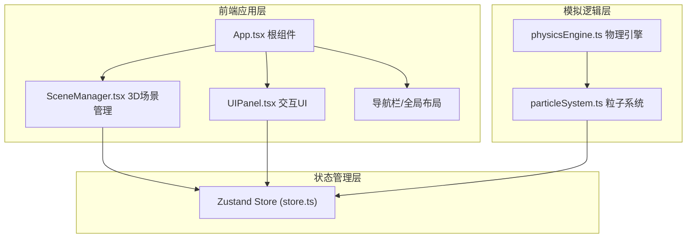

## 1. 架构设计



## 2. 技术描述
- 前端框架：React@18 + TypeScript
- 构建工具：Vite
- 3D渲染：three + @react-three/fiber + @react-three/drei
- 状态管理：zustand
- 辅助库：uuid
- 启动脚本：npm run dev

## 3. 路由定义
| 路由 | 用途 |
|------|------|
| / | 主页面，包含完整3D模拟场景和交互UI |

## 4. 数据模型

### 4.1 Store状态定义
```typescript
interface Particle {
  id: string;
  position: { x: number; y: number; z: number };
  velocity: { x: number; y: number; z: number };
  temperature: number;
  size: number;
  angle: number;
  radius: number;
  height: number;
}

interface CollisionEvent {
  id: string;
  position: { x: number; y: number; z: number };
  timestamp: number;
  type: 'flash' | 'marker';
}

interface SimulationParams {
  temperature: number;     // 1e6 - 1.5e8 K
  magneticField: number;   // 1 - 10 T
  particleCount: number;   // 50 - 500
  fusionProbability: number; // 1 - 100 %
}

interface CameraState {
  distance: number;
  theta: number;
  phi: number;
  panX: number;
  panY: number;
}

interface SimulationState {
  particles: Particle[];
  collisions: CollisionEvent[];
  params: SimulationParams;
  camera: CameraState;
  totalFusions: number;
  fusionRate: number;
  temperatureHistory: number[];
  isRunning: boolean;
  setParams: (params: Partial<SimulationParams>) => void;
  setCamera: (camera: Partial<CameraState>) => void;
  addCollision: (event: Omit<CollisionEvent, 'id' | 'timestamp'>) => void;
  incrementFusion: () => void;
  updateFusionRate: (rate: number) => void;
  addTemperatureSample: (temp: number) => void;
  resetSimulation: () => void;
  toggleRunning: () => void;
}
```

### 4.2 项目文件结构
```
src/
├── simulation/
│   ├── particleSystem.ts    # 粒子系统核心逻辑
│   └── physicsEngine.ts     # 物理引擎（磁场力场、运动轨迹）
├── interaction/
│   ├── UIPanel.tsx          # 参数面板+诊断图表组件
│   └── SceneManager.tsx     # Three.js场景管理
├── store/
│   └── store.ts             # Zustand状态管理
├── App.tsx                  # 应用根组件
├── main.tsx                 # 应用入口
└── index.css                # 全局样式
```

## 5. 核心模块职责

### 5.1 particleSystem.ts
- 生成指定数量的等离子体粒子，环形腔内随机分布
- 粒子温度颜色映射：蓝色(#1E90FF) → 白色(#FFFFFF)
- 碰撞检测：粒子间距<6px时触发聚变事件
- 输出：粒子数组、碰撞事件列表

### 5.2 physicsEngine.ts
- 计算环形磁场力场
- 更新粒子螺旋运动轨迹（环向速度0.5rad/s，径向扰动0.05单位）
- 根据温度、磁场强度参数调整运动行为
- 输入：粒子数组、模拟参数；输出：更新后的位置和速度

### 5.3 UIPanel.tsx
- 可折叠右侧参数调控面板（320px宽）
- 四个滑块控件：温度、磁场、粒子数、聚变概率
- 左下角诊断悬浮窗：反应速率进度条、温度折线图、累计次数
- 监听Zustand store，触发参数更新action

### 5.4 SceneManager.tsx
- 初始化Three.js场景、相机、渲染器
- 创建托卡马克环形几何体（主半径150，截面半径40，#2A4A7F半透明，边缘发光扫描动画）
- 挂载粒子系统Points渲染
- 实现自定义相机控制：拖拽旋转、滚轮缩放、右键平移
- 处理碰撞闪光和高亮标记渲染
- 窗口resize事件响应

### 5.5 store.ts
- Zustand store定义和创建
- 粒子数组、参数状态、相机状态、碰撞事件队列
- 更新参数、添加碰撞、累计聚变、温度采样等actions

## 6. 性能优化策略
- 使用BufferGeometry替代Geometry
- 启用Three.js frustum culling
- 粒子使用Points和PointsMaterial批量渲染
- 碰撞检测使用空间分区或距离平方比较优化
- 温度历史采样限制最近50帧
- 目标帧率：正常≥45fps，500粒子≥30fps
- 参数响应延迟：<100ms
