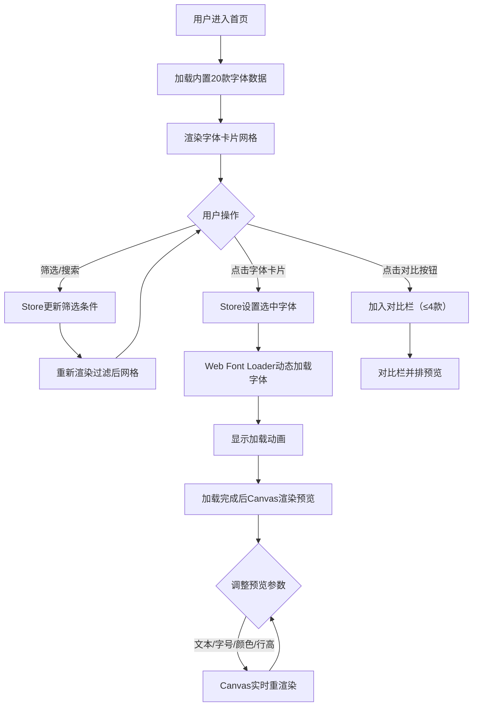

## 1. 产品概述

FontGallery是一款面向设计师和开发者的在线字体展示与筛选工具，帮助团队快速浏览、预览、搜索和对比Google Fonts开源字体库中不同字体在各种参数下的渲染效果。

- 核心目标：提供高效的字体选型工作流，让团队在浏览器中直观地评估字体适用性
- 目标用户：UI/UX设计师、前端开发者、品牌设计师
- 市场价值：缩短字体选型周期，减少反复测试字体的时间成本

## 2. 核心功能

### 2.1 用户角色

| 角色 | 注册方式 | 核心权限 |
|------|----------|----------|
| 访客用户 | 无需注册 | 浏览字体、筛选搜索、预览参数调整、字体对比 |

### 2.2 功能模块

1. **字体展示区**：响应式网格布局展示字体卡片，含名称、分类标签、变体数量、迷你画布预览
2. **筛选搜索栏**：分类下拉筛选、标签多选按钮组、字体名称实时搜索
3. **预览面板**：自定义预览文本、字号滑块、前景/背景拾色器、行高滑块、字体加载状态
4. **字体对比栏**（进阶）：选择最多4款字体进行并排对比，含小画布预览

### 2.3 页面详情

| 页面名称 | 模块名称 | 功能描述 |
|----------|----------|----------|
| 主页面 | 顶部筛选栏 | 分类下拉（5类）、标签多选（5类）、搜索输入框，固定高度56px |
| 主页面 | 字体网格区 | 响应式4/3/2列网格，卡片悬停上移，点击选中高亮，滚动平滑吸附 |
| 主页面 | 预览面板 | 固定280px宽度右侧面板，调整预览参数实时渲染，显示加载状态 |
| 主页面 | 对比栏 | （可选）最多4款字体对比列表，每项可关闭移除 |

## 3. 核心流程

用户进入首页 → 浏览20款字体卡片网格 → 通过分类/标签/搜索筛选字体 → 点击字体卡片选中 → 系统动态加载Google Fonts → 在预览面板调整文本/字号/颜色/行高 → 实时Canvas预览渲染 → （可选）点击对比按钮加入对比栏 → 并排对比多款字体效果

## 4. 用户界面设计

### 4.1 设计风格

- **主色调**：深蓝 #4A90D9
- **辅助色**：暗灰 #666666
- **背景色**：浅灰 #F5F5F5
- **卡片背景**：纯白 #FFFFFF
- **圆角规范**：卡片8px、标签按钮20px、输入框8px、预览面板12px
- **阴影规范**：卡片0 2px 4px rgba(0,0,0,0.08)，顶部栏底部1px阴影
- **设计风格**：极简主义，干净留白，微交互细腻

### 4.2 页面设计概览

| 页面名称 | 模块名称 | UI元素 |
|----------|----------|--------|
| 主页面 | 顶部筛选栏 | 白色背景56px高、底部阴影、分类下拉（圆角8px，展开0.2s淡入，悬停#E3F2FD）、标签按钮（圆角20px，选中#4A90D9白色文字，过渡0.2s）、搜索框（放大镜图标、圆角8px、聚焦发光#4A90D9） |
| 主页面 | 字体网格区 | 响应式网格（大屏4列/中屏3列/小屏2列，间距16px）、卡片圆角8px、悬停上移2px过渡0.2s、选中#4A90D9边框+脉冲光晕动画、迷你Canvas预览、渐入动画0.4s、scroll-snap平滑滚动 |
| 主页面 | 预览面板 | 固定280px宽、白色背景圆角12px、1px浅灰边框、字体名称+加载状态、文本输入（≤50字符）、字号滑块12-72px（步长1带刻度）、圆形拾色器（前景#333/背景#FFF）、行高滑块1.0-2.0（步长0.1）、所有输入组件背景#F9F9F9 |
| 主页面 | 对比栏 | 列表形式、每项含字体名称+小Canvas预览（18px"The quick brown fox..."）、关闭按钮、最多4项 |

### 4.3 响应式设计

- **Desktop-first**，宽度<768px时：
  - PreviewPanel从右侧折叠到底部
  - 由+图标按钮控制展开收起
  - 展开时有0.3s向上滑入动画
  - 字体网格保持2列布局

### 4.4 动画与微交互

- 字体卡片悬停：上移2px，transition 0.2s
- 选中卡片：#4A90D9边框 + box-shadow脉冲光晕0.5s
- 卡片画布悬停：0.3秒随机字符闪现动画
- 下拉菜单展开：0.2s淡入
- 标签按钮切换：0.2s过渡
- 网格加载：opacity 0→1，0.4s渐入
- 字体加载：24px旋转环（#4A90D9主色，#1E3A5F轨迹）
- 移动端面板展开：0.3s向上滑入
