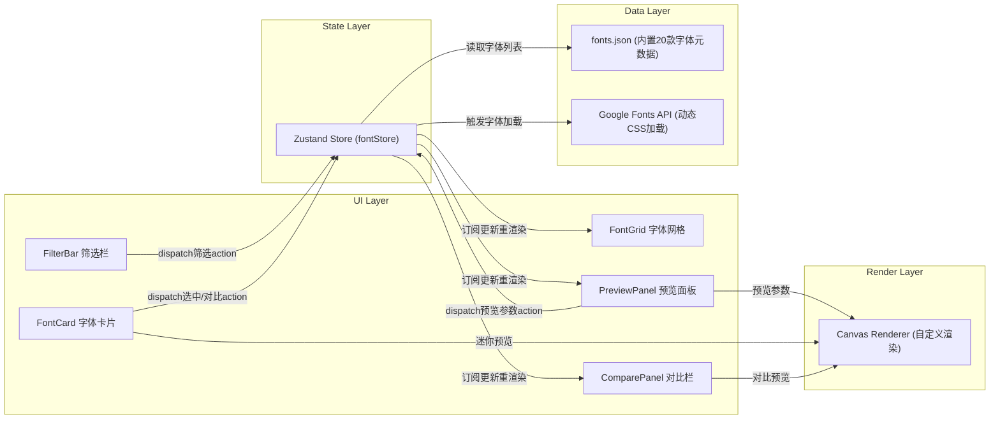

## 1. 架构设计



## 2. 技术描述

- **前端框架**：React@18 + TypeScript
- **构建工具**：Vite 5 + @vitejs/plugin-react
- **状态管理**：Zustand
- **唯一ID生成**：uuid
- **字体加载**：Web Font Loader（Google Fonts动态加载）
- **渲染方式**：HTML5 Canvas 2D API（所有字体预览）
- **无后端**：纯前端应用，数据内置JSON

## 3. 路由定义

| 路由 | 用途 |
|------|------|
| / | 主页面（唯一页面，单页应用） |

## 4. 数据模型

### 4.1 类型定义

```typescript
type FontCategory = 'serif' | 'sans-serif' | 'handwriting' | 'monospace' | 'display';
type FontTag = 'poster' | 'body' | 'heading' | 'code' | 'decorative';

interface Font {
  id: string;
  name: string;
  googleFontName: string;
  category: FontCategory;
  variants: {
    weights: number;
    italics: number;
  };
  tags: FontTag[];
}

interface FilterState {
  category: FontCategory | 'all';
  tags: FontTag[];
  searchText: string;
}

interface PreviewParams {
  text: string;
  fontSize: number;
  lineHeight: number;
  color: string;
  backgroundColor: string;
}

interface FontStoreState {
  fonts: Font[];
  filter: FilterState;
  selectedFontId: string | null;
  selectedFontLoading: boolean;
  compareFontIds: string[];
  previewParams: PreviewParams;
  filteredFonts: Font[];
  // actions
  setFilterCategory: (c: FontCategory | 'all') => void;
  toggleFilterTag: (t: FontTag) => void;
  setSearchText: (t: string) => void;
  selectFont: (id: string) => void;
  setFontLoading: (loading: boolean) => void;
  toggleCompareFont: (id: string) => void;
  setPreviewParams: (p: Partial<PreviewParams>) => void;
}
```

### 4.2 数据文件（fonts.json）

包含20款Google Fonts元数据：
- 每款字体：id, name, googleFontName, category, variants(weights, italics), tags
- 分类覆盖：serif(4), sans-serif(6), handwriting(3), monospace(3), display(4)
- 标签覆盖：poster, body, heading, code, decorative

## 5. 文件结构与调用关系

```
auto7/
├── package.json                 # 项目依赖与脚本
├── index.html                   # 入口HTML，引入Google Fonts API
├── tsconfig.json                # TS严格模式配置
├── vite.config.js               # Vite构建配置
├── src/
│   ├── main.tsx                 # React入口，挂载App
│   ├── App.tsx                  # 根组件，布局FilterBar+FontGrid+PreviewPanel
│   ├── index.css                # 全局样式（CSS变量、动画、响应式）
│   ├── data/
│   │   └── fonts.json           # 内置20款Google Fonts元数据
│   ├── types/
│   │   └── font.ts              # Font/Filter/Preview等类型定义
│   ├── store/
│   │   └── fontStore.ts         # Zustand Store（状态+派生+actions）
│   ├── hooks/
│   │   ├── useFontLoader.ts     # Web Font Loader封装Hook
│   │   └── useCanvasPreview.ts  # Canvas渲染逻辑Hook
│   ├── utils/
│   │   └── canvasRenderer.ts    # Canvas 2D绘制工具函数
│   └── components/
│       ├── FilterBar.tsx        # 顶部筛选栏（分类/标签/搜索）
│       ├── FontGrid.tsx         # 响应式网格容器
│       ├── FontCard.tsx         # 单字体卡片（含迷你Canvas+悬停动画）
│       ├── PreviewPanel.tsx     # 右侧预览参数面板
│       ├── PreviewCanvas.tsx    # 通用Canvas预览组件
│       ├── Spinner.tsx          # 加载旋转环组件
│       └── ComparePanel.tsx     # 字体对比栏（可选进阶）
```

**调用关系数据流**：
1. `App.tsx` → 组合所有布局组件
2. `FilterBar.tsx` → 调用 `fontStore.setFilterCategory/toggleFilterTag/setSearchText`
3. `FontCard.tsx` → 调用 `fontStore.selectFont/toggleCompareFont`，使用 `PreviewCanvas`
4. `FontGrid.tsx` → 订阅 `fontStore.filteredFonts`，渲染 `FontCard` 列表
5. `PreviewPanel.tsx` → 订阅 `fontStore.selectedFont/selectedFontLoading/previewParams`，调用 `setPreviewParams`，使用 `PreviewCanvas` + `Spinner`
6. `ComparePanel.tsx` → 订阅 `fontStore.compareFontIds`，渲染对比项
7. `PreviewCanvas.tsx` → 使用 `useCanvasPreview` Hook，调用 `canvasRenderer.ts`
8. `useFontLoader.ts` → 在 `PreviewPanel` 选中字体时触发，更新 `fontStore.setFontLoading`

## 6. 性能保障措施

| 约束 | 实现方案 |
|------|----------|
| 筛选搜索≤200ms | Zustand派生值`filteredFonts`使用memoized selector，字符串匹配用`includes`纯JS运算 |
| 字体加载不阻塞UI | Web Font Loader异步加载，加载状态用Spinner占位，不阻塞主线程 |
| Canvas渲染≥30fps | 使用`requestAnimationFrame`调度，仅在参数变化时重绘，最小化Canvas context操作 |
| 预览更新≤100ms无抖动 | Canvas离屏预渲染+双缓冲，参数变更节流16ms（~1帧） |
