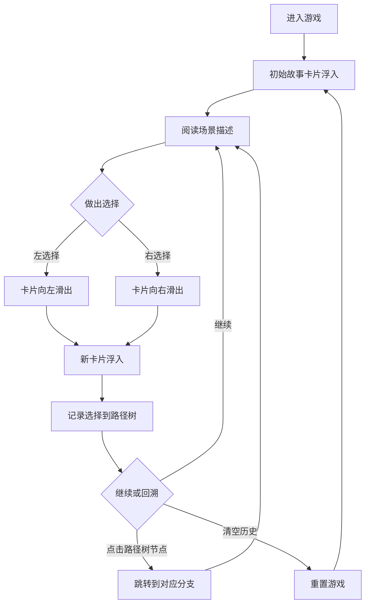

## 1. 产品概述

FlickerTale 是一款在浏览器中运行的沉浸式文字冒险游戏，通过 AI 动态生成的图文卡片推动故事发展，玩家在关键节点做出二选一选择，不同选择将引导至完全不同的故事分支。

- 目标用户：喜欢互动叙事、文字冒险游戏的玩家
- 核心价值：提供沉浸式、可回溯、分支丰富的互动故事体验

## 2. 核心功能

### 2.1 功能模块

1. **故事卡片渲染区**：展示当前场景标题、描述文本及两个选择按钮
2. **历史路径树面板**：记录并展示所有已做出的选择节点，支持回溯跳转
3. **故事引擎**：根据当前节点和选择计算下一个故事节点
4. **状态管理**：全局管理当前节点、历史选择栈和加载状态

### 2.2 页面详情

| 页面名称 | 模块名称 | 功能描述 |
|---------|---------|---------|
| 主页面 | 故事卡片渲染区 | 600x400px 卡片区域，展示场景标题、描述文本、两个选择按钮及关闭按钮，带入场/出场动画 |
| 主页面 | 历史路径树面板 | 底部可折叠面板，树形结构展示选择历史，支持节点跳转和清空历史 |

## 3. 核心流程

玩家打开应用 → 看到初始故事卡片（从底部浮入动画）→ 阅读场景描述 → 点击左/右选择按钮 → 卡片向选择方向滑出 → 新卡片浮入 → 选择记录到路径树 → 可随时点击路径树节点回溯 → 可清空历史重新开始

## 4. 用户界面设计

### 4.1 设计风格

- **主色调**：深紫蓝 #1A1A2E（卡片背景）、深蓝 #0F3460（右按钮/面板背景）、红色 #E94560（左按钮）、深灰蓝 #16213E（文本描边）
- **按钮样式**：圆角矩形，悬停缩放 1.05，0.3s ease-out 过渡
- **字体**：白色标题 22px 粗体（带渐变描边），白色正文 16px 行高 1.6
- **布局风格**：居中卡片布局 + 底部固定可折叠面板
- **动效**：卡片入场（0.6s 底部浮入 cubic-bezier(0.25, 0.46, 0.45, 0.94)）、内容淡入淡出（0.4s）、选择后卡片向对应方向滑出（0.5s）

### 4.2 页面设计概述

| 页面名称 | 模块名称 | UI 元素 |
|---------|---------|---------|
| 主页面 | 故事卡片 | 600x400px、#1A1A2E 背景、16px 圆角、内阴影；标题 22px 粗体白色渐变描边；文本 16px 白色行高 1.6；左右按钮各占 50% 宽 48px 高；24px 关闭按钮悬停亮红 |
| 主页面 | 路径树面板 | 300px 展开高度、与卡片同宽、#0F3460 半透明背景、12px 圆角；10px 白色圆点节点、1px 深灰分支线；12px 白色清空按钮悬停下划线 |

### 4.3 响应式

桌面端优先设计，卡片和面板采用固定宽度居中布局，暂不考虑移动端适配。

## 5. 性能要求

- 选择响应：点击按钮到新卡片完全渲染 ≤ 500ms
- 路径树性能：100 节点以内所有操作帧率 ≥ 30fps
