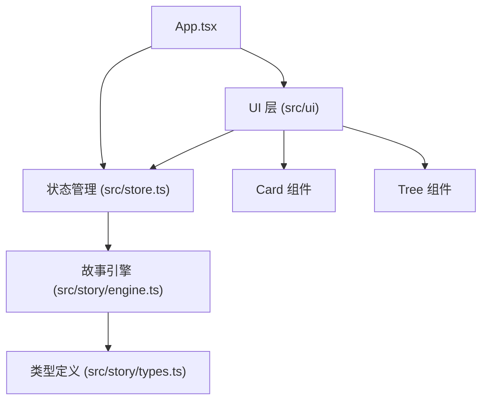

## 1. 架构设计



## 2. 技术说明

- **前端框架**：React@18 + TypeScript
- **构建工具**：Vite
- **状态管理**：Zustand
- **辅助库**：uuid（生成唯一节点ID）
- **后端**：无（纯前端应用，故事数据由引擎本地生成）
- **数据库**：无

## 3. 目录结构

```
src/
├── story/
│   ├── types.ts      # 故事节点和选择的类型定义
│   └── engine.ts     # 故事引擎，根据当前节点和选择计算下一节点
├── ui/
│   ├── Card.tsx      # 故事卡片渲染组件
│   └── Tree.tsx      # 历史路径树组件
├── App.tsx           # 根组件
├── store.ts          # Zustand 全局状态管理
└── main.tsx          # 入口文件
```

## 4. 数据模型

### 4.1 故事节点 (StoryNode)

```typescript
interface StoryNode {
  id: string;
  title: string;
  description: string;
  choices: [StoryChoice, StoryChoice];
}

interface StoryChoice {
  id: string;
  text: string;
  nextNodeId: string | null;
}
```

### 4.2 历史记录 (HistoryEntry)

```typescript
interface HistoryEntry {
  nodeId: string;
  choiceIndex: 0 | 1;
  choiceText: string;
  timestamp: number;
}
```

## 5. 状态管理

Zustand Store 包含以下状态和动作：

- `currentNodeId: string` - 当前故事节点ID
- `history: HistoryEntry[]` - 选择历史数组
- `isLoading: boolean` - 加载状态
- `dispatchChoice(choiceIndex: 0 | 1): void` - 处理选择动作
- `jumpToNode(nodeId: string, historyIndex: number): void` - 回溯到指定节点
- `clearHistory(): void` - 清空历史并重置
