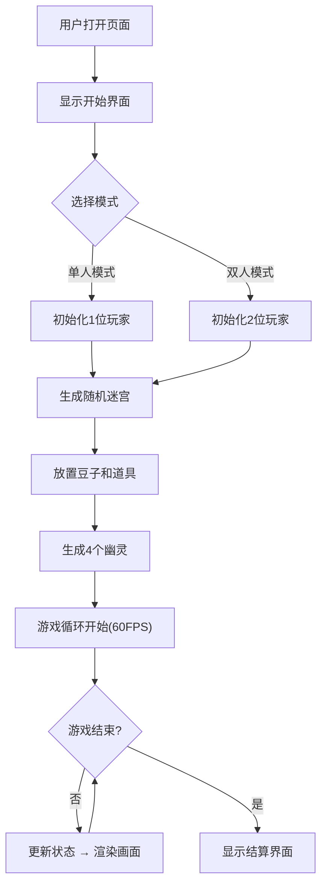
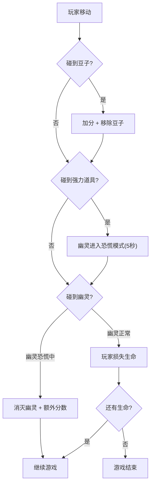
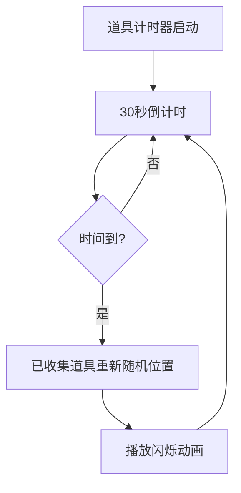

## 1. 产品概述

PacDot 是一款复古风格吃豆人迷宫游戏，面向独立游戏开发者的个人网站访客，提供经典吃豆人玩法体验并创新性地加入道具系统和关卡随机生成功能，让每次游戏都独一无二。

- 核心目的：为个人网站访客提供即开即玩的复古迷宫游戏体验
- 目标用户：游戏爱好者、复古游戏粉丝、个人网站访客

## 2. 核心功能

### 2.1 功能模块

1. **游戏主界面**：全屏Canvas游戏画面，顶部HUD信息栏，底部控制按钮
2. **迷宫关卡**：随机生成的15x15迷宫，包含豆子和强力道具

### 2.2 页面详情

| 页面名称 | 模块名称 | 功能描述 |
|----------|----------|----------|
| 游戏主界面 | GameCanvas | Canvas渲染迷宫、角色、道具和特效，响应式适配像素比 |
| 游戏主界面 | HUD | 显示两位玩家得分、生命数（红心图标）、当前道具状态 |
| 游戏主界面 | 控制面板 | 开始、暂停、重开按钮，荧光绿描边，按下缩放动画 |
| 游戏主界面 | 迷宫地图 | 15x15随机迷宫，左上入口右下出口，豆子和星星道具分布 |
| 游戏主界面 | 角色系统 | 吃豆人（双玩家）+ 4个幽灵（红粉蓝橙），BFS追踪AI |
| 游戏主界面 | 道具系统 | 4个闪烁星星强力道具，每30秒重新随机位置，冲击波特效 |

## 3. 核心流程

### 3.1 游戏启动流程

### 3.2 玩家与幽灵交互流程

### 3.3 道具刷新流程

## 4. 用户界面设计

### 4.1 设计风格

- **主色调**：暗色系复古风 — 背景 `#1A1A2E`，墙壁 `#16213E`，通道 `#0F3460`
- **强调色**：豆子/得分 `#E94560`，荧光绿按钮 `#00FF00`
- **玩家色**：玩家1紫色 `#9D4EDD`，玩家2青色 `#00D4AA`
- **幽灵色**：红 `#FF0000`、粉 `#FFB8FF`、蓝 `#00FFFF`、橙 `#FFB852`
- **字体**：像素风 `Press Start 2P, monospace`
- **按钮风格**：荧光绿描边，按下缩放0.95倍动画
- **布局风格**：全屏Canvas居中，顶部60px HUD栏

### 4.2 页面设计概览

| 页面名称 | 模块名称 | UI元素 |
|----------|----------|--------|
| 游戏主界面 | HUD区域 | 深色背景条，像素字体得分，红心生命图标，紫/青玩家分数条 |
| 游戏主界面 | Canvas区域 | 暗色迷宫，黄色吃豆人，彩色幽灵，闪烁星星道具，冲击波特效 |
| 游戏主界面 | 控制按钮 | 荧光绿描边按钮，像素字体，按下缩放动画 |
| 游戏主界面 | 开始界面 | 游戏标题，模式选择，开始按钮 |

### 4.3 响应式设计

- 桌面优先设计，最小支持800x600分辨率
- 高分屏Canvas自动适配 `devicePixelRatio`
- 游戏画面按比例缩放，保持15x15迷宫完整可见
- HUD区域固定60px高度，信息水平排列自适应

### 4.4 键盘控制

| 操作 | 玩家1 | 玩家2 |
|------|-------|-------|
| 上移 | W | ↑ |
| 下移 | S | ↓ |
| 左移 | A | ← |
| 右移 | D | → |
| 暂停 | Escape | Escape |

## 5. 性能约束

- 游戏循环保持60FPS稳定帧率
- Canvas渲染每帧耗时不超过8ms
- BFS寻路计算在15x15迷宫下耗时不超过2ms
- 道具刷新和特效不影响主循环帧率
