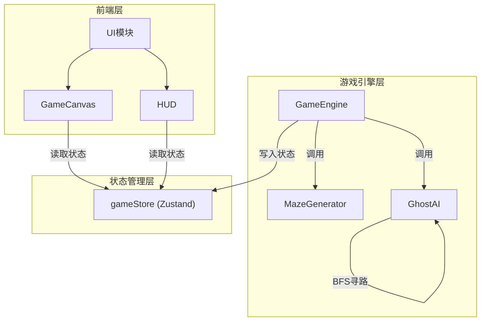
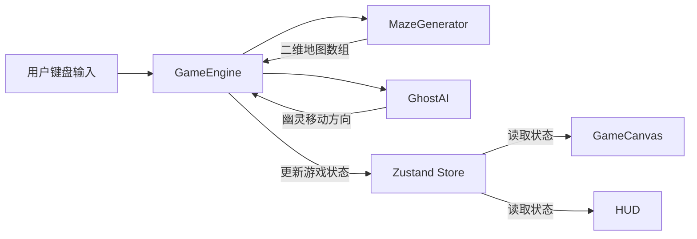

## 1. 架构设计



### 数据流向



## 2. 技术说明

- **前端框架**：React@18 + TypeScript
- **构建工具**：Vite（含React插件）
- **状态管理**：Zustand
- **依赖库**：uuid（唯一ID生成）
- **字体**：Press Start 2P（Google Fonts）
- **无后端**：纯前端游戏，所有逻辑在客户端运行
- **初始化工具**：vite-init（react-ts模板）

## 3. 文件结构

```
pacdot/
├── package.json
├── vite.config.js
├── tsconfig.json
├── index.html
└── src/
    ├── main.tsx                    # 应用入口，挂载React根组件
    ├── App.tsx                     # 根组件，布局游戏界面
    ├── engine/
    │   ├── GameEngine.ts           # 游戏主逻辑，管理状态更新循环
    │   ├── MazeGenerator.ts        # 迷宫生成器，递归回溯算法
    │   └── GhostAI.ts              # 幽灵AI，BFS寻路算法
    ├── components/
    │   ├── GameCanvas.tsx          # Canvas渲染组件
    │   └── HUD.tsx                 # 顶部信息栏组件
    └── stores/
        └── gameStore.ts            # Zustand状态管理
```

### 文件间调用关系

| 调用方 | 被调用方 | 关系说明 |
|--------|----------|----------|
| App.tsx | GameCanvas.tsx | 渲染游戏Canvas |
| App.tsx | HUD.tsx | 渲染顶部信息栏 |
| GameCanvas.tsx | gameStore.ts | 读取游戏状态用于Canvas绘制 |
| HUD.tsx | gameStore.ts | 读取得分、生命、道具状态 |
| GameEngine.ts | gameStore.ts | 写入更新后的游戏状态 |
| GameEngine.ts | MazeGenerator.ts | 调用生成迷宫地图 |
| GameEngine.ts | GhostAI.ts | 调用计算幽灵移动方向 |

## 4. 核心数据模型

### 4.1 迷宫地图

```typescript
enum CellType {
  WALL = 0,
  PATH = 1,
  DOT = 2,
  POWER_PELLET = 3,
  EXIT = 4,
}

type MazeMap = CellType[][]; // 15x15二维数组
```

### 4.2 游戏状态

```typescript
interface Position {
  x: number;
  y: number;
}

interface Ghost {
  id: string;
  position: Position;
  color: string;
  isScared: boolean;
  scaredTimer: number;
  direction: Direction;
}

interface Player {
  id: string;
  position: Position;
  score: number;
  lives: number;
  direction: Direction;
  color: string;
}

interface PowerPellet {
  id: string;
  position: Position;
  isVisible: boolean;
  respawnTimer: number;
}

interface GameState {
  maze: MazeMap;
  players: Player[];
  ghosts: Ghost[];
  powerPellets: PowerPellet[];
  gameStatus: 'idle' | 'playing' | 'paused' | 'gameover';
  mode: 'single' | 'coop';
  shockwaves: Shockwave[];
  dotsRemaining: number;
  level: number;
}
```

### 4.3 特效状态

```typescript
interface Shockwave {
  x: number;
  y: number;
  radius: number;
  maxRadius: number;
  opacity: number;
  startTime: number;
  duration: number; // 0.5秒
}
```

## 5. 核心算法

### 5.1 迷宫生成 — 递归回溯算法

1. 初始化15x15网格，所有单元格为墙壁
2. 从左上角(1,1)开始，标记为通道
3. 随机选择一个未访问的相邻单元格（步长2）
4. 打通中间墙壁，递归继续
5. 回溯直到所有可达单元格被访问
6. 在通道上随机放置豆子和强力道具
7. 设置左上角入口和右下角出口

### 5.2 幽灵AI — BFS寻路算法

1. 输入：幽灵当前位置、玩家位置、迷宫地图
2. 使用BFS从幽灵位置搜索到玩家位置的最短路径
3. 返回路径的第一步作为幽灵移动方向
4. 每次幽灵移动时重新计算路径
5. 恐慌模式下幽灵随机移动（不使用BFS）

### 5.3 游戏循环 — requestAnimationFrame

1. 计算deltaTime，确保帧率稳定60FPS
2. 处理输入：读取键盘状态，更新玩家方向
3. 更新玩家位置：按当前方向移动，碰墙停止
4. 更新幽灵位置：BFS计算方向，移动一格
5. 碰撞检测：玩家-豆子、玩家-道具、玩家-幽灵
6. 更新道具计时器：30秒刷新
7. 更新特效：冲击波扩散和消散
8. 将更新后的状态写入Zustand store
9. Canvas组件从store读取状态并绘制
