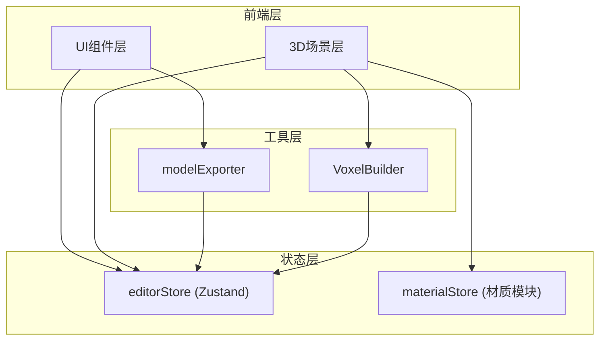

## 1. 架构设计



## 2. 技术说明

- 前端：React@18 + TypeScript + Vite
- 3D渲染：Three.js + @react-three/fiber + @react-three/drei
- 状态管理：Zustand
- 初始化工具：vite-init (react-ts模板)
- 后端：无
- 数据库：无

## 3. 路由定义

无路由，单页面应用。

## 4. 数据模型

### 4.1 核心数据结构

```typescript
interface Voxel {
  id: string;
  x: number;
  y: number;
  z: number;
  material: MaterialType;
}

type MaterialType = 'stone' | 'grass' | 'wood' | 'metal' | 'crystal' | 'lava';

interface MaterialConfig {
  name: string;
  type: MaterialType;
  color: string;
  opacity: number;
  emissive: string;
  emissiveIntensity: number;
  roughness: number;
}

interface EditorState {
  voxels: Voxel[];
  currentMaterial: MaterialType;
  toolMode: 'add' | 'remove';
  showGrid: boolean;
  addVoxel: (x: number, y: number, z: number) => void;
  removeVoxel: (id: string) => void;
  setMaterial: (material: MaterialType) => void;
  clearWorld: () => void;
  setShowGrid: (show: boolean) => void;
}

interface ExportModel {
  version: string;
  voxels: Array<{
    x: number;
    y: number;
    z: number;
    material: string;
  }>;
}
```

## 5. 文件结构

```
├── package.json
├── vite.config.js
├── tsconfig.json
├── index.html
├── src/
│   ├── main.tsx
│   ├── store/
│   │   └── editorStore.ts
│   ├── scene/
│   │   ├── VoxelWorld.tsx
│   │   └── VoxelBuilder.ts
│   ├── materials/
│   │   └── materialStore.ts
│   ├── ui/
│   │   ├── Toolbar.tsx
│   │   └── MaterialPanel.tsx
│   └── utils/
│       └── modelExporter.ts
```
