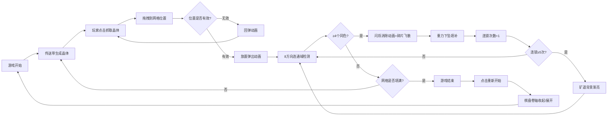

## 1. 产品概述

GemJam 是一款以宝石矿道为背景的反应堆栈消除游戏，玩家从传送带抓取晶体放置到网格中，通过连接同色晶体触发消除和连锁反应，点亮矿道深处的隐藏矿脉。

- 核心玩法：拖拽放置晶体，8方向连通域消除，连锁反应得分
- 目标用户：休闲游戏玩家，消除游戏爱好者
- 产品价值：提供具有深度策略性和视觉爽感的消除游戏体验

## 2. 核心特性

### 2.1 功能模块
1. **游戏主界面**：传送带、缓存区、6x6游戏网格、得分显示、连锁计数器
2. **晶体生成系统**：4种颜色（红/蓝/绿/紫）、4种多边形形状随机组合
3. **拖拽交互系统**：点击抓取、跟随鼠标、放置动画、错误回弹
4. **消除判定系统**：8方向连通域算法，≥4个同色晶体消除
5. **连锁反应系统**：重力下坠、自动连锁、矿脉点亮机制
6. **游戏结束系统**：填满检测、得分展示、重新开始

### 2.2 页面详情

| 页面名称 | 模块名称 | 功能描述 |
|---------|---------|---------|
| 游戏主界面 | 传送带系统 | 每1.5秒生成随机晶体从左向右滑动 |
| 游戏主界面 | 拖拽缓存区 | 传送带右侧暂存待放置晶体 |
| 游戏主界面 | 6x6游戏网格 | 放置晶体的核心游戏区域 |
| 游戏主界面 | 火焰计数器 | 左上角显示连锁次数，带缩放脉冲动画 |
| 游戏主界面 | 背景矿道 | 连锁≥5次时从暗到亮渐变成温暖金色 |
| 游戏结束界面 | 矿工帽图标 | 旋转淡入动画 |
| 游戏结束界面 | 得分展示 | 显示最终得分 |
| 游戏结束界面 | 重新开始按钮 | 悬停变色，点击触发棋盘卷轴动画 |

## 3. 核心流程

## 4. 用户界面设计

### 4.1 设计风格

- **主色调**：深褐色矿洞主题，背景径向渐变 `#2C1810` → `#1A0E0A`
- **强调色**：矿石金色 `#B8860B`（标题），温暖金色 `#DAA520` → `#FFF8DC`（矿脉激活）
- **晶体颜色**：红 `#FF4444`、蓝 `#4488FF`、绿 `#44CC44`、紫 `#AA44FF`
- **网格线**：暗红色 `#4A2C1A`，1px 细线
- **按钮**：圆角 6px，内凹阴影效果，悬停从 `#8B4513` 变为 `#FF8C00`
- **字体**：矿井风格字体，后备 serif 字体
- **晶体效果**：同色半透明内发光光晕
- **动画风格**：弹性缓动、缩放弹出、淡出飞散

### 4.2 页面设计概述

| 页面名称 | 模块名称 | UI 元素 |
|---------|---------|---------|
| 游戏主界面 | 标题区域 | 金色矿石质感字体"GemJam" |
| 游戏主界面 | 传送带 | 木质传送带纹理，晶体滑动动画 |
| 游戏主界面 | 拖拽缓存区 | 半透明阴影跟随鼠标 |
| 游戏主界面 | 游戏网格 | 6x6方格，暗红线框 |
| 游戏主界面 | 火焰计数器 | 🔥 图标 + 数字，缩放脉冲动画 |
| 游戏主界面 | 背景矿道 | 径向渐变，连锁激活时变亮 |
| 游戏结束界面 | 矿工帽 | 旋转淡入，居中显示 |
| 游戏结束界面 | 得分面板 | 大号金色数字 |
| 游戏结束界面 | 重新开始按钮 | 棕色按钮，橙色悬停效果 |

### 4.3 响应式设计

- **桌面端**：最小宽度 768px，网格固定尺寸
- **移动端**：网格自动缩放至屏幕宽度 90%
- **触摸优化**：增大点击热区，横向滚动提示条
- **布局适配**：使用 CSS 媒体查询动态调整元素尺寸

### 4.4 动画效果规范

| 动画名称 | 时长 | 缓动 | 描述 |
|---------|------|------|------|
| 传送带滑动 | 持续 | linear | 晶体从左向右移动 |
| 放置弹出 | 0.3s | elastic | 从 0.8x 弹到 1.0x |
| 错误回弹 | 0.2s | elastic | 返回原位并抖动 |
| 消除闪烁 | 0.3s | step | 白/原色交替 3 次，每次 0.1s |
| 消除淡出 | 0.4s | ease-out | 缩放消失 + 8 碎片飞散 |
| 重力下坠 | 0.3s | ease-out | 晶体下落填补空缺 |
| 连锁间隔 | 0.2s | - | 两轮消除之间等待 |
| 连锁脉冲 | 0.1s | scale | 数字由小变大再恢复 |
| 矿脉渐变 | 2s | ease-in-out | 背景从暗到亮 |
| 棋盘卷轴 | 0.8s | ease-in-out | 从左到右收起再展开 |

## 5. 性能要求

- 游戏帧率稳定 60FPS，使用 `requestAnimationFrame` 驱动
- 最低帧率不低于 50FPS
- Canvas 渲染游戏主循环
- 所有游戏逻辑在单一模块内组织
