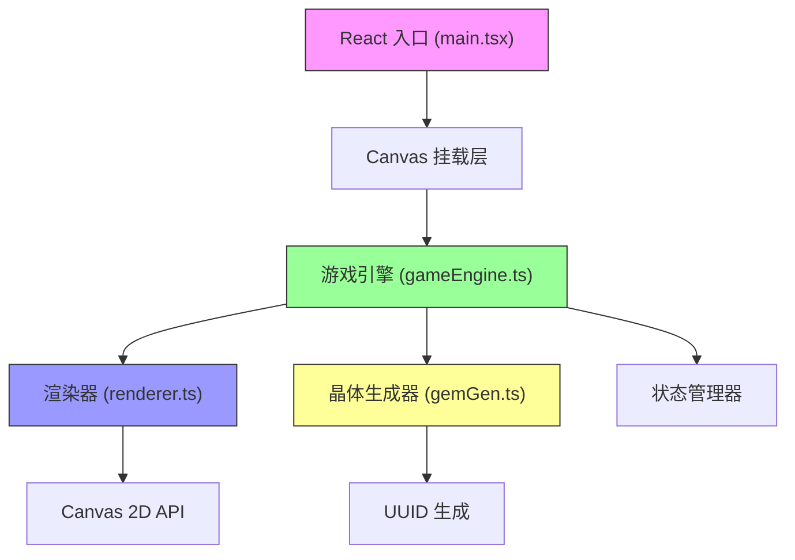

## 1. 架构设计



## 2. 技术描述

- **前端框架**：React@18 + React-DOM@18
- **构建工具**：Vite
- **编程语言**：TypeScript（严格模式，ES2020 目标）
- **渲染引擎**：HTML5 Canvas 2D
- **状态管理**：游戏引擎内部状态机 + React Hooks
- **唯一标识**：uuid
- **动画驱动**：requestAnimationFrame（60FPS）

## 3. 文件结构

```
d:\P\tasks\auto8\
├── package.json
├── index.html
├── tsconfig.json
├── vite.config.js
└── src/
    ├── main.tsx
    └── game/
        ├── gameEngine.ts
        ├── renderer.ts
        └── gemGen.ts
```

| 文件 | 职责 |
|------|------|
| [package.json](file:///d:/P/tasks/auto8/package.json) | 依赖管理、脚本配置 |
| [index.html](file:///d:/P/tasks/auto8/index.html) | 入口页面、字体引入、Canvas 容器 |
| [tsconfig.json](file:///d:/P/tasks/auto8/tsconfig.json) | TypeScript 编译配置（严格模式） |
| [vite.config.js](file:///d:/P/tasks/auto8/vite.config.js) | Vite 构建配置（base: './'） |
| [src/main.tsx](file:///d:/P/tasks/auto8/src/main.tsx) | React 入口、Canvas 挂载、事件绑定 |
| [src/game/gameEngine.ts](file:///d:/P/tasks/auto8/src/game/gameEngine.ts) | 游戏核心循环、Entity 更新、碰撞检测、消除逻辑、连锁反应、状态机 |
| [src/game/renderer.ts](file:///d:/P/tasks/auto8/src/game/renderer.ts) | Canvas 绘制：背景、网格、晶体、动画效果、粒子系统 |
| [src/game/gemGen.ts](file:///d:/P/tasks/auto8/src/game/gemGen.ts) | 晶体生成、形状定义、拖拽处理、碰撞检测 |

## 4. 核心数据模型

### 4.1 类型定义

```typescript
// 晶体颜色
type GemColor = 'red' | 'blue' | 'green' | 'purple';

// 晶体形状（4种多边形）
type GemShape = 'diamond' | 'hexagon' | 'octagon' | 'triangle';

// 晶体实体
interface Gem {
  id: string;
  color: GemColor;
  shape: GemShape;
  x: number;
  y: number;
  gridX?: number;
  gridY?: number;
  scale: number;
  rotation: number;
  opacity: number;
  isDragging: boolean;
  isFlashing: boolean;
  isFading: boolean;
  animationProgress: number;
}

// 碎片粒子
interface Particle {
  id: string;
  x: number;
  y: number;
  vx: number;
  vy: number;
  color: string;
  rotation: number;
  rotationSpeed: number;
  size: number;
  opacity: number;
}

// 游戏状态
type GameState = 'playing' | 'gameover' | 'animating' | 'resetting';

// 游戏引擎状态
interface GameEngineState {
  state: GameState;
  grid: (Gem | null)[][];  // 6x6 网格
  conveyorGems: Gem[];     // 传送带上的晶体
  bufferGem: Gem | null;   // 拖拽缓存区晶体
  draggingGem: Gem | null; // 正在拖拽的晶体
  particles: Particle[];   // 粒子系统
  score: number;
  chainCount: number;
  maxChain: number;
  mineGlowProgress: number; // 矿脉点亮进度 0-1
  lastSpawnTime: number;
  animationQueue: AnimationTask[];
}
```

## 5. 核心算法

### 5.1 8方向连通域消除算法

```typescript
function findConnectedGems(grid: (Gem | null)[][], startX: number, startY: number): Gem[] {
  if (!grid[startY][startX]) return [];
  
  const targetColor = grid[startY][startX]!.color;
  const visited = new Set<string>();
  const connected: Gem[] = [];
  const stack: [number, number][] = [[startX, startY]];
  
  // 8个方向：上、下、左、右、四个对角
  const directions = [
    [-1, -1], [0, -1], [1, -1],
    [-1, 0],           [1, 0],
    [-1, 1],  [0, 1],  [1, 1]
  ];
  
  while (stack.length > 0) {
    const [x, y] = stack.pop()!;
    const key = `${x},${y}`;
    
    if (visited.has(key)) continue;
    if (x < 0 || x >= 6 || y < 0 || y >= 6) continue;
    if (!grid[y][x] || grid[y][x]!.color !== targetColor) continue;
    
    visited.add(key);
    connected.push(grid[y][x]!);
    
    for (const [dx, dy] of directions) {
      stack.push([x + dx, y + dy]);
    }
  }
  
  return connected;
}
```

### 5.2 重力下坠算法

```typescript
function applyGravity(grid: (Gem | null)[][]): { grid: (Gem | null)[][], hasMoved: boolean } {
  let hasMoved = false;
  
  for (let col = 0; col < 6; col++) {
    let writePos = 5; // 从底部开始
    
    for (let row = 5; row >= 0; row--) {
      if (grid[row][col]) {
        if (writePos !== row) {
          grid[writePos][col] = grid[row][col];
          grid[row][col] = null;
          grid[writePos][col]!.gridY = writePos;
          hasMoved = true;
        }
        writePos--;
      }
    }
  }
  
  return { grid, hasMoved };
}
```

## 6. 游戏循环架构

```typescript
class GameEngine {
  private lastTime: number = 0;
  private animationFrameId: number | null = null;
  
  start(): void {
    this.lastTime = performance.now();
    this.gameLoop();
  }
  
  private gameLoop = (): void => {
    const currentTime = performance.now();
    const deltaTime = (currentTime - this.lastTime) / 1000;
    this.lastTime = currentTime;
    
    this.update(deltaTime);
    this.render();
    
    this.animationFrameId = requestAnimationFrame(this.gameLoop);
  };
  
  private update(dt: number): void {
    // 1. 传送带生成晶体
    this.spawnConveyorGems(dt);
    
    // 2. 更新晶体位置动画
    this.updateGemAnimations(dt);
    
    // 3. 更新粒子系统
    this.updateParticles(dt);
    
    // 4. 处理消除检测
    this.processMatches();
    
    // 5. 处理连锁反应
    this.processChainReaction(dt);
    
    // 6. 更新矿脉点亮进度
    this.updateMineGlow(dt);
    
    // 7. 检测游戏结束
    this.checkGameOver();
  }
  
  private render(): void {
    this.renderer.render(this.state);
  }
}
```

## 7. 性能优化策略

1. **分层渲染**：背景静态层一次性绘制，动态层每帧更新
2. **离屏 Canvas**：预渲染晶体模板，运行时直接绘制
3. **脏矩形优化**：仅重绘变化区域
4. **对象池**：复用粒子对象，避免频繁 GC
5. **时间步长**：固定 dt 防止帧率波动影响动画
6. **requestAnimationFrame**：与浏览器刷新率同步

## 8. 事件处理

| 事件 | 处理函数 | 所属模块 |
|------|---------|---------|
| mousedown / touchstart | handleGemPickup | gemGen.ts |
| mousemove / touchmove | handleGemDrag | gemGen.ts |
| mouseup / touchend | handleGemPlace | gameEngine.ts |
| click (restart) | handleRestart | gameEngine.ts |
| resize | handleResize | renderer.ts |
