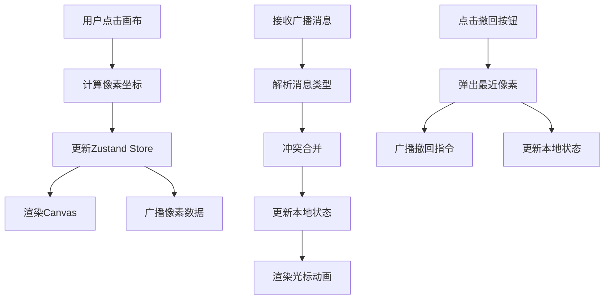

## 1. 产品概述

PixelPalette 是一款在线像素画协作白板应用，支持多个用户在同一块 32x32 像素画布上实时协作绘制。通过 BroadcastChannel API 实现浏览器标签页间的实时同步，使用 IndexedDB 进行本地数据持久化。

- **核心价值**：提供轻量级、无需后端的像素画协作体验，适合创意团队快速脑暴和像素艺术创作
- **目标用户**：像素艺术爱好者、游戏设计师、创意工作者
- **目标场景**：多人协作像素画创作、快速原型设计、教学演示

## 2. 核心功能

### 2.1 功能模块

1. **像素画布**：32x32 网格画布，点击绘制像素，支持实时渲染
2. **工具栏**：颜色选择器、撤回按钮、保存/加载按钮、在线用户数
3. **实时协作**：BroadcastChannel 多标签页同步，支持像素绘制和撤回广播
4. **像素列表**：左侧面板显示所有已绘制像素的坐标和颜色
5. **数据持久化**：IndexedDB 本地存储画布数据

### 2.2 页面详情

| 页面名称 | 模块名称 | 功能描述 |
|----------|----------|----------|
| 主页面 | 像素画布 | 32x32 网格，点击绘制，支持光标动画提示 |
| 主页面 | 左侧工具栏 | 应用标题、颜色选择器、撤回按钮、保存/加载按钮、当前颜色指示器 |
| 主页面 | 像素列表面板 | 实时显示所有像素的坐标和颜色信息 |
| 主页面 | 用户数量指示 | 显示当前在线用户数（模拟标签页数量） |

## 3. 核心流程

### 3.1 绘制像素流程
用户在画布上点击 → 计算像素坐标 → 添加到本地状态 → 广播到其他标签页 → 渲染画布 → 更新像素列表

### 3.2 撤回操作流程
用户点击撤回按钮 → 从本地状态移除最近像素 → 广播撤回指令 → 其他标签页同步撤回 → 重新渲染画布

### 3.3 协作同步流程
接收 BroadcastChannel 消息 → 解析消息类型（绘制/撤回） → 冲突合并（基于时间戳） → 更新本地状态 → 渲染画布（带黄色光标动画）

## 4. 用户界面设计

### 4.1 设计风格
- **主题**：深色科技风，霓虹紫色调点缀
- **主色调**：背景 #1A1A2E，次背景 #16213E，画布背景 #E0E0E0
- **强调色**：#6C63FF（紫）、#00B894（绿）、#FFD93D（黄）
- **字体**：现代无衬线字体，清晰易读
- **按钮风格**：圆角 6px，悬停有微放大效果，过渡 0.2s
- **整体布局**：左侧工具栏 + 居中画布 + 右侧像素列表

### 4.2 页面设计概述

| 页面名称 | 模块名称 | UI 元素 |
|----------|----------|---------|
| 主页面 | 工具栏 | 应用标题（14px白色居中）、24色色板（20x20px圆角4px）、撤回按钮（32x32px紫色背景）、保存/加载按钮（绿色背景）、当前颜色指示器（30x30px带白边）、用户数指示（24x24px图标+数字） |
| 主页面 | 像素画布 | 640x640px居中，浅灰背景，1px灰色网格线，点击绘制，新像素黄色半透明光标动画（0.3s） |
| 主页面 | 像素列表 | 滚动列表，每项显示坐标和颜色色块 |

### 4.3 响应式
- 桌面端优先设计
- 画布居中显示，工具栏固定左侧
- 最小支持 1024x768 分辨率

### 4.4 动效设计
- 色板悬停：放大 1.1 倍，过渡 0.2s
- 新像素提示：黄色半透明光标，大小 20px，透明度 0.6，动画 0.3s
- 加载进度条：0.5s 动画
- 按钮点击：轻微缩放反馈
