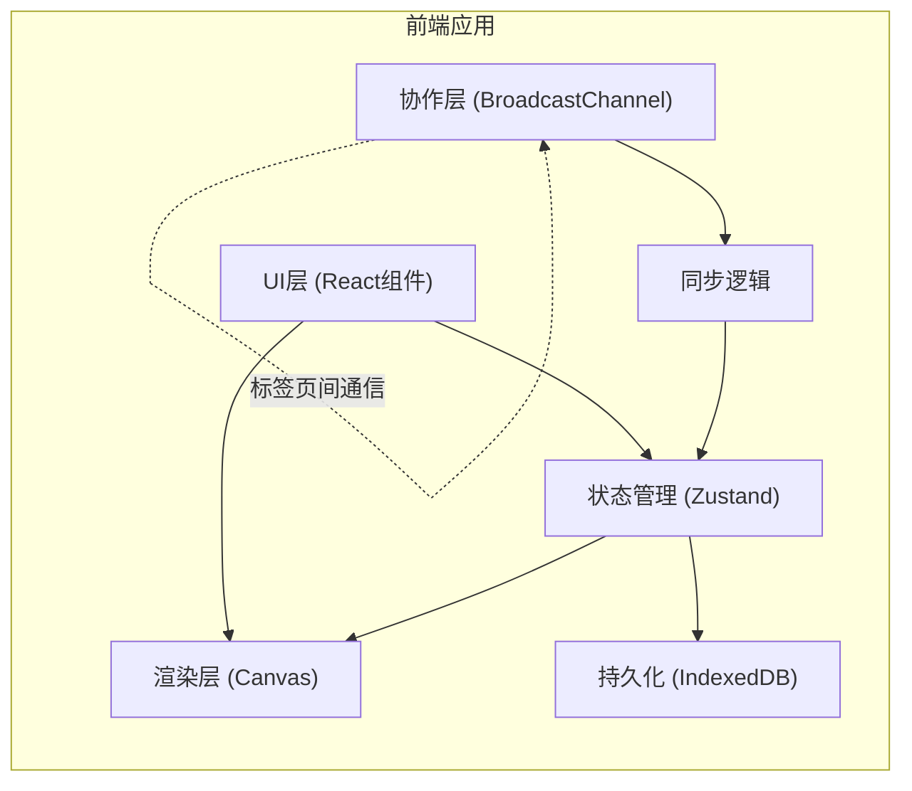

## 1. 架构设计



## 2. 技术栈描述

- **前端框架**：React@18 + TypeScript
- **构建工具**：Vite
- **状态管理**：Zustand
- **渲染引擎**：HTML5 Canvas API
- **实时通信**：BroadcastChannel API（模拟 WebSocket）
- **数据持久化**：IndexedDB
- **工具库**：uuid（生成唯一ID）
- **样式方案**：原生 CSS + CSS Modules

## 3. 项目结构

```
src/
├── pixelBoard/
│   ├── types.ts      # 像素数据接口、全局状态类型
│   ├── store.ts      # Zustand store，管理像素数组和撤回栈
│   └── renderer.ts   # Canvas 渲染模块
├── collaboration/
│   ├── channel.ts    # BroadcastChannel 通信模块
│   └── sync.ts       # 数据同步与冲突合并逻辑
├── components/
│   ├── Toolbar.tsx   # 工具栏组件
│   ├── PixelCanvas.tsx # 画布组件
│   └── PixelList.tsx # 像素列表组件
├── App.tsx           # 主应用组件
├── main.tsx          # 入口文件
└── index.css         # 全局样式
```

## 4. 核心模块定义

### 4.1 类型定义 (types.ts)

```typescript
interface Pixel {
  x: number;
  y: number;
  color: string;
  timestamp: number;
  id: string;
}

interface PixelBoardState {
  pixels: Pixel[];
  redoStack: Pixel[][];
  currentColor: string;
  onlineUsers: number;
  addPixel: (pixel: Pixel) => void;
  undo: () => void;
  setCurrentColor: (color: string) => void;
  setOnlineUsers: (count: number) => void;
}
```

### 4.2 状态管理 (store.ts)
- 使用 Zustand create 函数创建 store
- pixels: Pixel[] 存储所有像素
- redoStack: Pixel[][] 撤回历史栈
- addPixel: 添加像素并推入撤回栈
- undo: 从撤回栈弹出并恢复

### 4.3 渲染模块 (renderer.ts)
- drawPixel: 绘制单个像素到 canvas
- clearCanvas: 清空画布
- renderAll: 批量渲染所有像素
- drawCursor: 绘制新像素提示动画

### 4.4 协作模块 (channel.ts + sync.ts)
- channel.ts: 封装 BroadcastChannel，提供 connect/disconnect
- sync.ts: 消息解析、冲突合并（基于时间戳）、同步状态

## 5. 消息协议

```typescript
type CollabMessage = 
  | { type: 'PIXEL_ADD'; pixel: Pixel; senderId: string }
  | { type: 'PIXEL_UNDO'; pixelId: string; senderId: string }
  | { type: 'SYNC_REQUEST'; senderId: string }
  | { type: 'SYNC_RESPONSE'; pixels: Pixel[]; senderId: string }
  | { type: 'USER_JOIN'; senderId: string }
  | { type: 'USER_LEAVE'; senderId: string };
```

## 6. 性能指标

| 指标 | 目标值 |
|------|--------|
| 画布渲染帧率 | ≥ 30 FPS |
| 广播同步延迟 | ≤ 200ms |
| 撤回操作响应 | ≤ 200ms |
| 广播内部延迟 | ≤ 50ms |
| 画布大小 | 32x32 像素，每格 20px |
