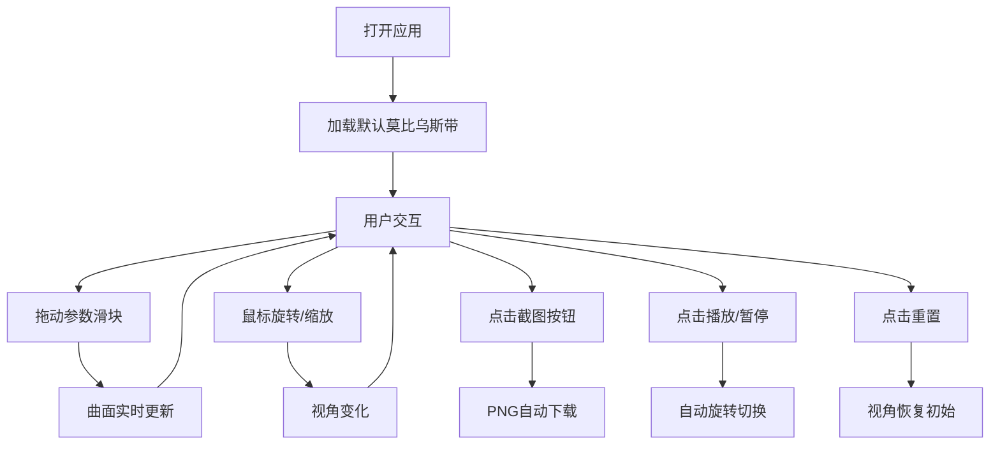

## 1. 产品概述

MathViz 3D 是一个在浏览器中构建和探索抽象数学模型的三维可视化沙盒应用，解决传统数学公式和定理难以直观理解、缺乏交互式探索工具的问题。

- 主要用途：通过交互式三维可视化帮助用户理解复杂的数学曲面和参数方程
- 目标用户：数学爱好者、学生、教师、科研人员
- 核心价值：将抽象的数学公式转化为可交互、可探索的三维视觉体验

## 2. 核心功能

### 2.1 功能模块

1. **三维参数曲面生成器**：参数方程输入、实时曲面渲染、多参数控制
2. **交互视角控制系统**：旋转、平移、缩放、截图
3. **动画与重置系统**：自动旋转动画、视角重置
4. **状态栏与监控**：参数方程显示、FPS计数器
5. **参数控制面板**：6个可拖拽滑块、实时数值显示

### 2.2 页面详情

| 页面名称 | 模块名称 | 功能描述 |
|---------|---------|----------|
| 主场景 | 3D曲面渲染 | 实时生成参数曲面，半透明渐变材质，动态流动线框 |
| 主场景 | 视角控制 | 鼠标拖拽旋转、右键平移、滚轮缩放 |
| 状态栏 | 参数方程显示 | 左侧显示当前参数方程文本 |
| 状态栏 | FPS计数器 | 右侧显示实时帧率 |
| 控制面板 | 参数滑块 | 6个滑块控制曲面参数，范围-10到10，步长0.1 |
| 控制面板 | 截图按钮 | 左上角相机图标按钮，导出PNG |
| 控制面板 | 重置按钮 | 右下角循环箭头图标，恢复初始视角 |
| 控制面板 | 播放/暂停 | 右下角三角/方块图标，控制自动旋转 |

## 3. 核心流程

用户打开应用 → 看到默认莫比乌斯带曲面 → 拖动滑块调整参数 → 曲面实时更新 → 鼠标旋转/缩放查看 → 点击截图保存 → 点击播放查看自动旋转动画 → 点击重置恢复初始状态

## 4. 用户界面设计

### 4.1 设计风格

- **主题风格**：暗黑科幻主题
- **主色调**：深蓝 `#0A0B1E`，深紫 `#2D2D3F`
- **辅助色**：青色 `#00E5FF`，橙红 `#FF6B6B`，金黄 `#FFD700`
- **强调色**：紫色按钮 `#6C63FF`
- **字体**：等宽字体（参数方程），无衬线字体（UI文本）
- **动效节奏**：过渡时长 0.2s~0.5s，requestAnimationFrame 驱动

### 4.2 界面布局

- **主场景**：中央占满视口，全屏3D渲染
- **顶部状态栏**：高度48px，半透明深底，左侧方程显示，右侧FPS
- **底部滑块面板**：宽度400px，居中，圆角12px，6个滑块
- **左上角截图按钮**：36x36px，金色圆形相机按钮
- **右下角控制按钮**：重置和播放/暂停按钮

### 4.3 组件设计

**滑块组件**：
- 轨道颜色：`#4A4A6E`
- 滑块按钮：圆形，颜色 `#6C63FF`
- 拖拽动画：0.2s 光晕扩散
- 数值显示：实时显示当前值
- 标签：白色12px文字
- 间距：8px

**按钮组件**：
- 截图按钮：36x36px，圆角8px，背景 `#FFD700`，悬浮 `#FFAA00`
- 重置按钮：循环箭头图标
- 播放/暂停：三角/方块图标

### 4.4 响应式设计

- **桌面端**：底部滑块面板完整显示
- **移动端**（<768px）：滑块面板收折为浮动按钮（圆形40px，紫色背景，齿轮图标），点击从底部弹出

### 4.5 3D场景设计

- **默认曲面**：莫比乌斯带，60x60网格布点
- **材质**：半透明渐变色（`#00E5FF` → `#FF6B6B`），平面渲染
- **线框**：白色，透明度0.3，动态流动速度0.5周期/秒
- **光照**：环境光 + 方向光，确保曲面立体感
- **相机**：初始位置(5,5,5)，看向原点
- **交互**：旋转速度90°/s，阻尼0.95；平移速度100单位/s；缩放范围0.5x~5x，缓动ease-out 0.3s

### 4.6 动画效果

- **线框流动**：沿UV方向流动，每秒0.5个周期
- **自动旋转**：绕Y轴，每秒20度
- **滑块光晕**：拖拽时0.2s扩散动画
- **按钮悬浮**：0.2s颜色过渡
- **缩放缓动**：ease-out 0.3s

## 5. 性能要求

- 帧率目标：60fps
- 3600点渲染时帧率：≥50fps
- 滑块拖动延迟：≤50ms
- 实时参数更新：无明显卡顿
