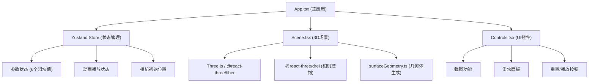

## 1. 架构设计



## 2. 技术描述

- **前端框架**：React@18 + TypeScript
- **构建工具**：Vite
- **3D渲染**：three.js + @react-three/fiber + @react-three/drei
- **状态管理**：zustand
- **工具库**：uuid
- **样式方案**：内联样式 + CSS变量
- **动画方案**：requestAnimationFrame + @react-three/fiber useFrame

## 3. 项目结构

```
auto84/
├── package.json
├── vite.config.js
├── tsconfig.json
├── index.html
└── src/
    ├── App.tsx              # 主应用组件
    ├── components/
    │   ├── Scene.tsx        # 3D场景组件
    │   └── Controls.tsx     # UI控件组件
    ├── store/
    │   └── useStore.ts      # Zustand状态管理
    └── utils/
        └── surfaceGeometry.ts  # 曲面几何体生成工具
```

## 4. 模块说明

### 4.1 store/useStore.ts

Zustand全局状态管理，包含：

**状态**：
- `params: { a, b, c, d, e, f }` - 6个参数滑块值
- `isPlaying: boolean` - 动画播放状态
- `initialCamera: { x, y, z }` - 相机初始位置

**动作**：
- `updateParam(key, value)` - 更新单个参数
- `toggleAnimation()` - 切换动画播放状态
- `resetCamera()` - 重置相机视角（触发事件）
- `takeScreenshot()` - 截图（触发事件）

### 4.2 utils/surfaceGeometry.ts

参数曲面几何体生成工具：

**函数**：
- `createMobilusStrip(width, height, params)` - 生成莫比乌斯带几何体
- `createParametricSurface(width, height, xFunc, yFunc, zFunc, params)` - 通用参数曲面生成器
- `getWireframeFlowOffset(time, speed)` - 计算线框流动偏移量

**参数方程**（莫比乌斯带）：
- x = (a + b*v*cos(u/2)) * cos(u)
- y = (a + b*v*cos(u/2)) * sin(u)
- z = c*v*sin(u/2)
- u ∈ [0, 2π], v ∈ [-1, 1]

### 4.3 components/Scene.tsx

3D场景渲染组件：

**组件内容**：
- `<Canvas>` - @react-three/fiber 画布
- `<OrbitControls>` - 相机控制器（来自drei）
- `<ambientLight>` + `<directionalLight>` - 光照
- `<ParametricSurface>` - 参数曲面子组件
- `<gridHelper>` - 网格辅助线（可选）
- `useFrame` hook - 动画帧更新

**Props**：
- params - 曲面参数
- isPlaying - 动画播放状态

### 4.4 components/Controls.tsx

UI交互控件组件：

**子组件**：
- `StatusBar` - 顶部状态栏（方程显示 + FPS）
- `SliderPanel` - 底部滑块面板（6个滑块）
- `ScreenshotButton` - 左上角截图按钮
- `ControlButtons` - 右下角重置/播放按钮
- `MobileToggle` - 移动端浮动按钮

**Props**：
- 来自store的所有状态和动作

### 4.5 App.tsx

主应用组件，负责组装：

- 全局样式和主题变量
- Zustand store 提供
- 3D场景 (Scene)
- UI控件层 (Controls)
- 响应式布局逻辑

## 5. 关键技术点

### 5.1 参数曲面生成

使用 `BufferGeometry` 手动构建顶点、法线、颜色：
- 遍历 u, v 参数网格
- 计算每个顶点的 x, y, z 坐标
- 计算顶点颜色（基于位置的渐变色）
- 计算法向量（用于光照）
- 构建索引缓冲区（三角形面片）

### 5.2 动态线框流动

通过 shaderMaterial 或修改 uv 偏移实现：
- 在片元着色器中计算网格线
- 随时间偏移 uv 坐标实现流动效果
- 使用 `useFrame` 更新时间 uniform

### 5.3 截图功能

使用 Three.js 的渲染器：
- `renderer.domElement.toDataURL('image/png')`
- 创建 `<a>` 标签触发下载
- 文件名：`mathviz_screenshot_{timestamp}.png`

### 5.4 相机控制

使用 @react-three/drei 的 `OrbitControls`：
- 配置旋转速度、阻尼系数
- 配置平移速度
- 配置缩放范围和缓动
- 暴露 ref 用于重置视角

### 5.5 FPS 计数器

使用 `useFrame` hook：
- 记录帧时间戳
- 每秒计算平均帧率
- 显示在状态栏右侧

## 6. 性能优化

- 使用 `BufferGeometry` 而非 `Geometry`
- 参数变化时仅更新顶点位置，不重建几何体
- 合理的网格细分（60x60 = 3600顶点）
- 使用 `useMemo` 缓存计算结果
- 避免在 render 中创建新对象
- 使用 `requestAnimationFrame` 统一动画驱动

## 7. 响应式适配

- CSS媒体查询：@media (max-width: 768px)
- 滑块面板在移动端隐藏，显示浮动按钮
- 浮动按钮点击后面板从底部滑入
- 触控设备优化（增大触摸区域）
