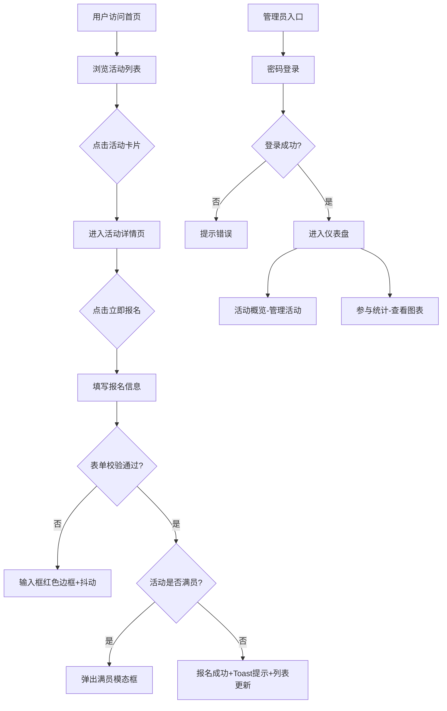

## 1. 产品概述

学校社团活动管理全栈应用，致力于解决社团活动信息分散、报名流程繁琐、管理员难以实时统计参与数据的痛点问题。面向社团管理员和普通学生用户，提供活动发布、在线报名、数据统计等一体化服务。

## 2. 核心功能

### 2.1 用户角色

| 角色 | 登录方式 | 核心权限 |
|------|----------|----------|
| 普通用户 | 无需登录 | 浏览活动列表、查看活动详情、提交报名信息 |
| 社团管理员 | 密码登录（admin123） | 创建/编辑/删除活动、查看所有活动、管理报名、数据统计分析 |

### 2.2 功能模块

1. **活动列表页**：活动卡片网格展示、分页浏览、渐入动画、点击跳转详情
2. **活动详情页**：完整活动信息展示、报名表单、实时报名列表、Toast提示
3. **管理员仪表盘**：登录验证、活动表格管理、编辑/删除操作、侧滑编辑面板
4. **参与统计页**：Chart.js条形图展示报名数据、总活动数/总报名数指标卡片

### 2.3 页面详情

| 页面名称 | 模块名称 | 功能描述 |
|----------|----------|----------|
| 活动列表页 | 卡片网格 | 每行3个卡片，320px宽度，悬停上移动画，进度条展示报名情况 |
| 活动列表页 | 分页组件 | 每页6个活动，按钮圆角8px，选中高亮紫色 |
| 活动详情页 | 报名表单 | 姓名/邮箱/手机号输入，前端校验，失败抖动动画 |
| 活动详情页 | 报名列表 | 交替背景色，每项48px高，实时更新 |
| 管理员仪表盘 | 登录模态框 | 密码验证，400px宽度，居中显示 |
| 管理员仪表盘 | 活动表格 | 交替行背景色，悬停高亮，编辑/删除图标按钮 |
| 管理员仪表盘 | 编辑侧滑面板 | 400px宽度，右侧滑入，修改活动所有字段 |
| 参与统计页 | 条形图 | 渐变柱形，顶部数值标签，1s绘制动画 |
| 参与统计页 | 指标卡片 | 200px宽度，48px粗体数值，过渡动画 |

## 3. 核心流程

## 4. 用户界面设计

### 4.1 设计风格

- **主色调**：深蓝紫 #1E1E2E（背景）
- **强调色**：亮紫 #6C63FF、红色 #E94560
- **辅助色**：边框 #3A3A5C，文字 #B0B0C3
- **按钮风格**：圆角设计（8px/12px/16px），点击缩放0.95，波纹扩散
- **字体**：系统无衬线字体，48px粗体大数值，正文常规字重
- **布局风格**：卡片式布局，深色主题，网格+弹性布局混合
- **图标风格**：react-icons线性图标，20px尺寸

### 4.2 页面设计概述

| 页面名称 | 模块名称 | UI元素 |
|----------|----------|--------|
| 活动列表页 | 卡片网格 | #1E1E2E背景卡片，16px圆角，0.5px #3A3A5C边框，悬停#6C63FF边框+上移4px，0.3s过渡，渐入动画延迟0.1s |
| 活动列表页 | 报名进度条 | 6px高度，3px圆角，#6C63FF到#E94560渐变，0.5s宽度动画 |
| 活动详情页 | 报名按钮 | 240px×48px，#E94560背景，8px圆角，点击缩放0.95+波纹0.4s |
| 活动详情页 | 输入框校验 | 失败时#FF3366红色边框+0.3s抖动 |
| 管理员仪表盘 | 侧边栏 | 240px宽度，#16162A背景，48px菜单项，选中左侧4px #6C63FF实线 |
| 管理员仪表盘 | 活动表格 | #3A3A5C表头，交替#28283A/#2A2A3E行，4px圆角，悬停#3E3E5E |
| 参与统计页 | 条形图 | 40px柱宽，300px最大高度，渐变#6C63FF→#E94560，1s ease-out动画 |
| 参与统计页 | 指标卡片 | 200px宽度，#2A2A4E背景，12px圆角，48px粗体白色数值 |

### 4.3 响应式设计

- **>1200px**：侧边栏常驻展开
- **900px-1200px**：侧边栏收起为图标菜单，悬停展开
- **<900px**：侧边栏变为底部导航栏（60px高度，图标居中），卡片全宽（边距16px）

### 4.4 性能指标

- 主页面加载时间 < 1.5s
- 列表滚动帧率 ≥ 50fps
- 报名提交响应时间 < 500ms
