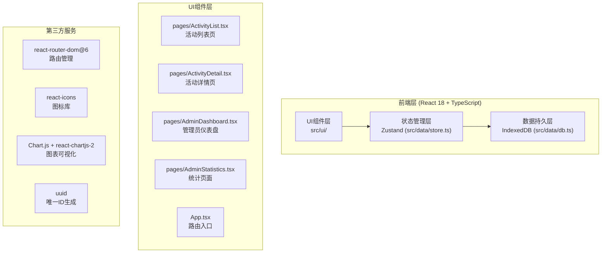
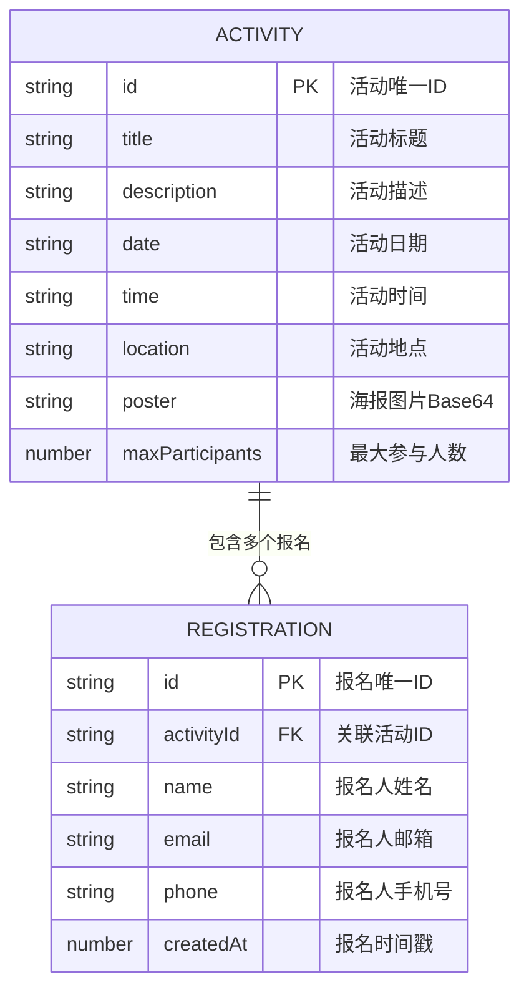

## 1. 架构设计



## 2. 技术描述

- **前端框架**：React@18 + TypeScript@5
- **构建工具**：Vite@5
- **路由管理**：react-router-dom@6
- **状态管理**：zustand@4
- **本地数据库**：IndexedDB（通过idb库封装）
- **图表库**：chart.js@4 + react-chartjs-2@5
- **图标库**：react-icons@5
- **唯一ID**：uuid@9

## 3. 路由定义

| 路由 | 页面组件 | 用途 |
|------|----------|------|
| / | ActivityList | 活动列表首页，展示所有活动卡片 |
| /activity/:id | ActivityDetail | 活动详情页，展示完整信息与报名功能 |
| /admin | AdminDashboard | 管理员仪表盘，活动管理与登录 |
| /admin/statistics | AdminStatistics | 参与统计页面，数据可视化 |

## 4. 数据模型

### 4.1 数据模型定义



### 4.2 数据结构定义

```typescript
interface Activity {
  id: string;
  title: string;
  description: string;
  date: string;
  time: string;
  location: string;
  poster?: string;
  maxParticipants: number;
}

interface Registration {
  id: string;
  activityId: string;
  name: string;
  email: string;
  phone: string;
  createdAt: number;
}

interface AppStore {
  activities: Activity[];
  registrations: Registration[];
  isAdmin: boolean;
  currentUser: string | null;
  setActivities: (activities: Activity[]) => void;
  addActivity: (activity: Activity) => void;
  updateActivity: (id: string, data: Partial<Activity>) => void;
  removeActivity: (id: string) => void;
  addRegistration: (registration: Registration) => void;
  setCurrentUser: (user: string | null) => void;
}
```

## 5. 项目文件结构

```
d:\P\tasks\auto87/
├── .trae/documents/
│   ├── prd.md
│   └── tech-arch.md
├── package.json
├── vite.config.js
├── tsconfig.json
├── index.html
└── src/
    ├── data/
    │   ├── db.ts          # IndexedDB数据操作层
    │   └── store.ts       # Zustand状态管理层
    └── ui/
        ├── App.tsx        # 应用根组件与路由
        └── pages/
            ├── ActivityList.tsx      # 活动列表页
            ├── ActivityDetail.tsx    # 活动详情页
            ├── AdminDashboard.tsx    # 管理员仪表盘
            └── AdminStatistics.tsx   # 参与统计页
```

## 6. 核心技术实现要点

### 6.1 IndexedDB封装（src/data/db.ts）

- 使用`idb`库封装IndexedDB操作
- 数据库名：`ClubActivityDB`，版本号：1
- 对象存储：`activities`（keyPath: id）、`registrations`（keyPath: id）
- `registrations`建立`activityId`索引用于快速查询

### 6.2 Zustand状态管理（src/data/store.ts）

- 全局单例store，管理activities、registrations、isAdmin、currentUser
- Actions负责同时更新内存状态与IndexedDB持久化
- 组件通过`useStore` Hook订阅状态

### 6.3 路由与代码分割（src/ui/App.tsx）

- 使用`BrowserRouter` + `Routes`定义路由
- 页面组件使用`React.lazy` + `Suspense`进行代码分割
- 加载 fallback：居中旋转加载图标（#6C63FF，32px，1s线性无限旋转）

### 6.4 动画实现

- CSS过渡动画：`transition: all 0.3s ease-out`
- 卡片渐入：`@keyframes fadeInUp` + `animation-delay` 逐卡延迟
- 抖动动画：`@keyframes shake` 0.3s
- 侧滑面板：`transform: translateX` 从100%到0，0.3s ease-out
- 波纹效果：点击按钮时动态创建扩散圆元素
