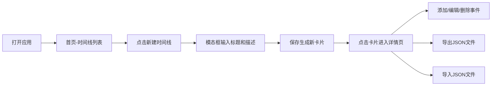

## 1. 产品概述

时间线事件管理应用，帮助用户在浏览器中创建、编辑和分享时间线，解决历史事件或项目里程碑信息分散、难以按时间顺序组织和可视化呈现的问题。

- 主要用途：组织和可视化历史事件、项目里程碑、个人记事等时间相关信息
- 目标用户：学生、研究人员、项目经理、历史爱好者等需要时间维度信息管理的人群
- 产品价值：提供直观的时间轴可视化，让信息按时间顺序清晰呈现，便于理解和分享

## 2. 核心功能

### 2.1 用户角色
| 角色 | 注册方式 | 核心权限 |
|------|----------|----------|
| 普通用户 | 无需注册，本地使用 | 创建、编辑、删除时间线和事件，导入导出数据 |

### 2.2 功能模块
1. **首页**：时间线列表、新建时间线按钮、时间线卡片网格
2. **时间线详情页**：横向缩略图导航、垂直事件列表、添加事件、导出导入功能

### 2.3 页面详情
| 页面名称 | 模块名称 | 功能描述 |
|----------|----------|----------|
| 首页 | 新建时间线按钮 | 居中圆角按钮，点击弹出模态框输入标题和描述 |
| 首页 | 时间线卡片网格 | 展示所有时间线卡片，显示标题、描述截断和事件数，点击进入详情 |
| 首页 | 新建模态框 | 半透明遮罩，输入标题（最多50字）和描述（多行120px高度） |
| 时间线详情页 | 横向缩略图导航 | 可滚动微型时间轴，显示事件点状分布，悬停显示tooltip |
| 时间线详情页 | 垂直事件列表 | 2px竖线时间轴，事件卡片带颜色标签左边框，间距16px |
| 时间线详情页 | 添加事件表单 | 输入标题、日期、描述、选择8种预设颜色标签 |
| 时间线详情页 | 导出功能 | 导出JSON文件，按钮图标动画反馈 |
| 时间线详情页 | 导入功能 | 文件选择器和拖拽区域，支持导入JSON文件 |
| 全局 | 数据状态显示 | 页面底部显示"已保存 X条时间线 Y个事件" |

## 3. 核心流程

用户打开应用 → 首页显示时间线列表 → 点击"新建时间线"按钮 → 弹出模态框输入标题和描述 → 保存后生成新卡片 → 点击卡片进入详情页 → 详情页显示缩略图导航和事件列表 → 添加/编辑/删除事件 → 可导出JSON或导入JSON文件

## 4. 用户界面设计

### 4.1 设计风格
- 主色调：#6C63FF（紫色）
- 辅色：#F50057（玫红）用于错误提示和删除按钮
- 背景色：#121221
- 卡片背景：#1E1E2E
- 文字色：#E0E0E0
- 按钮风格：圆角8px，悬停背景变暗10%，过渡0.2s-0.3s
- 布局：卡片式布局，主容器最大宽度1200px居中
- 动画：所有按钮和卡片悬停0.3s ease-out变换动画
- 字体：现代无衬线字体，正文14px-16px，标题适当加大

### 4.2 页面设计概述
| 页面名称 | 模块名称 | UI元素 |
|----------|----------|--------|
| 首页 | 新建按钮 | 240x48px圆角矩形，#6C63FF背景，白色16px文字，悬停变暗 |
| 首页 | 时间线卡片 | 300px宽，#1E1E2E背景，12px圆角，0.5px边框，悬停上移4px |
| 首页 | 模态框 | 半透明遮罩#00000066，输入框360px宽，#2D2D3F背景 |
| 时间线详情页 | 缩略图导航 | 横向可滚动，圆点6px，悬停放大到10px显示tooltip |
| 时间线详情页 | 事件列表 | 2px#6C63FF竖线，卡片左边框4px颜色标签，间距16px |
| 时间线详情页 | 颜色选择器 | 8个30x30px圆形色块，点击缩放0.95再弹回 |
| 时间线详情页 | 拖拽区域 | 2px虚线#6C63FF边框，拖入时变实线且背景变亮10% |

### 4.3 响应式
- 桌面优先设计，移动端自适应
- 宽度小于768px时，卡片改为单列布局
- 移动端缩略图时间轴自动隐藏
- 触摸设备优化交互区域

## 5. 性能要求
- 切换时间线时，事件列表渲染时间≤200ms
- 首屏加载时间≤2s
- 动画流畅度≥60fps
