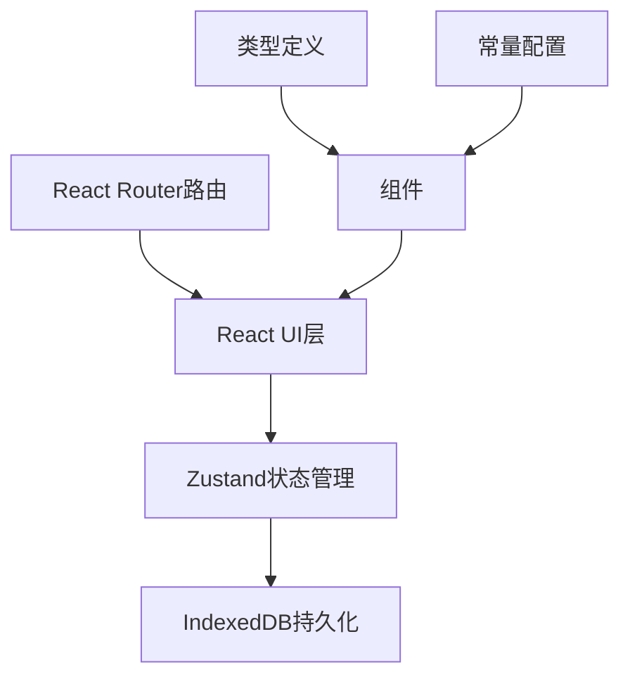
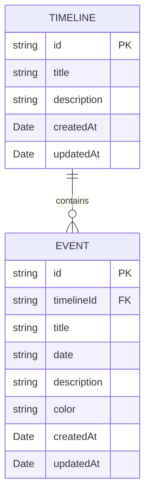

## 1. 架构设计



## 2. 技术描述
- 前端框架：React@18 + TypeScript
- 构建工具：Vite
- 路由：react-router-dom@6
- 状态管理：zustand
- 数据持久化：IndexedDB（idb库）
- 工具库：uuid

## 3. 路由定义
| 路由 | 用途 |
|------|------|
| / | 首页，展示时间线列表和新建按钮 |
| /timeline/:id | 时间线详情页，展示事件列表和操作功能 |

## 4. 数据模型

### 4.1 数据模型定义


### 4.2 TypeScript类型定义
```typescript
interface Timeline {
  id: string;
  title: string;
  description: string;
  createdAt: Date;
  updatedAt: Date;
}

interface Event {
  id: string;
  timelineId: string;
  title: string;
  date: string;
  description: string;
  color: string;
  createdAt: Date;
  updatedAt: Date;
}
```

## 5. 文件结构
```
├── package.json
├── index.html
├── vite.config.js
├── tsconfig.json
└── src/
    ├── constants.ts    # 颜色标签、日期格式化等常量
    ├── types.ts        # Timeline和Event接口类型
    ├── store.ts        # Zustand store，状态管理和IndexedDB交互
    ├── App.tsx         # 根组件，路由配置
    └── pages/
        ├── HomePage.tsx      # 首页组件
        └── TimelinePage.tsx  # 详情页组件
```

## 6. 核心模块说明

### 6.1 Store模块 (src/store.ts)
- 使用Zustand创建全局状态
- 管理时间线列表和当前选中时间线
- 提供增删改查方法
- 与IndexedDB交互实现数据持久化
- 初始化时从IndexedDB加载数据

### 6.2 首页模块 (src/pages/HomePage.tsx)
- 展示"新建时间线"按钮
- 渲染时间线卡片网格
- 处理新建模态框逻辑
- 调用store方法添加时间线

### 6.3 详情页模块 (src/pages/TimelinePage.tsx)
- 横向微型缩略图导航组件
- 垂直事件列表组件
- 添加事件表单
- 导出/导入功能
- 调用store方法操作事件

### 6.4 IndexedDB操作
- 数据库名：TimelineDB
- 版本：1
- 对象仓库：
  - timelines（主键：id）
  - events（主键：id，索引：timelineId）
