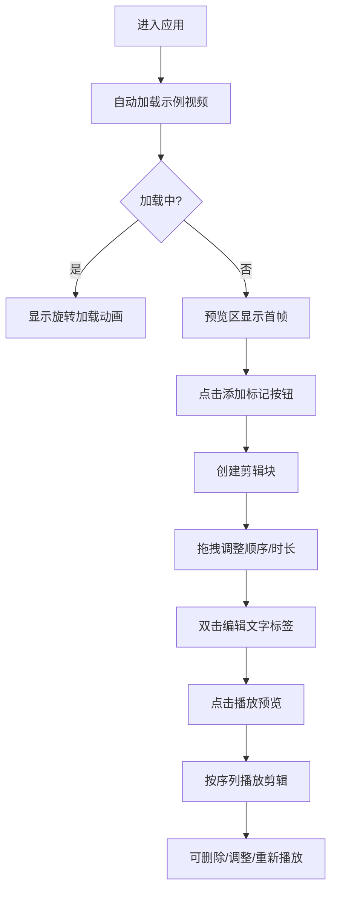

## 1. 产品概述

ClipCanvas是一款面向视频内容创作者和访客的交互式视频剪辑时间轴编辑器，让用户可以在浏览器中体验专业视频剪辑的乐趣，通过简单的拖拽、标注和预览操作完成视频片段的编辑。

- **核心价值**：降低视频编辑门槛，提供直观的交互体验，让访客在作品展示网站上就能参与视频创作过程
- **目标用户**：视频内容创作者的网站访客、视频编辑爱好者、对视频制作感兴趣的普通用户

## 2. 核心功能

### 2.1 用户角色

| 角色 | 注册方式 | 核心权限 |
|------|----------|----------|
| 访客用户 | 无需注册 | 加载示例视频、创建剪辑块、添加文字标注、调整播放顺序、预览剪辑效果 |

### 2.2 功能模块

1. **视频处理模块**：视频加载与预处理、逐帧提取、帧渲染、视频元数据管理
2. **编辑交互模块**：时间轴UI、剪辑块拖拽、手柄调整、文字标签编辑、播放控制
3. **状态管理模块**：Zustand store统一管理视频状态和剪辑状态
4. **预览渲染模块**：Canvas帧渲染、文字叠加、播放序列控制

### 2.3 页面详情

| 页面名称 | 模块名称 | 功能描述 |
|----------|----------|-------------|
| 主编辑页 | 视频预览区 | 640x360固定尺寸Canvas，实时渲染当前帧和叠加文字，加载动画 |
| 主编辑页 | 播放控制区 | 播放/暂停、停止、循环播放按钮，状态反馈 |
| 主编辑页 | 时间轴编辑区 | 横向时间轴、剪辑块拖拽、添加标记按钮、缩放滑块、播放头同步 |
| 主编辑页 | 剪辑块交互 | 双击编辑文字、拖拽调整时长、Delete键删除、选中高亮、动画效果 |

## 3. 核心流程

### 3.1 主要用户流程

用户进入应用 → 自动加载示例视频（显示加载动画）→ 加载完成后预览区显示视频 → 点击"添加标记"按钮创建剪辑块 → 拖拽剪辑块调整顺序 → 拖拽手柄调整剪辑时长 → 双击剪辑块添加文字标签 → 点击播放按钮预览剪辑效果 → 可循环播放、暂停、停止 → 选中剪辑块按Delete删除

## 4. 用户界面设计

### 4.1 设计风格

- **设计调性**：专业视频剪辑软件风格，深色主题，科技感，精致细腻
- **主色调**：#6C63FF（紫色强调色），用于选中状态、按钮、加载动画
- **危险色**：#FF6B6B，用于删除手柄、危险操作
- **背景色系**：#121220（主背景）、#1A1A2E（面板）、#1E1E2E（时间轴）、#2D2D3F（次要面板）
- **文字色**：#E0E0E0（主要）、#A0A0B0（次要）
- **字体**：系统默认无衬线字体，保持跨平台一致性
- **圆角规范**：面板8px，按钮和输入框4px，剪辑块8px
- **阴影规范**：内阴影营造深度感，选中状态发光阴影

### 4.2 页面设计概述

| 页面名称 | 模块名称 | UI元素 |
|----------|----------|--------|
| 主编辑页 | 整体布局 | 左右结构（<1024px改为上下），左侧预览区650px，右侧时间轴自适应，最小400px |
| 主编辑页 | 视频预览区 | 640x360 Canvas，黑色背景，白色居中文字，黑色描边，30fps动画 |
| 主编辑页 | 播放控制区 | 按钮hover变亮10%（0.2s过渡），点击scale 0.95（0.1s过渡），图标使用lucide-react |
| 主编辑页 | 时间轴区域 | 高度120px，横向滚动，0.5秒无交互自动隐藏滚动条，仅显示透明箭头 |
| 主编辑页 | 剪辑块 | 渐变背景#3A3A5C到#4A4A6E，高度80px，圆角8px，选中时边框2px #6C63FF + 发光阴影 |
| 主编辑页 | 拖拽手柄 | 宽度8px，高度80px，#FF6B6B，拖拽时显示垂直辅助虚线 |
| 主编辑页 | 播放头 | 红色竖线2px宽，高度120px，平滑线性动画 |
| 主编辑页 | 文字输入框 | 内嵌于剪辑块，背景#2D2D3F，聚焦边框#6C63FF |
| 主编辑页 | 加载动画 | 44px旋转圆圈，#6C63FF，边框4px |
| 主编辑页 | 删除动画 | 0.3s缩放至0消失，后续剪辑块0.3s ease-out滑动填补 |

### 4.3 响应式设计

- **桌面端（≥1024px）**：左右布局，左侧预览区650px固定宽度，右侧时间轴占剩余空间，最小400px
- **移动端/平板（<1024px）**：上下布局，预览区100%宽度，时间轴移至下方，触摸交互优化
- **触摸优化**：剪辑块和按钮最小触摸区域48px，拖拽操作带视觉反馈

### 4.4 动画与交互细节

- **微交互**：所有按钮hover过渡0.2s，点击按压效果0.1s
- **时间轴滚动**：无交互0.5秒后自动隐藏滚动条，仅显示透明度0.3的箭头，hover时恢复
- **播放头动画**：使用requestAnimationFrame实现平滑移动，与视频帧率同步
- **剪辑块动画**：删除时缩放消失，重排时滑动过渡，拖拽时位置实时更新
- **帧渲染**：30fps稳定渲染，使用ImageData提高性能
