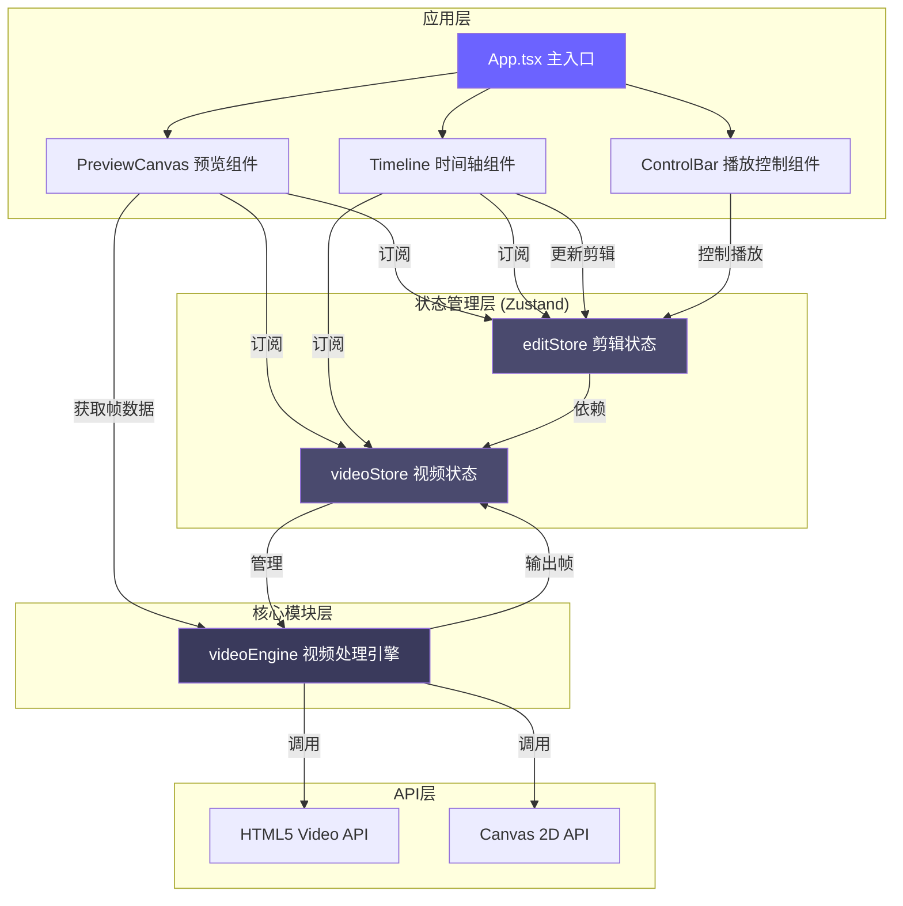

## 1. 架构设计



**数据流说明**：
1. videoEngine → videoStore：视频元数据、当前帧ImageData、帧时间戳
2. videoStore → editStore：视频时长、帧数据（供剪辑计算）
3. editStore → Timeline/PreviewCanvas：剪辑块列表、选中状态、播放进度
4. 用户交互 → Timeline → editStore：更新剪辑状态
5. 播放控制 → editStore → videoEngine → videoStore → PreviewCanvas：播放帧渲染

## 2. 技术描述

### 2.1 技术栈
- **前端框架**：React@18 + React DOM@18
- **构建工具**：Vite@5
- **类型系统**：TypeScript@5（严格模式，noUnusedLocals + noUnusedParameters）
- **状态管理**：Zustand@4
- **唯一ID生成**：uuid@9
- **图标库**：lucide-react@0.344
- **视频处理**：HTML5 Video API + Canvas 2D API
- **样式方案**：纯CSS（CSS Variables + CSS Modules，避免Tailwind以获得更精细的动画控制）

### 2.2 项目初始化
使用 `react-ts` 模板通过 vite-init 初始化，然后按需求调整依赖和配置。

## 3. 文件结构与调用关系

```
src/
├── modules/
│   ├── video/
│   │   ├── videoEngine.ts      # 视频处理核心，管理Video元素、帧提取
│   │   └── videoStore.ts       # Zustand视频状态片，被editStore依赖
│   └── editor/
│       ├── editStore.ts        # Zustand剪辑状态片，依赖videoStore
│       ├── Timeline.tsx        # 时间轴UI组件
│       ├── PreviewCanvas.tsx   # 预览画布组件
│       ├── ClipBlock.tsx       # 剪辑块子组件
│       ├── ControlBar.tsx      # 播放控制栏组件
│       └── LoadingSpinner.tsx  # 加载动画组件
├── types/
│   └── index.ts                # 全局类型定义
├── App.tsx                     # 主应用组件
├── main.tsx                    # 入口文件
└── styles/
    ├── global.css              # 全局样式 + CSS变量
    ├── variables.css           # 设计token
    └── animations.css          # 关键帧动画
```

**调用关系**：
- [App.tsx](file:///d:/P/tasks/auto91/src/App.tsx) → [PreviewCanvas.tsx](file:///d:/P/tasks/auto91/src/modules/editor/PreviewCanvas.tsx) + [Timeline.tsx](file:///d:/P/tasks/auto91/src/modules/editor/Timeline.tsx) + [ControlBar.tsx](file:///d:/P/tasks/auto91/src/modules/editor/ControlBar.tsx)
- [Timeline.tsx](file:///d:/P/tasks/auto91/src/modules/editor/Timeline.tsx) → [ClipBlock.tsx](file:///d:/P/tasks/auto91/src/modules/editor/ClipBlock.tsx)
- [PreviewCanvas.tsx](file:///d:/P/tasks/auto91/src/modules/editor/PreviewCanvas.tsx) → [videoEngine.ts](file:///d:/P/tasks/auto91/src/modules/video/videoEngine.ts)
- [editStore.ts](file:///d:/P/tasks/auto91/src/modules/editor/editStore.ts) → [videoStore.ts](file:///d:/P/tasks/auto91/src/modules/video/videoStore.ts)
- [videoStore.ts](file:///d:/P/tasks/auto91/src/modules/video/videoStore.ts) → [videoEngine.ts](file:///d:/P/tasks/auto91/src/modules/video/videoEngine.ts)

## 4. 核心数据模型

### 4.1 TypeScript 类型定义

```typescript
// types/index.ts
export interface VideoMetadata {
  id: string;
  duration: number;
  width: number;
  height: number;
  fps: number;
  totalFrames: number;
}

export interface Clip {
  id: string;
  startTime: number;
  endTime: number;
  text: string;
  orderIndex: number;
}

export interface VideoState {
  sourceUrl: string | null;
  metadata: VideoMetadata | null;
  isLoading: boolean;
  loadError: string | null;
  currentFrame: ImageData | null;
  currentTime: number;
  currentFrameIndex: number;
}

export interface EditorState {
  clips: Clip[];
  selectedClipId: string | null;
  timelineScale: number;
  isPlaying: boolean;
  isLooping: boolean;
  playheadTime: number;
  currentClipIndex: number;
}

export interface VideoActions {
  loadVideo: (url: string) => Promise<void>;
  seekToFrame: (frameIndex: number) => Promise<void>;
  seekToTime: (time: number) => Promise<void>;
  getFrameAtTime: (time: number) => Promise<ImageData | null>;
}

export interface EditorActions {
  addClip: (time: number) => void;
  removeClip: (clipId: string) => void;
  reorderClip: (clipId: string, newIndex: number) => void;
  updateClipTime: (clipId: string, startTime: number, endTime: number) => void;
  updateClipText: (clipId: string, text: string) => void;
  selectClip: (clipId: string | null) => void;
  setTimelineScale: (scale: number) => void;
  togglePlay: () => void;
  stop: () => void;
  toggleLoop: () => void;
  setPlayheadTime: (time: number) => void;
}
```

### 4.2 Zustand Store 定义

**videoStore**：
- 状态：sourceUrl, metadata, isLoading, currentFrame, currentTime
- Action：loadVideo, seekToTime, getFrameAtTime
- 依赖videoEngine进行底层视频操作

**editStore**：
- 状态：clips, selectedClipId, timelineScale, isPlaying, isLooping, playheadTime
- Action：addClip, removeClip, reorderClip, updateClipTime, updateClipText, selectClip, togglePlay
- 通过get()获取videoStore的状态

## 5. 核心模块设计

### 5.1 videoEngine.ts 设计

**核心职责**：
- 管理隐藏的HTMLVideoElement
- 逐帧提取视频帧到Canvas
- 计算视频元数据（时长、宽高、估算fps）
- 提供seek和帧获取接口

**关键方法**：
- `loadVideo(url: string): Promise<VideoMetadata>`：加载视频，解析元数据
- `seekToTime(time: number): Promise<ImageData | null>`：跳转到指定时间点，提取帧
- `getCurrentFrame(): ImageData | null`：获取当前帧的ImageData
- `destroy()`：清理资源，释放内存

### 5.2 Timeline.tsx 设计

**核心交互**：
- 横向时间轴渲染，根据缩放比例计算像素-时间映射
- 剪辑块拖拽重排序（mousedown → mousemove → mouseup）
- 左右手柄拖拽调整时长
- 添加标记按钮点击创建新clip
- 播放头平滑动画（CSS transition）
- 缩放滑块控制时间轴缩放

**性能优化**：
- 使用CSS transform进行拖拽，避免重排
- 拖拽节流，确保重绘延迟<100ms
- 虚拟滚动（如需要）处理大量剪辑块

### 5.3 PreviewCanvas.tsx 设计

**渲染逻辑**：
- 固定640x360尺寸canvas
- requestAnimationFrame循环，30fps更新
- 从videoEngine获取当前帧ImageData并putImageData
- 检查当前时间是否在某个clip范围内，如是则叠加文字
- 文字渲染：白色16px字体，居中，2px黑色描边

**播放序列逻辑**：
- 根据clips的orderIndex排序
- 计算每个clip的播放时间段（相对于序列总时长）
- 遇到间隙显示黑色画面
- 循环模式：到达末尾自动跳转到开头

## 6. 性能优化策略

### 6.1 帧渲染性能
- 目标：30fps以上稳定渲染
- 策略：
  - 使用ImageData而非drawImage减少GPU开销
  - 渲染循环中避免不必要的计算
  - 帧缓存机制（最近10帧LRU缓存）
  - 非活动标签页自动降频到10fps

### 6.2 拖拽交互性能
- 目标：拖拽重绘延迟<100ms
- 策略：
  - 使用transform + will-change: transform
  - requestAnimationFrame统一处理拖拽更新
  - 避免在拖拽回调中执行复杂计算
  - 指针事件而非鼠标事件，兼容触摸

### 6.3 播放启动延迟
- 目标：点击到画面更新<200ms
- 策略：
  - 预加载首帧和关键帧
  - 视频元素保持ready状态
  - 避免播放时的同步操作
  - 使用decode()预解码即将播放的帧

## 7. 配置文件说明

### 7.1 package.json
```json
{
  "name": "clipcanvas",
  "private": true,
  "version": "0.1.0",
  "type": "module",
  "scripts": {
    "dev": "vite",
    "build": "tsc && vite build",
    "preview": "vite preview",
    "check": "tsc --noEmit"
  },
  "dependencies": {
    "react": "^18.2.0",
    "react-dom": "^18.2.0",
    "zustand": "^4.5.0",
    "uuid": "^9.0.1",
    "lucide-react": "^0.344.0"
  },
  "devDependencies": {
    "@types/react": "^18.2.55",
    "@types/react-dom": "^18.2.19",
    "@types/uuid": "^9.0.8",
    "@vitejs/plugin-react": "^4.2.1",
    "typescript": "^5.3.3",
    "vite": "^5.1.0"
  }
}
```

### 7.2 tsconfig.json 关键配置
```json
{
  "compilerOptions": {
    "strict": true,
    "noUnusedLocals": true,
    "noUnusedParameters": true,
    "target": "ES2020",
    "module": "ESNext",
    "jsx": "react-jsx",
    "moduleResolution": "bundler",
    "resolveJsonModule": true,
    "isolatedModules": true,
    "esModuleInterop": true,
    "skipLibCheck": true
  }
}
```

### 7.3 vite.config.js
```javascript
import { defineConfig } from 'vite'
import react from '@vitejs/plugin-react'

export default defineConfig({
  plugins: [react()],
  server: {
    port: 3000,
    open: true
  }
})
```

## 8. 示例视频方案

使用BLOB URL模拟内置示例视频：
1. 创建一个隐藏的canvas，生成动态视频帧
2. 使用MediaRecorder录制canvas流
3. 将录制的Blob转换为Object URL作为视频源
4. 生成约10秒的示例视频，包含色彩变化和简单动画

备选方案：使用data URL的短MP4视频，或直接使用公开的示例视频CDN链接。
