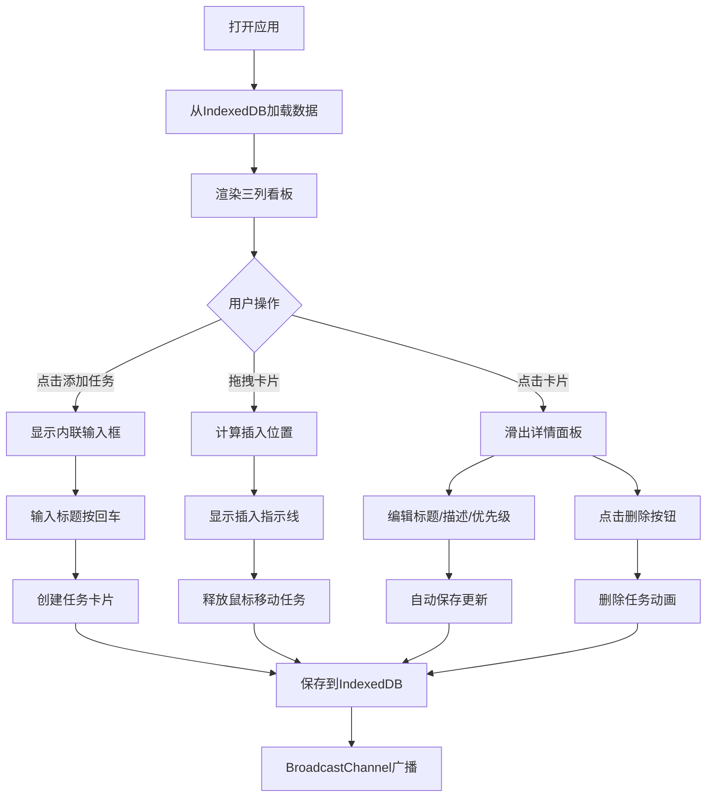

## 1. 产品概述

TaskPulse是一个面向团队的可视化任务看板应用，通过拖拽式交互实现任务状态流转和优先级管理，支持多标签页实时协作同步。
- 主要目标：提升团队协作效率，直观展示任务进度，降低沟通成本
- 核心价值：简洁高效的拖拽体验、实时协同、本地数据持久化、无需后端即可使用

## 2. 核心特性

### 2.1 用户角色
| 角色 | 注册方式 | 核心权限 |
|------|----------|----------|
| 团队成员 | 无需注册，直接使用 | 创建、编辑、删除任务，拖拽排序，跨列移动，查看任务详情 |

### 2.2 功能模块
1. **看板主页**：三列任务看板（待办/进行中/已完成），任务卡片展示，拖拽交互
2. **任务管理**：任务创建、编辑标题/描述/优先级、删除任务
3. **拖拽系统**：同列内上下排序、跨列移动任务、插入指示线、平滑动画
4. **实时协作**：多标签页通过BroadcastChannel同步数据变更
5. **数据持久化**：IndexedDB本地存储，刷新页面数据不丢失

### 2.3 页面详情
| 页面名称 | 模块名称 | 功能描述 |
|----------|----------|----------|
| 看板主页 | 顶部导航栏 | 品牌名称"TaskPulse"、绿色在线用户数指示器 |
| 看板主页 | 待办列 | 显示待办任务列表，列标题+计数徽章，添加任务按钮 |
| 看板主页 | 进行中列 | 显示进行中任务列表，列标题+计数徽章，添加任务按钮 |
| 看板主页 | 已完成列 | 显示已完成任务列表，列标题+计数徽章，添加任务按钮 |
| 看板主页 | 任务卡片 | 标题展示、优先级标签、创建者头像、悬停效果、点击展开详情 |
| 看板主页 | 内联输入框 | 点击添加按钮后出现，回车创建任务 |
| 任务详情面板 | 详情编辑 | 标题编辑、描述多行文本、优先级下拉选择、时间信息展示 |
| 任务详情面板 | 删除操作 | 底部红色删除按钮，二次确认后删除 |

## 3. 核心流程

用户打开应用 → 从IndexedDB加载看板数据 → 查看三列任务 → 
点击添加按钮 → 弹出输入框 → 输入标题按回车 → 创建任务卡片 → 
拖拽任务卡片 → 同列排序或跨列移动 → BroadcastChannel广播更新 → 
点击卡片 → 右侧滑出详情面板 → 编辑信息或删除任务 → 自动保存并广播

## 4. 用户界面设计

### 4.1 设计风格
- **主色调**：深紫蓝色 #6C63FF（强调色），配合深色主题
- **背景色**：主背景 #12121F，卡片 #252540，列容器 #1A1A2E
- **优先级颜色**：高 #FF4D4D，中 #FFB84D，低 #4DDB4D
- **按钮样式**：圆角8px，带过渡动画，悬停有状态变化
- **字体**：白色/浅灰文字，标题14px，标签11px，辅助文字12px
- **布局风格**：三列等宽卡片式布局，居中对齐最大宽度1200px
- **动效风格**：平滑过渡动画0.2-0.3s，删除缩小动画，滑入面板动画

### 4.2 页面设计概述
| 页面名称 | 模块名称 | UI元素 |
|----------|----------|----------|
| 看板主页 | 顶部导航 | 左对齐"TaskPulse" 24px白色字体，绿色在线指示器 |
| 看板主页 | 列容器 | 圆角12px，内边距12px，内阴影，背景#1A1A2E |
| 看板主页 | 列标题 | 白色字体 + 紫色#6C63FF计数徽章（圆角8px 12px字体） |
| 看板主页 | 添加按钮 | 高度36px，虚线边框#5A5A7A→悬停实线#6C63FF，背景#2A2A3C |
| 看板主页 | 任务卡片 | 圆角10px，背景#252540，边框#3A3A5C→悬停#6C63FF+阴影增强 |
| 看板主页 | 优先级标签 | 圆角4px，11px字体，右对齐，三色区分 |
| 看板主页 | 头像 | 直径24px圆形，柔和随机背景色 |
| 看板主页 | 插入指示线 | 2px高 #6C63FF，0.2s动画 |
| 详情面板 | 滑入容器 | 宽度360px，背景#1A1A2E，左边框#3A3A5C |
| 详情面板 | 表单元素 | 标题输入框、描述文本域（100px高）、优先级下拉 |
| 详情面板 | 删除按钮 | 红色#E94560，圆角8px，悬停变暗 |

### 4.3 响应式设计
- 桌面端优先，三列等宽（33%）布局
- 中等屏幕可缩小间距保持三列
- 移动端可切换为单列滚动布局（可选优化）
- 拖拽操作支持鼠标，触控设备可长按触发

### 4.4 性能要求
- 拖拽动画帧率 ≥ 55fps，使用requestAnimationFrame优化
- 任务卡片渲染响应时间 < 50ms，虚拟化长列表可选
- IndexedDB读写异步执行不阻塞UI主线程
- BroadcastChannel消息携带唯一ID去重，避免重复更新
