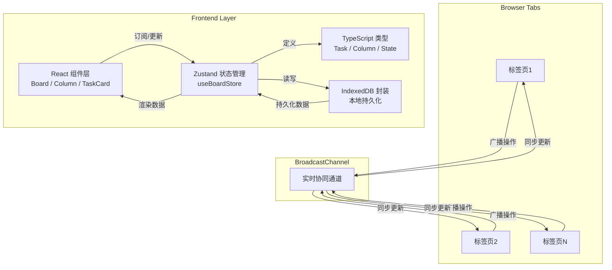
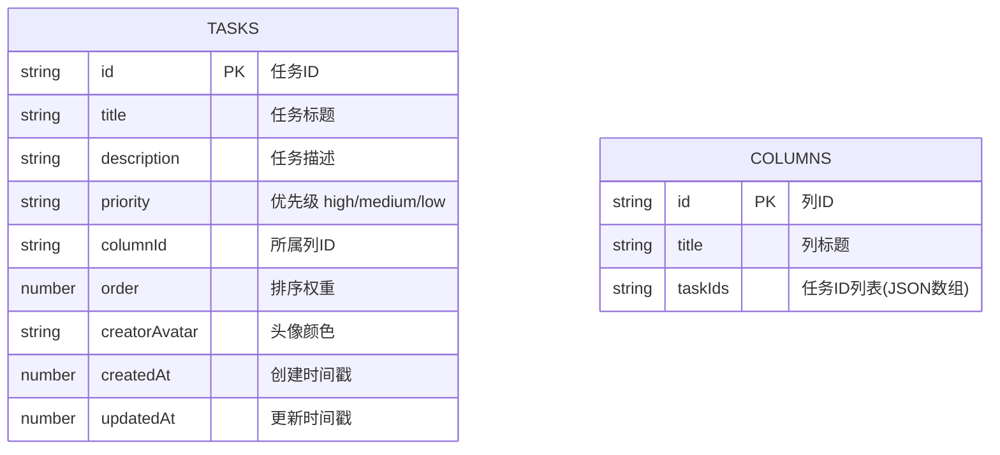

## 1. 架构设计



## 2. 技术描述

- **前端框架**：React@18 + TypeScript（严格模式）
- **构建工具**：Vite（vite.config.js + React插件）
- **状态管理**：Zustand（轻量级，支持订阅和中间件）
- **唯一标识**：uuid（任务ID、消息ID生成）
- **实时协作**：BroadcastChannel API（同源多标签页通信）
- **数据持久化**：IndexedDB（异步存储，容量大）
- **样式方案**：原生CSS（CSS Modules或全局样式，按需求文件结构）

## 3. 路由定义
| 路由 | 用途 |
|------|------|
| / | 看板主页（单页应用，无需路由） |

*本应用为单页面应用，无需React Router。*

## 4. 核心类型定义

```typescript
// 任务优先级
type Priority = 'high' | 'medium' | 'low'

// 任务状态（列ID）
type ColumnId = 'todo' | 'in-progress' | 'done'

// 任务接口
interface Task {
  id: string
  title: string
  description: string
  priority: Priority
  columnId: ColumnId
  order: number           // 同列内排序权重
  creatorAvatar: string   // 头像背景色HSL值
  createdAt: number       // 时间戳
  updatedAt: number       // 时间戳
}

// 列接口
interface Column {
  id: ColumnId
  title: string
  taskIds: string[]       // 有序任务ID列表
}

// 看板状态
interface BoardState {
  tasks: Record<string, Task>
  columns: Record<ColumnId, Column>
  columnOrder: ColumnId[]
  onlineUsers: number     // 模拟在线用户数
  lastMessageId?: string  // BroadcastChannel去重用
}

// BroadcastChannel 消息类型
type BroadcastAction =
  | { type: 'CREATE_TASK'; payload: Task; messageId: string }
  | { type: 'UPDATE_TASK'; payload: Task; messageId: string }
  | { type: 'DELETE_TASK'; payload: { taskId: string }; messageId: string }
  | { type: 'MOVE_TASK'; payload: { taskId: string; fromColumn: ColumnId; toColumn: ColumnId; toIndex: number }; messageId: string }
  | { type: 'REORDER_TASK'; payload: { taskId: string; columnId: ColumnId; newIndex: number }; messageId: string }
```

## 5. Store 操作定义

### Zustand Actions
| 方法名 | 参数 | 返回值 | 说明 |
|--------|------|--------|------|
| createTask | columnId, title | Task | 创建新任务并添加到指定列末尾 |
| updateTask | taskId, updates | void | 部分更新任务字段（标题、描述、优先级） |
| deleteTask | taskId | void | 删除任务并从列中移除 |
| moveTask | taskId, toColumn, toIndex | void | 跨列移动任务到目标位置 |
| reorderTask | taskId, columnId, newIndex | void | 同列内重新排序 |
| loadFromDB | - | Promise\<void\> | 应用启动时从IndexedDB加载数据 |
| broadcastAction | action | void | 发送BroadcastChannel消息并去重 |
| applyRemoteAction | action | void | 处理来自BroadcastChannel的远程更新 |

## 6. 数据模型（IndexedDB）

### 6.1 数据模型ER图



### 6.2 IndexedDB 配置
- **数据库名**：TaskPulseDB
- **版本号**：1
- **Object Store 1**：`tasks`（keyPath: `id`）
- **Object Store 2**：`columns`（keyPath: `id`）
- **索引**：tasks 按 columnId + order 排序查询

## 7. 文件结构

```
auto92/
├── package.json              # 依赖与脚本（react@18, react-dom@18, zustand, uuid）
├── vite.config.js            # Vite配置 + React插件
├── tsconfig.json             # TypeScript严格模式配置
├── index.html                # 入口HTML，加载index.tsx
└── src/
    ├── index.tsx             # React入口，渲染<App />
    ├── App.tsx               # 根组件
    ├── types.ts              # Task / Column / State / Action 类型定义
    ├── store.ts              # Zustand store + useBoardStore + IndexedDB逻辑
    ├── db.ts                 # IndexedDB封装（可选，可合并到store.ts）
    ├── styles/
    │   └── global.css        # 全局样式（深色主题、动画、布局）
    └── components/
        ├── Board.tsx         # 看板主组件 + BroadcastChannel监听 + 拖拽上下文
        ├── Column.tsx        # 列组件 + 放置目标 + 添加任务输入框 + 排序动画
        └── TaskCard.tsx      # 任务卡片 + 拖拽源 + 悬停效果 + 点击打开详情面板
```

## 8. 关键技术实现点

### 8.1 拖拽实现（HTML5 Drag & Drop API）
- 源元素：`TaskCard` 绑定 `onDragStart` 设置 `dataTransfer`（taskId, fromColumn），添加半透明样式
- 目标元素：`Column` 绑定 `onDragOver`（preventDefault允许放置）、`onDragLeave`（隐藏指示线）、`onDrop`（执行移动）
- 插入位置计算：根据鼠标Y坐标相对于列内各卡片位置，使用二分或线性遍历确定插入索引
- 指示线：绝对定位的2px高div，根据计算出的插入位置动态设置top值

### 8.2 BroadcastChannel 去重机制
- 每条消息携带唯一 `messageId`（uuid.v4()）
- 发送方：发送消息后立即本地应用操作，记录 `lastSentMessageId`
- 接收方：收到消息先检查 `messageId` 是否等于 `lastMessageId`，相同则忽略；否则应用操作并更新 `lastMessageId`
- 同时检查操作来源标记，避免自身发送的消息被重复处理（虽然BroadcastChannel默认不回传，但跨场景需保险）

### 8.3 IndexedDB 异步封装
- 使用Promise包装 `IDBRequest` 成功/错误回调
- Store初始化时调用 `loadFromDB()`，异步加载后更新状态触发渲染
- 每次变更（CREATE/UPDATE/DELETE/MOVE）后，微任务队列中异步持久化，避免阻塞拖拽动画
- 考虑使用批量写入优化

### 8.4 动画优化
- 卡片位置变化：使用 CSS `transform: translateY()` + `transition: transform 0.25s ease` 实现GPU加速动画
- 删除动画：添加 `deleting` className → `transform: scale(0)` + `opacity: 0` → 0.25s后从DOM移除
- 详情面板：CSS `transform: translateX(300px)` → `translateX(0)` 配合 `opacity` 过渡
- 拖拽时使用 `requestAnimationFrame` 节流鼠标移动事件处理

### 8.5 性能保障
- 卡片组件使用 `React.memo` 避免不必要重渲染
- Zustand selector 精确订阅：`useBoardStore(state => state.tasks[id])` 而非全量订阅
- 长列表考虑 `position: sticky` 固定列标题
- IndexedDB读写使用异步API，不在主线程做序列化/反序列化阻塞
