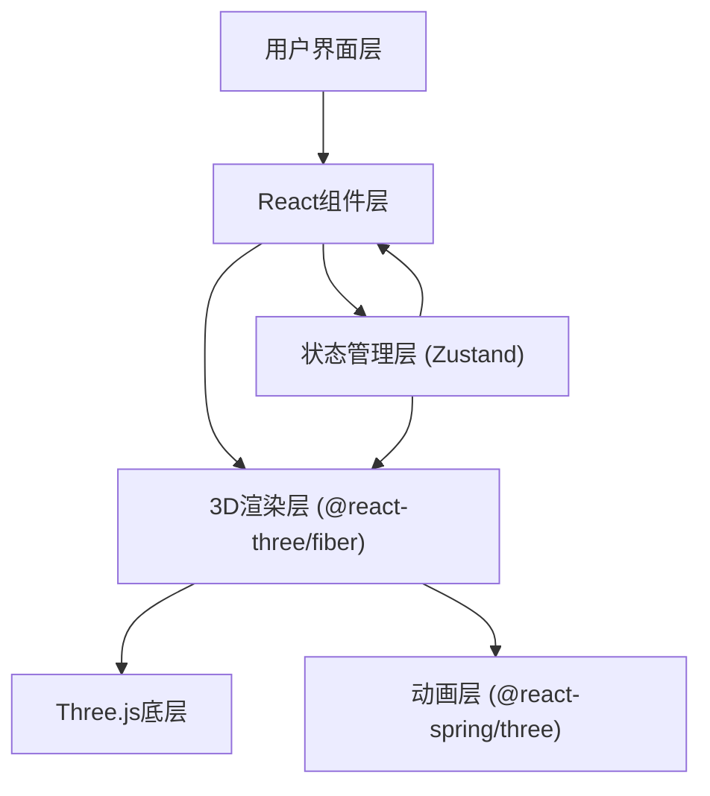
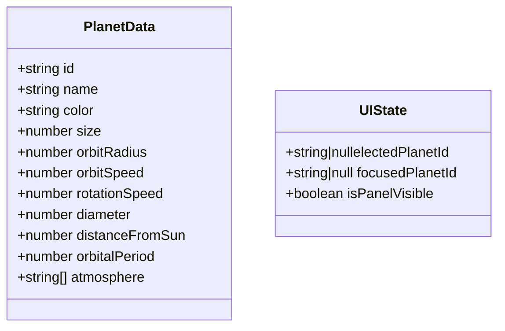

## 1. 架构设计



## 2. 技术描述
- **前端框架**：React@18 + TypeScript
- **构建工具**：Vite
- **3D渲染**：Three.js + @react-three/fiber + @react-three/drei
- **状态管理**：Zustand
- **动画库**：@react-spring/three
- **初始化方式**：vite-init (react-ts模板)

## 3. 项目文件结构
| 文件路径 | 用途 |
|----------|------|
| `package.json` | 项目依赖与脚本 |
| `vite.config.js` | Vite构建配置，含React插件 |
| `tsconfig.json` | TypeScript严格模式配置 |
| `index.html` | 入口页面，含Canvas容器 |
| `src/types.ts` | 行星数据、轨道参数、UI状态的TypeScript接口定义 |
| `src/store.ts` | Zustand状态管理（行星选择、视角焦点） |
| `src/scene.tsx` | 3D场景组件（太阳、行星、轨道、星空渲染，点击聚焦动画） |
| `src/panel.tsx` | 行星信息面板组件（毛玻璃卡片、淡入动画） |
| `src/App.tsx` | 主应用组件（场景+面板+控制栏组合布局） |

## 4. 数据模型定义

### 4.1 行星数据模型



### 4.2 TypeScript 接口定义
```typescript
interface PlanetData {
  id: string;
  name: string;
  color: string;
  size: number;
  orbitRadius: number;
  orbitSpeed: number;
  rotationSpeed: number;
  diameter: string;
  distanceFromSun: string;
  orbitalPeriod: string;
  atmosphere: string[];
}

interface OrbitParams {
  semiMajorAxis: number;
  eccentricity: number;
  inclination: number;
}

interface UIState {
  selectedPlanetId: string | null;
  focusedPlanetId: string | null;
  isPanelVisible: boolean;
}
```

## 5. 核心实现要点
1. **星空粒子系统**：使用BufferGeometry批量渲染800个点，自定义着色器实现透明度随机和缓慢旋转
2. **太阳特效**：点光源 + 发光材质 + 粒子系统实现CME抛射动画（useFrame定时触发）
3. **行星轨道**：EllipseCurve生成椭圆路径，Line渲染半透明轨道环
4. **行星渲染**：MeshStandardMaterial + 发光贴图实现光晕效果，useFrame驱动自转和公转
5. **射线拾取**：@react-three/drei的Interactive组件或原生Raycaster实现行星点击
6. **相机聚焦**：@react-spring/three的useSpring实现相机位置平滑过渡动画
7. **面板动画**：CSS transform scale + opacity 实现0.3s ease-out缩放淡入
