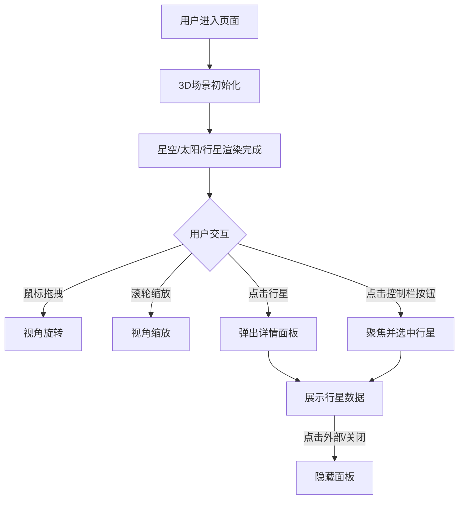

## 1. 产品概述
CosmicOrrery是一个基于Web的交互式3D太阳系模型，用户可以自由旋转视角、缩放观看行星轨道，并通过点击行星查看详细数据。项目旨在为天文爱好者和教育用户提供沉浸式的太阳系可视化体验。

## 2. 核心功能

### 2.1 用户角色
| 角色 | 注册方式 | 核心权限 |
|------|----------|----------|
| 普通用户 | 无需注册 | 浏览3D场景、操控视角、查看行星数据 |

### 2.2 功能模块
1. **3D场景主页面**：宇宙星空背景、太阳及粒子特效、八大行星与轨道、视角控制
2. **行星信息面板**：毛玻璃风格数据卡片、缩放淡入动画
3. **左侧控制栏**：行星列表快速聚焦按钮、悬停交互效果

### 2.3 页面详情
| 页面名称 | 模块名称 | 功能描述 |
|----------|----------|----------|
| 主场景 | 星空背景 | 800个星点粒子，大小1-3px，白色#FFFFFF，透明度0.3-0.9，缓慢旋转 |
| 主场景 | 太阳渲染 | 点光源+粒子闪烁，定期1.5秒日冕物质抛射特效 |
| 主场景 | 行星系统 | 八大行星按比例分布在椭圆轨道，轨道线半透明环#4A90D9，行星自转，发光光晕 |
| 主场景 | 视角控制 | 鼠标拖拽旋转(灵敏度0.5)、滚轮缩放(0.5-30)、0.1阻尼 |
| 信息面板 | 行星详情 | 名称/直径/距离/公转周期/大气成分，毛玻璃风格rgba(10,10,30,0.85)，缩放淡入0.3s |
| 控制栏 | 行星按钮 | 八大行星列表，点击聚焦对应行星，悬停背景#1A2B4A过渡0.2s |

## 3. 核心流程
用户打开页面进入3D太阳系场景，可通过鼠标拖拽旋转视角、滚轮缩放查看细节。用户可：
1. 直接点击场景中的行星弹出详情面板
2. 点击左侧控制栏中的行星按钮聚焦并选中该行星
3. 点击面板外部或关闭按钮隐藏详情面板

## 4. 用户界面设计

### 4.1 设计风格
- **主色调**：深蓝#0B0C1A、银灰#C0C0C0、亮蓝#00BFFF
- **行星色彩**：水星#A5A5A5、金星#E8C87A、地球#4A90D9、火星#D14A3A、木星#D4A574、土星#C8B060、天王星#7EC8E3、海王星#3B5EAB
- **整体风格**：深色科幻主题，毛玻璃UI元素，深空氛围
- **字体**：现代无衬线字体，数字等宽显示
- **布局**：全屏3D画布 + 左侧260px控制栏 + 浮动信息面板

### 4.2 页面设计概述
| 页面名称 | 模块名称 | UI元素 |
|----------|----------|--------|
| 主场景 | 背景层 | 深色#0B0C1A渐变、800个星点粒子、缓慢旋转 |
| 主场景 | 太阳层 | 发光球体、点光源、闪烁粒子、CME特效 |
| 主场景 | 行星层 | 八大行星球体、自转动画、发光光晕、椭圆轨道环 |
| 控制栏 | 按钮组 | 左侧#0F1025背景、#3A4A6E边框、8px圆角、行星按钮列表 |
| 信息面板 | 数据卡片 | 半透明毛玻璃、12px圆角、缩放淡入动画、行星数据展示 |

### 4.3 响应式设计
- 桌面端优先设计，全屏Canvas渲染
- 控制栏固定宽度260px，场景自适应剩余空间
- 信息面板居中显示，最大宽度限制

### 4.4 3D场景指导
- **环境**：深空背景，无HDRI，自建星点粒子系统
- **光照**：太阳点光源作为主光源，环境光补充
- **相机**：PerspectiveCamera，初始距离适中，OrbitControls控制
- **交互**：点击射线检测行星，聚焦时相机平滑过渡
- **特效**：Bloom后处理实现发光效果，粒子系统实现CME
- **性能**：60FPS目标，每帧更新轨道计算，复用几何体
