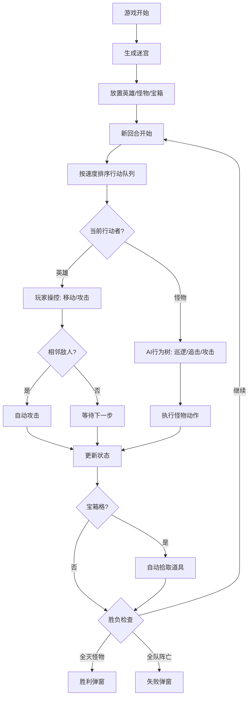

## 1. 产品概述

MazeCrusade 是一款融合 roguelike 元素与回合制战术的迷宫探险游戏。玩家在随机生成的 12x12 迷宫中控制一支由战士、法师、牧师组成的英雄小队，通过策略移动、技能释放和道具收集击败怪物并寻找出口。

- 目标用户：喜欢策略类、roguelike 迷宫探险的休闲/中度玩家
- 核心价值：每局随机迷宫带来高可玩性，回合制战术降低操作门槛，AI 行为树驱动的怪物提供动态挑战

## 2. 核心功能

### 2.1 功能模块

1. **游戏主界面**：迷宫棋盘、英雄面板、战斗日志三区布局
2. **迷宫生成与渲染**：递归回溯算法生成 12x12 随机迷宫，保证路径可达
3. **回合制战斗系统**：按速度属性排序行动，移动+攻击组合
4. **英雄小队管理**：3 英雄切换操控，技能冷却管理
5. **怪物 AI 行为树**：巡逻→追击→攻击三态切换
6. **道具收集**：宝箱自动拾取，药水效果及持续回合管理
7. **胜负判定**：全灭怪物胜利 / 全队阵亡失败

### 2.2 页面详情

| 页面名称 | 模块名称 | 功能描述 |
|----------|----------|----------|
| 游戏主界面 | 迷宫棋盘 (GameBoard) | 30px 网格渲染迷宫，英雄蓝色圆形、怪物红色方块、宝箱金色标记，点击交互移动/攻击 |
| 游戏主界面 | 英雄面板 (HeroPanel) | 左侧面板显示小队成员，血量条渐变色，技能图标及冷却，点击切换操控英雄 |
| 游戏主界面 | 战斗日志 (BattleLog) | 底部浮动面板，按时间显示战斗文本，最新高亮，自动滚动 |
| 游戏主界面 | 胜利弹窗 | 居中模态框，绿色渐变背景，显示"胜利！" |
| 游戏主界面 | 失败弹窗 | 居中模态框，红色渐变背景，显示"失败" |

## 3. 核心流程

玩家进入游戏 → 系统随机生成 12x12 迷宫（含怪物、宝箱、出口）→ 英雄小队出现在左上角 → 回合开始 → 玩家选择英雄 → 点击空地移动（相邻格含对角线）→ 移动后若与怪物相邻自动攻击 → 怪物按 AI 行为树行动 → 回合结束检查胜负 → 循环直至胜利或失败

## 4. 用户界面设计

### 4.1 设计风格

- 主题：深色暗黑风格（主背景 #0D1117，卡片 #1E1E2E，边框 #3A3A5C）
- 色彩：冷色调为主——英雄蓝 #4A90D9，怪物红 #E74C3C，辅助金 #F1C40F
- 字体：思源黑体 / Noto Sans SC，标题 24px 加粗，正文 14px，日志 12px
- 布局：中央棋盘 80% 宽度居中，左侧面板 240px 固定，底部日志 120px 固定
- 按钮/交互元素：圆角 4px，hover 放大 10% + 半透明指示圈

### 4.2 页面设计概览

| 页面名称 | 模块名称 | UI 元素 |
|----------|----------|---------|
| 游戏主界面 | 迷宫棋盘 | 30px×30px 网格 div，带边框；英雄蓝色圆形(半径12px)带流光动画；怪物红色方块带闪烁动画；宝箱金色标记；选中单位流光边框 |
| 游戏主界面 | 英雄面板 | 左侧面板宽240px；列表项高48px背景#1E1E2E间隔4px；头像+血量条(绿→红渐变宽0.5s过渡)+技能图标(圆24px冷却半透明) |
| 游戏主界面 | 战斗日志 | 底部浮动高120px背景#2D2D3F半透明圆角8px；白色12px文本行高1.4；最新高亮#F1C40F；新日志fadeIn 0.3s |
| 游戏主界面 | 胜利弹窗 | 居中模态框背景半透明；圆角16px；渐变#27AE60→#2ECC71；白色粗体32px"胜利！" |
| 游戏主界面 | 失败弹窗 | 居中模态框背景半透明；圆角16px；渐变#E74C3C→#C0392B；白色粗体32px"失败" |

### 4.3 动画规范

- 英雄移动：transition 0.3s ease-out 沿路径平滑移动
- 攻击闪光：0.15s 白色圆形光晕半径40px透明度先升后降
- 怪物被击败：0.5s scale+opacity 缩小消散
- 道具拾取：6个彩色点旋转扩散1.2s消失
- 悬停反馈：放大10%+半径35px指示圈#FFFFFF20
- 点击脉冲：0.1s 缩放脉冲

### 4.4 响应式适配

- 桌面端（≥768px）：左面板240px+中央棋盘80%+底部日志120px
- 移动端（<768px）：左面板移至底部高100px水平滚动；棋盘占满剩余高度；日志缩至80px
