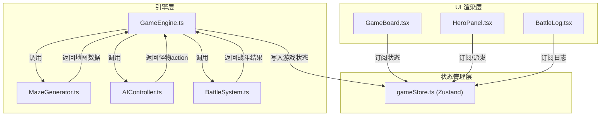

## 1. 架构设计



### 数据流向

1. **GameEngine** 是核心调度器，管理游戏循环和回合制状态机
2. **MazeGenerator** 被 GameEngine 调用，生成地图数据返回给 GameEngine
3. **AIController** 被 GameEngine 调用，根据怪物状态返回行为 action
4. **BattleSystem** 被 GameEngine 调用，计算伤害/治疗/增益并返回结果
5. **GameEngine** 将所有计算结果写入 **gameStore**（Zustand）
6. **UI 组件**（GameBoard、HeroPanel、BattleLog）订阅 gameStore 渲染界面
7. **UI 组件**通过 gameStore 的 action 派发用户操作，GameEngine 响应处理

## 2. 技术说明

- 前端框架：React 18 + TypeScript（严格模式）
- 构建工具：Vite + @vitejs/plugin-react
- 状态管理：Zustand（轻量级，无中间件）
- 工具库：uuid（唯一标识生成）
- 初始化工具：vite-init (react-ts 模板)
- 无后端服务，纯前端单页应用

## 3. 路由定义

| 路由 | 用途 |
|------|------|
| / | 游戏主界面（唯一页面，包含棋盘、英雄面板、战斗日志） |

## 4. 文件结构与调用关系

```
MazeCrusade/
├── package.json                    # 依赖: react@18, react-dom@18, zustand, uuid
├── vite.config.js                  # Vite配置 + React插件
├── tsconfig.json                   # 严格模式, noUnusedLocals, noUnusedParameters
├── index.html                      # 入口页面
├── src/
│   ├── main.tsx                    # React入口，挂载App
│   ├── App.tsx                     # 根组件，组合三个UI面板
│   ├── engine/
│   │   ├── GameEngine.ts           # 核心调度 → 调用MG/AC/BS，输出到store
│   │   ├── MazeGenerator.ts        # 递归回溯算法 → 暴露generateMaze(w,h)
│   │   ├── AIController.ts         # 行为树 → 返回action给GameEngine
│   │   └── BattleSystem.ts         # 战斗计算 → 输出结果到store
│   ├── stores/
│   │   └── gameStore.ts            # Zustand store → 英雄/怪物/地图/回合/日志
│   └── ui/
│       ├── GameBoard.tsx           # 迷宫渲染 → 订阅store，派发移动/攻击
│       ├── HeroPanel.tsx           # 英雄面板 → 订阅store，派发切换英雄
│       └── BattleLog.tsx           # 战斗日志 → 订阅store日志列表
```

### 文件间调用关系

| 调用方 | 被调用方 | 关系 |
|--------|----------|------|
| GameEngine | MazeGenerator | 调用 generateMaze() 获取地图 |
| GameEngine | AIController | 调用 getAction() 获取怪物行为 |
| GameEngine | BattleSystem | 调用 resolve() 计算战斗结果 |
| GameEngine | gameStore | 写入游戏状态 |
| GameBoard | gameStore | 读取地图/单位状态，派发移动/攻击 |
| HeroPanel | gameStore | 读取英雄状态，派发切换选中英雄 |
| BattleLog | gameStore | 读取日志列表 |

## 5. 核心数据模型

### 5.1 类型定义

```typescript
type CellType = 'wall' | 'floor' | 'treasure' | 'exit'

interface Position { x: number; y: number }

interface Unit {
  id: string
  name: string
  position: Position
  hp: number
  maxHp: number
  attack: number
  defense: number
  speed: number
  skills: Skill[]
}

interface Hero extends Unit {
  type: 'warrior' | 'mage' | 'cleric'
  activeBuffs: Buff[]
}

interface Monster extends Unit {
  aiState: 'patrol' | 'chase' | 'attack'
}

interface Skill {
  name: string
  type: 'damage' | 'heal' | 'buff'
  value: number
  cooldown: number
  currentCooldown: number
}

interface Buff {
  type: 'attack' | 'defense'
  value: number
  remainingTurns: number
}

interface Item {
  type: 'heal_potion' | 'power_potion' | 'shield_potion'
  value: number
  duration?: number
}

interface GameState {
  maze: CellType[][]
  heroes: Hero[]
  monsters: Monster[]
  turn: number
  selectedHeroId: string | null
  battleLog: string[]
  gameStatus: 'playing' | 'won' | 'lost'
}
```

### 5.2 游戏参数

| 参数 | 值 |
|------|-----|
| 迷宫尺寸 | 12×12 |
| 最少怪物数 | 3 |
| 最少宝箱数 | 1 |
| 暴击概率 | 15% |
| 暴击倍率 | 1.5× |
| 最低伤害 | 1 |
| 巡逻→追击距离 | <3格 |
| 追击→巡逻距离 | >6格 |
| 治疗药水 | +30 HP |
| 力量药水 | +10 攻击 3回合 |
| 护盾药水 | +10 防御 3回合 |
| 英雄移动范围 | 相邻8方向 |
| 攻击公式 | max(攻击-防御, 1) |
