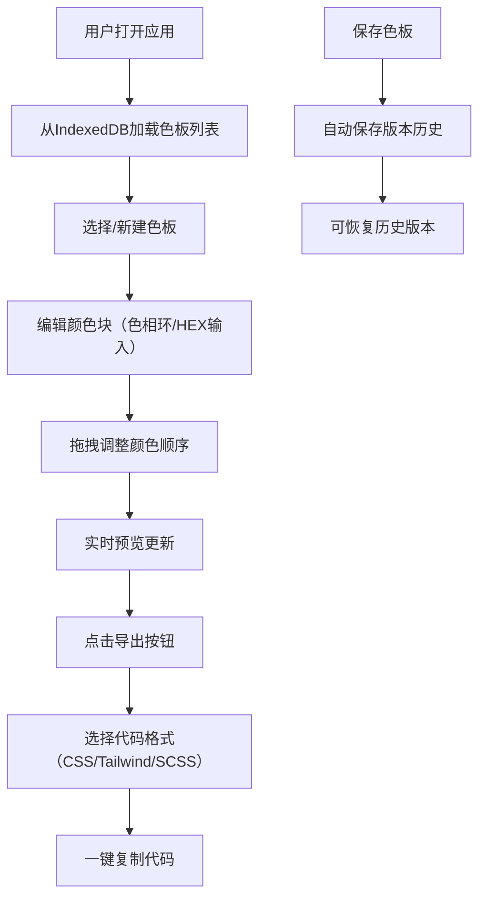

## 1. 产品概述

PaletteSync 是一款浏览器端配色方案创建与分享工具，解决设计师与非设计人员协作时配色方案难以统一、无法直观预览和导出为可用代码格式的问题。

- 核心目标：提供直观的色板创建、实时主题预览、多格式代码导出，提升设计协作效率
- 目标用户：UI设计师、前端开发者、产品经理及需要配色方案的创意工作者
- 市场价值：简化配色流程，实现设计与开发间的无缝协作，降低沟通成本

## 2. 核心功能

### 2.1 用户角色

| 角色 | 注册方式 | 核心权限 |
|------|----------|----------|
| 普通用户 | 无需注册，本地使用 | 创建、编辑、导出、管理色板及版本历史 |

### 2.2 功能模块

1. **色板管理模块：色板创建、编辑、删除、重命名、版本历史

2. **颜色编辑模块：色相环选择器、HEX输入、拖拽排序、颜色标签

3. **主题预览模块：按钮、文本、渐变背景实时预览

4. **代码导出模块：CSS变量、Tailwind配置、SCSS变量

### 2.3 页面详情

| 页面名称 | 模块名称 | 功能描述 |
|---------|----------|----------|
| 主应用页面 | 左侧导航栏 | 色板列表（2列网格）、版本历史侧边栏 |
| 主应用页面 | 中间编辑区 | 颜色块编辑、色相环选择器、颜色标签编辑 |
| 主应用页面 | 右侧预览面板 | 按钮、标题、正文、渐变背景实时预览 |
| 主应用页面 | 导出模态框 | 三种代码格式切换、一键复制功能 |

## 3. 核心流程

**用户操作流程：

1. 用户打开应用后，系统从本地数据库加载已保存的色板列表。用户可以选择现有色板或创建新色板。

2. 在编辑区中，用户通过色相环选择器或HEX输入添加颜色块，为颜色块添加文字标签，拖拽调整颜色顺序。

3. 右侧预览面板实时更新，展示按钮、文本、渐变背景效果。

4. 点击导出按钮后，弹出模态框展示三种代码格式，用户可切换格式后一键复制。

5. 色板数据自动保存到IndexedDB，每个色板保留最多5个历史版本，用户可在侧边栏查看和恢复历史版本。

## 4. 用户界面设计

### 4.1 设计风格

- **主色调**：#4A90D9（蓝色系），强调色：#E74C3C（红色）
- **背景色**：#F5F6FA，卡片背景：#F8F9FA
- **按钮风格**：圆角矩形，平滑过渡动画（0.2s-0.3s）
- **字体**：现代无衬线字体，标题20px粗体，正文14px
- **布局**：三栏布局（左280px导航 + 中间编辑区 + 右400px预览）
- **动效**：悬停放大、阴影加深、位置微调等微交互

### 4.2 页面设计概述

| 页面名称 | 模块名称 | UI元素 |
|---------|----------|--------|
| 主应用页面 | 色板卡片 | 宽度360px，圆角12px，阴影0 2px 8px rgba(0,0,0,0.08)，悬停阴影加深并上移2px |
| 主应用页面 | 颜色块 | 80x80px圆角矩形，边框1px solid #E0E0E0，悬停放大1.05倍 |
| 主应用页面 | 预览面板 | 宽度400px，圆角16px，阴影0 4px 20px rgba(0,0,0,0.1) |
| 主应用页面 | 导出按钮 | 160x44px，背景#4A90D9，白色文字16px，圆角8px |
| 主应用页面 | 导出模态框 | 宽度500px，背景#FFFFFF，圆角12px，半透明遮罩#00000040 |

### 4.3 响应式设计

- **桌面端（>768px）：三栏完整布局

- **平板（≤768px）：左侧导航栏折叠为汉堡菜单，点击展开

- **手机（≤375px）：单列布局，预览面板位于编辑区下方

- **触摸优化**：增大触控区域，确保移动端操作流畅

### 4.4 性能指标

- 色板切换时预览面板更新 < 100ms

- IndexedDB读写异步执行，不阻塞UI线程

- 颜色拖拽排序时预览更新延迟 < 50ms
