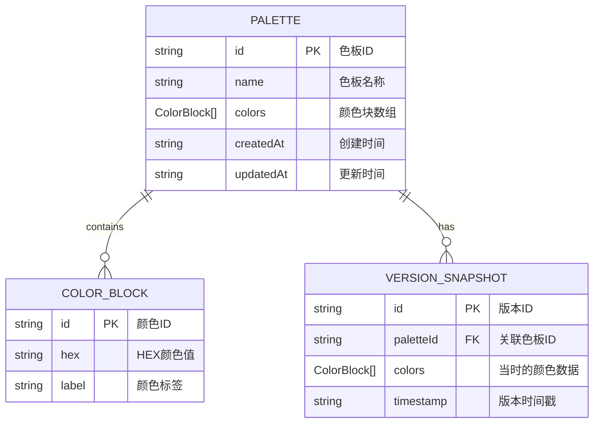

## 1. 架构设计

```mermaid
graph TD
    subgraph "界面渲染模块"
        A["App.tsx 主应用组件
        B["ColorPicker.tsx 色相环选择器
        C["PaletteCard.tsx 色板卡片
        D["PreviewPanel.tsx 预览面板
        E["ExportModal.tsx 导出模态框
    end
    
    subgraph "状态管理层"
        F["Zustand Store"]
        G["paletteStore.ts 色板状态管理
    end
    
    subgraph "数据管理模块"
        H["dbManager.ts IndexedDB封装
        I["IndexedDB 本地数据库
    end
    
    subgraph "类型定义层"
        J["types.ts 接口定义
    end
    
    J --> G
    J --> H
    G --> A
    G --> H
    A --> B
    A --> C
    A --> D
    A --> E
    E --> G
    H --> I
```

## 2. 技术描述

- **前端框架**：React@18 + TypeScript + Vite

- **状态管理**：Zustand

- **数据持久化**：IndexedDB (idb库)

- **颜色处理**：chroma-js

- **唯一标识**：uuid

- **构建工具**：Vite

- **样式方案**：原生CSS + CSS Modules（不使用Tailwind（用户未明确要求使用具体的样式属性，直接在组件内

## 3. 项目结构

```
src/
├── types.ts              # 类型定义
├── store/
│   └── paletteStore.ts   # Zustand状态管理
├── data/
│   └── dbManager.ts  # IndexedDB操作封装
├── components/
│   ├── ColorPicker.tsx   # 色相环选择器
│   ├── PaletteCard.tsx # 色板卡片
│   ├── PreviewPanel.tsx # 预览面板
│   └── ExportModal.tsx # 导出模态框
└── App.tsx             # 主应用组件
└── main.tsx           # 入口文件
└── index.css          # 全局样式
```

## 4. 数据模型

### 4.1 数据模型定义



### 4.2 类型定义

```typescript
interface ColorBlock {
  id: string;
  hex: string;
  label: string;
}

interface Palette {
  id: string;
  name: string;
  colors: ColorBlock[];
  createdAt: string;
  updatedAt: string;
}

interface VersionSnapshot {
  id: string;
  paletteId: string;
  colors: ColorBlock[];
  timestamp: string;
}

interface PaletteStore {
  palettes: Palette[];
  selectedPaletteId: string | null;
  versions: Record<string, VersionSnapshot[]>;
  // actions...
}
```

## 5. 性能优化策略

1. **React.memo**：PreviewPanel组件使用React.memo避免不必要重渲染

2. **异步数据操作**：所有IndexedDB操作为Promise异步，不阻塞UI

3. **批量状态更新**：拖拽排序时使用useTransition优化响应性

4. **CSS过渡动画**：使用transform和opacity属性实现GPU加速动画

5. **防抖处理**：颜色输入框输入时防抖处理，避免频繁更新

## 6. 文件清单

| 文件路径 | 主要职责 |
|---------|----------|
| package.json | 项目依赖配置 |
| vite.config.js | Vite构建配置 |
| tsconfig.json | TypeScript配置 |
| index.html | 入口HTML |
| src/types.ts | TypeScript类型定义 |
| src/store/paletteStore.ts | Zustand状态管理 |
| src/data/dbManager.ts | IndexedDB数据管理 |
| src/components/ColorPicker.tsx | 色相环选择器 |
| src/components/PaletteCard.tsx | 色板卡片 |
| src/components/PreviewPanel.tsx | 预览面板 |
| src/components/ExportModal.tsx | 导出模态框 |
| src/App.tsx | 主应用组件 |
| src/main.tsx | React入口 |
| src/index.css | 全局样式 |
