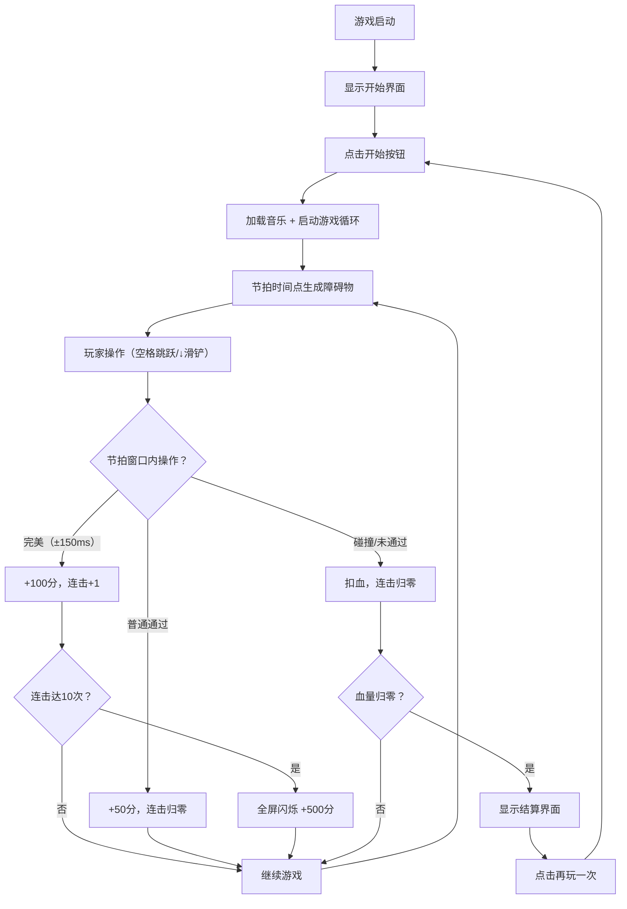

## 1. 产品概述

RhythmRush是一款音乐节奏跑酷游戏，玩家控制角色在无限延伸的3D跑道上奔跑，根据背景音乐节拍跳跃或滑铲躲避障碍物，得分根据与节拍的同步精度计算。
- 主要目的：融合音乐节奏游戏与3D跑酷的休闲娱乐体验，通过视觉反馈与音乐节拍的同步获得沉浸感
- 目标用户：喜欢音乐游戏、跑酷游戏的年轻玩家群体
- 产品价值：提供独特的视听同步体验，让玩家在操作中感受音乐节奏的律动

## 2. 核心功能

### 2.1 功能模块
1. **3D游戏场景**：无限延伸跑道、角色、障碍物、星空背景、霓虹灯带
2. **音频分析系统**：音乐加载播放、节拍检测、频率分析
3. **角色控制系统**：跳跃（空格键）、滑铲（下箭头键）
4. **评分系统**：节拍同步判定（完美/普通/失误）、连击累计、得分计算
5. **UI覆盖层**：得分显示、连击显示、血条、开始/暂停/结束界面
6. **视觉特效**：角色发光、屏幕闪光、全屏闪烁、连击断裂动画

### 2.2 页面详情
| 页面名称 | 模块名称 | 功能描述 |
|-----------|-------------|---------------------|
| 游戏主界面 | 3D场景渲染 | 使用Three.js渲染跑道、角色、障碍物和背景，@react-three/fiber驱动React声明式3D |
| 游戏主界面 | 音频节拍同步 | Web Audio API加载示例音乐，实时分析节拍，驱动障碍物生成与评分判定 |
| 游戏主界面 | 角色操作响应 | 监听键盘事件，执行跳跃（0.4s）和滑铲（0.3s）动作，处理碰撞检测 |
| 游戏主界面 | HUD信息显示 | 顶部居中得分（40px等宽字体）、连击数、血条、暂停按钮 |
| 开始界面 | 开始按钮 | 全屏半透明遮罩，中央渐变按钮，悬停缩放1.05，点击启动游戏和音乐 |
| 结算界面 | 结束面板 | 显示最终得分、连击峰值、再玩一次按钮，半透明背景圆角面板 |

## 3. 核心流程

游戏启动 → 显示开始界面 → 点击开始按钮 → 加载音乐并启动游戏循环 → 节拍时间点生成障碍物 → 玩家操作（跳跃/滑铲）→ 节拍同步判定（完美/普通/失误）→ 更新得分与连击 → 血量归零时显示结算界面 → 点击再玩一次重新开始

## 4. 用户界面设计

### 4.1 设计风格
- 主背景色：深蓝 #0B0C1E
- 高亮色：霓虹蓝 #00BFFF、粉色 #FF69B4
- 文字颜色：白色
- 跑道材质：半透明深蓝 #1A2A4A，透明度0.6
- 按钮风格：圆角（30px）、背景渐变、悬停缩放
- 字体：等宽字体（显示分数）、系统字体（按钮文字）

### 4.2 页面设计概述
| 页面名称 | 模块名称 | UI元素 |
|-----------|-------------|-------------|
| 游戏主界面 | 3D跑道场景 | 半透明深蓝跑道、两侧粉蓝霓虹灯带（闪烁与BPM同步）、200颗缓慢旋转星空粒子、地面网格线 |
| 游戏主界面 | HUD覆盖层 | 顶部居中得分（40px等宽，白色带蓝色投影#00BFFF）、连击显示、左上角血条、右上角暂停按钮 |
| 开始界面 | 覆盖层 | 全屏半透明#000000CC背景、中央开始按钮（200x60px，渐变#6C63FF→#483D8B，圆角30px，白色24px文字，悬停缩放1.05，过渡0.3s） |
| 结算界面 | 结束面板 | 400px宽度，背景#1A1A2E，圆角16px，内阴影，显示最终得分、连击峰值、再玩一次按钮 |

### 4.3 响应式
- 桌面优先（800px-1920px宽度），移动端自动缩放按钮和文本
- 3D场景全屏适配，使用Canvas渲染自适应视口
- UI元素使用百分比或vw单位，确保在不同屏幕尺寸下布局正确

### 4.4 3D场景指导
- 环境：黑暗星空背景，营造赛博朋克音乐氛围
- 灯光：方向光+环境光组合，角色和障碍物使用emissive材质增加发光效果
- 相机设置：第三人称跟随视角，距离角色后方一定距离，略微俯视跑道
- 动画：角色跳跃抛物线运动、滑铲高度缩放动画、障碍物沿跑道向玩家移动、屏幕震动（2Hz，3px幅度）
- 后处理特效：完美操作触发角色发光（颜色随频率渐变0.5s）和屏幕边缘闪光，连击10次全屏闪烁（0.8s，透明度0.15）
- 性能预算：帧率稳定45FPS以上，障碍物生成延迟≤50ms
