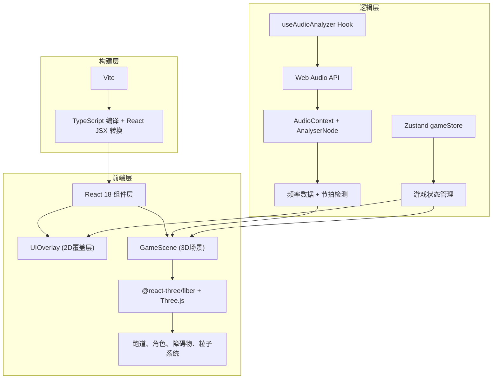

## 1. 架构设计



## 2. 技术描述
- 前端框架：React@18 + TypeScript
- 构建工具：Vite（配置devServer端口与基础路径）
- 3D渲染：three@0.160 + @react-three/fiber@8 + @react-three/drei@9
- 状态管理：zustand@4
- 音频处理：原生 Web Audio API（AudioContext / AnalyserNode）
- 样式方案：CSS Modules + 内联样式（使用CSS变量统一配色）

## 3. 目录结构
```
auto97/
├── package.json               # 依赖配置与启动脚本
├── vite.config.js             # Vite构建配置（React插件、devServer端口、base路径）
├── tsconfig.json              # TypeScript配置（严格模式、esModuleInterop）
├── index.html                 # HTML入口（字体、meta viewport）
└── src/
    ├── main.tsx               # ReactDOM渲染入口，挂载App组件
    ├── App.tsx                # 根组件（整合GameScene与UIOverlay）
    ├── hooks/
    │   └── useAudioAnalyzer.ts # 音频分析Hook（加载、节拍检测、频率数据）
    ├── stores/
    │   └── gameStore.ts       # Zustand全局状态（得分、血量、连击、角色状态）
    └── components/
        ├── GameScene.tsx      # 3D场景核心（跑道、角色、障碍物、特效）
        └── UIOverlay.tsx      # 2D UI覆盖层（HUD、开始/结束界面）
```

## 4. 核心数据模型

### 4.1 游戏状态类型定义
```typescript
interface GameState {
  // 游戏阶段
  status: 'idle' | 'playing' | 'paused' | 'gameover';
  // 得分数据
  score: number;
  combo: number;
  maxCombo: number;
  // 生命系统
  health: number;       // 0-100
  // 节拍窗口
  currentBeatWindow: BeatWindow | null;
  // 角色状态
  playerAction: 'running' | 'jumping' | 'sliding';
  playerActionStartTime: number;
  // 视觉特效触发
  perfectFlash: boolean;
  comboBreakFlash: boolean;
  fullscreenFlash: boolean;
  screenShake: boolean;
  // 控制方法
  startGame: () => void;
  pauseGame: () => void;
  resumeGame: () => void;
  endGame: () => void;
  resetGame: () => void;
  jump: () => void;
  slide: () => void;
  handleBeatJudge: (result: 'perfect' | 'normal' | 'miss') => void;
  takeDamage: (amount: number) => void;
}

interface BeatWindow {
  beatTime: number;       // 节拍时间戳（ms）
  obstacleType: 'block' | 'arch'; // 障碍物类型
  windowStart: number;    // 判定窗口开始
  windowEnd: number;      // 判定窗口结束
  judged: boolean;        // 是否已判定
}
```

### 4.2 障碍物类型
```typescript
interface Obstacle {
  id: string;
  type: 'block' | 'arch';   // block需要跳跃，arch需要滑铲
  zPosition: number;        // 沿跑道的位置（随游戏前移）
  passed: boolean;          // 是否已通过玩家位置
  judged: boolean;          // 是否已判定
}
```

### 4.3 节拍数据（内置示例音乐约60秒，BPM=120）
```typescript
const PRESET_BEATMAP: BeatData[] = [
  { time: 1000, type: 'block' },
  { time: 1500, type: 'arch'  },
  { time: 2000, type: 'block' },
  // ... 每500ms一个节拍，共约120个
];
```

## 5. 节拍判定与得分算法

### 5.1 判定窗口
- **完美判定**：操作时间在节拍时间 ±150ms 内 → 100分，连击+1
- **普通判定**：操作时间在节拍时间 ±300ms 内（非完美区间）→ 50分，连击归零
- **失误判定**：未在窗口内操作或与障碍物碰撞 → 扣血20点，连击归零

### 5.2 连击奖励
- 连续完美达到10次 → 全屏闪烁特效（0.8s, opacity=0.15）+ 额外奖励500分
- 连击中断 → 红色X缩放消失动画（0.3s）

## 6. 性能优化策略
1. **障碍物池化**：复用已通过的障碍物对象，避免频繁创建销毁
2. **粒子系统优化**：使用InstancedMesh一次性渲染200个星空粒子
3. **渲染帧率控制**：使用useFrame的delta时间做帧率无关的动画更新
4. **音频分析节流**：频率数据获取频率≤60次/秒，避免过度计算
5. **状态更新优化**：Zustand使用选择性订阅减少组件重渲染
