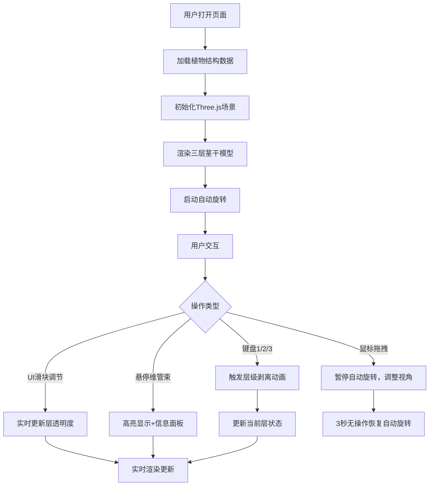

## 1. 产品概述

PlantMicroverse是一个基于Web的3D植物解剖结构可视化应用，让用户能够在浏览器中探索植物茎干内部微观结构，通过虚拟切片实验逐层剥离观察细胞排列和维管束走向。

- 主要目的：为生物学教育和科普提供交互式3D可视化工具
- 目标用户：学生、教师、植物学爱好者
- 解决的问题：传统教学中难以直观展示植物内部微观结构的痛点
- 市场价值：填补Web端植物解剖学教育工具的空白

## 2. 核心功能

### 2.2 功能模块

1. **3D主场景页面：植物茎干3D模型渲染、分层结构展示
2. **交互控制面板：层可见性切换、透明度调节、旋转速度控制
3. **信息展示面板：当前层级显示、维管束详细信息展示
4. **动画效果模块：层级剥离动画、悬停高亮效果

### 2.3 页面详情

| 页面名称 | 模块名称 | 功能描述 |
|-----------|-------------|---------------------|
| 主场景页面 | 3D场景渲染 | 渲染植物茎干3D模型，支持鼠标拖拽旋转视角、滚轮缩放、逐层剥离交互 |
| 主场景页面 | 层级控制面板 | 提供层可见性切换按钮、透明度调节滑块、旋转速度控制 |
| 主场景页面 | 信息展示面板 | 显示当前剥离层信息、维管束悬停详情 |
| 主场景页面 | 动画效果 | 层切换动画、悬停高亮发光效果 |

## 3. 核心流程

## 4. 用户界面设计

### 4.1 设计风格

- **主色调**：深空蓝渐变背景（#0A0E27 → #1A1F3A）
- **强调色**：植物绿色系（表皮层半透明白色、皮层浅绿色#8FBC8F、维管束层深绿色#006400、高亮亮绿色#00FF88）
- **UI面板**：半透明深色背景（rgba(0,0,0,0.6)、#2C2C3A）
- **字体**：现代无衬线字体，14px正文
- **圆角**：12px（主面板）、8px（信息面板）
- **动画**：所有UI元素0.3s淡入淡出

### 4.2 页面设计概述

| 页面名称 | 模块名称 | UI元素 |
|-----------|-------------|-------------|
| 主场景页面 | 3D场景 | 全屏3D视口，深空蓝渐变背景 |
| 主场景页面 | 左上角层级面板 | 半透明背景（rgba(0,0,0,0.6)，圆角12px，内边距16px，显示当前层编号和名称 |
| 主场景页面 | 右上角控制面板 | dat.gui面板，宽度280px，包含层切换按钮、透明度滑块、旋转速度控制 |
| 主场景页面 | 右下角信息面板 | 背景#2C2C3A，圆角8px，内边距8px，字体14px，默认隐藏 |

### 4.3 响应式设计

- **桌面端**：控制面板固定右上角，宽度280px
- **移动端**（<768px）：控制面板折叠为抽屉，从右侧滑入，宽度240px
- **触摸优化**：支持触摸拖拽旋转视角，双指缩放

### 4.4 3D场景设计

- **环境**：深空蓝渐变背景，营造科学探索氛围
- **光照**：环境光 + 点光源，突出3D层次感
- **相机**：PerspectiveCamera，初始距离15单位
- **后期处理**：Bloom发光效果（高亮维管束）
- **动画**：层剥离时旋转360度缩放至0（1.2秒，power3.out缓动）
- **交互**：OrbitControls控制视角，自动旋转0.02弧度/帧
