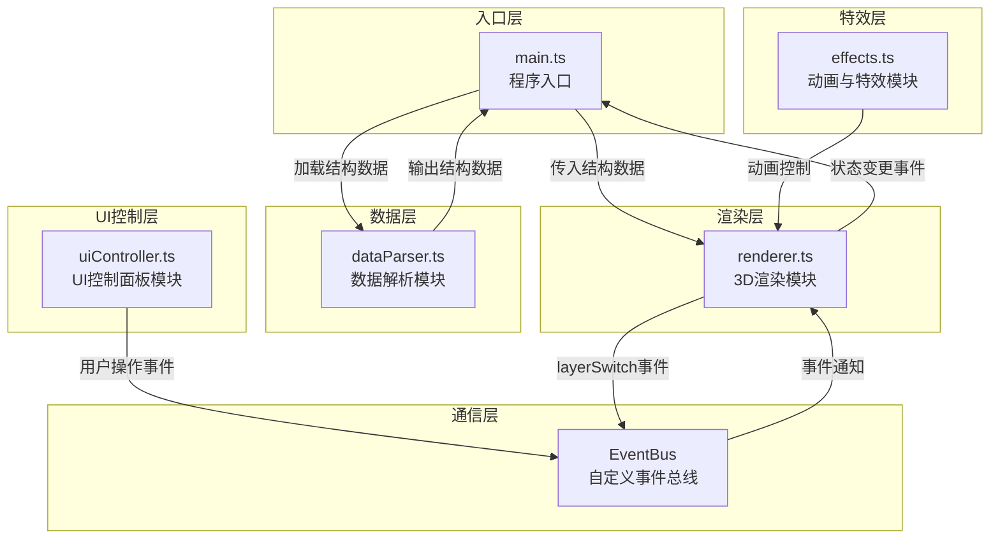

## 1. 架构设计



**调用关系与数据流向说明：**

1. **main.ts** → 初始化场景、相机、渲染器，调用dataParser加载数据，将数据传给renderer
2. **dataParser.ts** → 解析内置植物茎干结构数据，输出分层几何描述对象给main.ts和renderer.ts
3. **renderer.ts** → 接收结构数据创建3D模型，通过事件总线发射layerSwitch事件
4. **uiController.ts** → 创建dat.gui面板，监听用户操作，通过事件总线通知renderer
5. **effects.ts** → 添加光照，使用Gsap实现平滑动画过渡

## 2. 技术描述

- **构建工具**：Vite@5.x
- **前端框架**：TypeScript@5.x + Three.js@0.160.0
- **UI组件**：dat.gui@0.7.9
- **动画库**：gsap@3.12.5
- **开发语言**：TypeScript（严格模式，target ES2020）
- **事件通信**：自定义EventBus事件总线
- **3D控制**：Three.js OrbitControls
- **后期处理**：Three.js EffectComposer + UnrealBloomPass

## 3. 文件结构

```
PlantMicroverse/
├── package.json
├── vite.config.js
├── tsconfig.json
├── index.html
└── src/
    ├── main.ts              # 程序入口
    ├── dataParser.ts        # 数据解析模块
    ├── renderer.ts          # 3D渲染模块
    ├── uiController.ts      # UI控制面板模块
    └── effects.ts           # 动画与特效模块
```

## 4. 核心数据结构

### 4.1 植物结构数据类型

```typescript
// 层级类型
type LayerType = 'epidermis' | 'cortex' | 'vascular';

// 层配置接口
interface LayerConfig {
  id: LayerType;
  name: string;
  index: number;
  visible: boolean;
  opacity: number;
  color: number;
  thickness: number;
  innerRadius: number;
  outerRadius: number;
}

// 维管束数据接口
interface VascularBundle {
  id: number;
  angle: number;
  x: number;
  z: number;
  width: number;
  height: number;
  length: number;
}

// 植物茎干结构接口
interface PlantStemData {
  height: number;
  diameter: number;
  layers: LayerConfig[];
  vascularBundles: VascularBundle[];
  gap: number;
}
```

### 4.2 渲染状态接口

```typescript
interface RenderState {
  currentLayer: number;
  autoRotate: boolean;
  autoRotateSpeed: number;
  selectedVascular: number | null;
  isAnimating: boolean;
}
```

## 5. 事件总线定义

```typescript
// 事件类型
enum EventType {
  LAYER_SWITCH = 'layerSwitch',
  LAYER_VISIBILITY_CHANGE = 'layerVisibilityChange',
  LAYER_OPACITY_CHANGE = 'layerOpacityChange',
  ROTATION_SPEED_CHANGE = 'rotationSpeedChange',
  AUTO_ROTATE_TOGGLE = 'autoRotateToggle',
  VASCULAR_HOVER = 'vascularHover',
  VASCULAR_LEAVE = 'vascularLeave',
}

// 事件总线接口
interface IEventBus {
  on(event: EventType, callback: Function): void;
  off(event: EventType, callback: Function): void;
  emit(event: EventType, data?: any): void;
}
```

## 6. 性能优化策略

1. **几何体复用**：复用CylinderGeometry和CylinderGeometry构造，避免重复创建
2. **材质共享**：相同层级使用共享材质实例
3. **帧速率控制**：使用requestAnimationFrame，目标帧率60FPS
4. **射线检测优化**：限制射线检测频率，每帧最多执行一次
5. **透明渲染顺序**：从内到外渲染透明物体，正确处理深度排序
6. **后期处理优化**：Bloom效果仅应用于高亮维管束

## 7. 技术约束

- TypeScript严格模式（strict: true）
- 目标ES2020
- 所有模块使用ESM语法
- 帧率稳定在55 FPS以上
- 支持响应式布局（<768px适配移动端）
