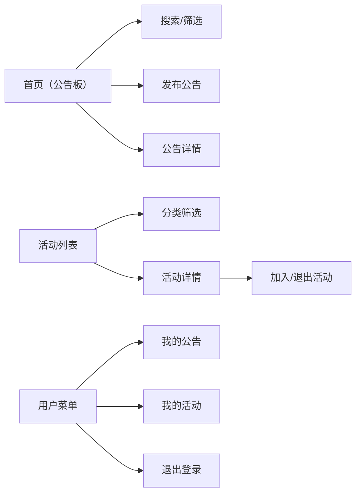

## 1. 产品概述

CommunityCanvas是一款社区公告板与活动组织应用，旨在为社区居民提供便捷的信息发布与活动参与平台。用户可以浏览社区公告、发现并参与感兴趣的活动，同时管理自己发布的内容和参与的活动。

- 目标用户：社区居民、活动组织者、社区管理者
- 产品价值：提升社区信息流通效率，促进社区互动与凝聚力

## 2. 核心功能

### 2.1 用户角色
| 角色 | 注册方式 | 核心权限 |
|------|---------|---------|
| 注册用户 | 模拟登录 | 发布公告、创建活动、加入/退出活动、管理个人内容 |

### 2.2 功能模块
1. **公告板页面**：公告卡片网格展示、发布公告模态框、搜索过滤
2. **活动浏览页面**：分类标签筛选、瀑布流活动卡片、搜索过滤
3. **活动详情页面**：活动信息展示、参与管理、参与者列表
4. **公告详情页面**：公告完整内容展示
5. **个人中心**：我的公告、我的活动、退出登录

### 2.3 页面详情
| 页面名称 | 模块名称 | 功能描述 |
|---------|---------|---------|
| 公告板 | 公告网格 | 以卡片网格形式展示公告列表，支持点击进入详情 |
| 公告板 | 发布按钮 | 右下角悬浮圆形按钮，点击展开发布模态框 |
| 公告板 | 发布模态框 | 标题输入（60字）、正文文本域（500字）、字数统计、提交按钮 |
| 活动列表 | 分类标签栏 | 横向滚动标签：全部、艺术、体育、技术、社交、其他 |
| 活动列表 | 瀑布流卡片 | 展示活动标题、日期、地点、参与进度条 |
| 活动详情 | 顶部大图 | 随机渐变背景横幅 |
| 活动详情 | 活动信息 | 名称、描述、日期时间、地点、组织者信息 |
| 活动详情 | 参与按钮 | 加入/退出活动，状态切换 |
| 活动详情 | 参与者列表 | 显示最近5位参与者头像，超出显示"+N" |
| 导航栏 | 搜索框 | 实时搜索公告和活动，防抖300ms |
| 导航栏 | 用户菜单 | 下拉菜单：我的公告、我的活动、退出登录 |

## 3. 核心流程

用户打开应用 → 浏览公告板/活动列表 → 通过分类或搜索筛选内容 → 点击卡片查看详情 → 选择加入活动/查看公告 → 用户可发布新公告 → 管理个人发布和参与的内容

## 4. 用户界面设计

### 4.1 设计风格
- **主色调**：靛蓝色 #6366f1
- **背景色**：浅灰色 #f8fafc
- **强调色**：翠绿 #10b981（成功/正向）、红色 #ef4444（警告/负向）
- **卡片风格**：毛玻璃效果（背景rgba(255,255,255,0.8)，backdrop-filter:blur(12px)）
- **按钮风格**：圆角胶囊形，悬停有阴影和颜色变化
- **字体**：现代无衬线字体，清晰的层级结构
- **动效**：页面切换fade过渡（0.3s），卡片悬停上移（0.2s），按钮ripple效果

### 4.2 页面设计概览
| 页面名称 | 模块名称 | UI元素 |
|---------|---------|--------|
| 公告板 | 公告卡片 | 280×200px，圆角12px，左侧彩色竖条，两行文字截断 |
| 公告板 | 发布按钮 | 直径48px圆形，靛蓝背景，白色加号，悬浮于右下角 |
| 活动列表 | 分类标签 | 圆角24px胶囊形，选中态靛蓝背景白字 |
| 活动列表 | 活动卡片 | 瀑布流布局，240px宽，参与进度条（绿到橙渐变） |
| 活动详情 | 顶部横幅 | 随机渐变背景，活动标题叠加 |
| 活动详情 | 参与按钮 | 宽240px高48px，圆角24px，靛蓝背景 |
| 导航栏 | 导航栏 | 高64px，白色背景，底部1px浅灰边框 |

### 4.3 响应式设计
- **桌面端（≥1024px）**：公告网格4列，活动瀑布流3列
- **平板端（768-1023px）**：公告3列，活动2列
- **手机端（<768px）**：公告2列，活动1列，卡片宽度自适应100%

### 4.4 动效与交互
- 公告入场动画：scale(0.8)→scale(1)，0.3秒
- 卡片悬停：上移4px，阴影加深，0.2s ease
- 按钮点击：ripple动画，100%→120%→回弹，0.3s
- 页面切换：fade过渡，0.3s
- 搜索框展开：200px→350px宽度动画

## 5. 性能要求
- 公告列表首次加载：≤500ms（20条模拟数据）
- 搜索过滤响应：≤100ms（本地数据过滤）
- 页面切换流畅度：60fps动画效果
